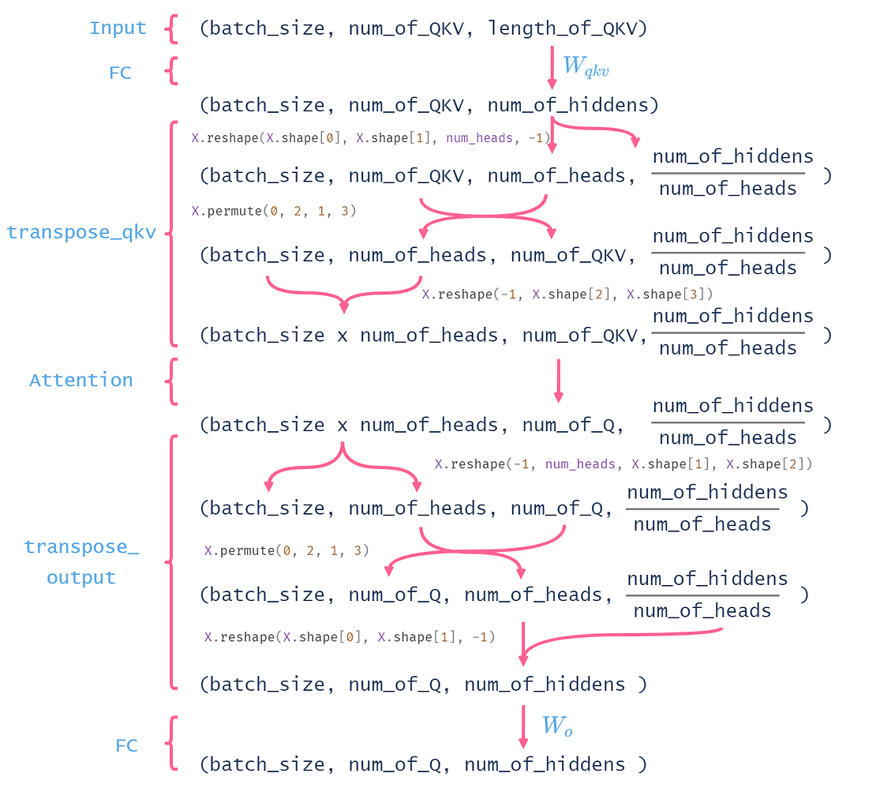

# 注意力机制

## Attention和全连接的区别
Attention的最终输出可以看成是一个“在关注部分权重更大的全连接层”。但是它与全连接层的区别在于，**注意力机制可以利用输入的特征信息来确定哪些部分更重要**。

**全连接的作用的是对一个实体进行从一个特征空间到另一个特征空间的映射，而注意力机制是要对来自同一个特征空间的多个实体进行整合**。全连接的权重对应的是一个实体上的每个特征的重要性，而注意力机制的输出结果是各个实体的重要性。

## 注意力评分函数
注意力评分函数（attention scoring function）， 简称评分函数（scoring function）， 然后把这个函数的输出结果输入到softmax函数中进行运算。 通过上述步骤，我们将得到与键对应的值的概率分布（即注意力权重）。 最后，注意力汇聚的输出就是基于这些注意力权重的值的加权和。

seq2seq + attention 的 attention 的 key 与 value  是相同的，都是解码器的输出，但是在其他框架中就不一定了


用数学语言描述，假设有一个查询 $\mathbf{q} \in \mathbb{R}^{q}$ 和 $m$ 个"键一值"对 $\left(\mathbf{k}_{1}, \mathbf{v}_{1}\right), \ldots,\left(\mathbf{k}_{m}, \mathbf{v}_{m}\right)$, 其中 $\mathbf{k}_{i} \in \mathbb{R}^{k}, \mathbf{v}_{i} \in \mathbb{R}^{v}$ 。 注意 力汇聚函数 $f$ 就被表示成值的加权和：
$$
f\left(\mathbf{q},\left(\mathbf{k}_{1}, \mathbf{v}_{1}\right), \ldots,\left(\mathbf{k}_{m}, \mathbf{v}_{m}\right)\right)=\sum_{i=1}^{m} \alpha\left(\mathbf{q}, \mathbf{k}_{i}\right) \mathbf{v}_{i} \in \mathbb{R}^{v},
$$
其中查询 $\mathbf{q}$ 和键 $\mathbf{k}_{i}$ 的注意力权重（标量）是通过注意力评分函数 $a$ 将两个向量映射成标量, 再经过softmax运算得到的:
$$
\alpha\left(\mathbf{q}, \mathbf{k}_{i}\right)=\operatorname{softmax}\left(a\left(\mathbf{q}, \mathbf{k}_{i}\right)\right)=\frac{\exp \left(a\left(\mathbf{q}, \mathbf{k}_{i}\right)\right)}{\sum_{j=1}^{m} \exp \left(a\left(\mathbf{q}, \mathbf{k}_{j}\right)\right)} \in \mathbb{R} .
$$
正如我们所看到的, 选择不同的注意力评分函数 $a$ 会导致不同的注意力汇聚操作。在本节中, 我们将介绍两个流行的评分 函数, 稍后将用他们来实现更复杂的注意力机制。
### 掩蔽softmax操作
softmax操作用于输出一个概率分布作为注意力权重。 在某些情况下，并非所有的值都应该被纳入到注意力汇聚中，如填充了没有意义的特殊词元。 为了仅将有意义的词元作为值来获取注意力汇聚， 我们可以指定一个有效序列长度（即词元的个数）， 以便在计算softmax时过滤掉超出指定范围的位置。 通过这种方式，我们可以在下面的masked_softmax函数中 实现这样的掩蔽softmax操作（masked softmax operation），掩蔽的元素使用一个非常大的负值替换，从而其softmax输出为0。

### 加性注意力
一般来说, 当查询和键是不同长度的矢量时, 我们可以使用加性注意力作为评分函数。 给定查询 $\mathbf{q} \in \mathbb{R}^{q}$ 和 键 $\mathbf{k} \in \mathbb{R}^{k}$, 加性注意力 (additive attention) 的评分函数为
$$
a(\mathbf{q}, \mathbf{k})=\mathbf{w}_{v}^{\top} \tanh \left(\mathbf{W}_{q} \mathbf{q}+\mathbf{W}_{k} \mathbf{k}\right) \in \mathbb{R},
$$
其中可学习的参数是 $\mathbf{W}_{q} \in \mathbb{R}^{h \times q} 、 \mathbf{W}_{k} \in \mathbb{R}^{h \times k}$ 和 $\mathbf{w}_{v} \in \mathbb{R}^{h}$ 。将查询和键连结起来后输入到一个多层 感知机 (MLP) 中, 感知机包含一个隐藏层, 其隐藏单元数是一个超参数 $h_{\circ}$ 通过使用 $\tanh$ 作为激活函数, 并且禁用偏置项。

```py
class AdditiveAttention(nn.Module):
    """加性注意力"""
    def __init__(self, key_size, query_size, num_hiddens, dropout, **kwargs):
        super(AdditiveAttention, self).__init__(**kwargs)
        self.W_k = nn.Linear(key_size, num_hiddens, bias=False)
        self.W_q = nn.Linear(query_size, num_hiddens, bias=False)
        self.w_v = nn.Linear(num_hiddens, 1, bias=False)
        self.dropout = nn.Dropout(dropout)

    def forward(self, queries, keys, values, valid_lens):
        queries, keys = self.W_q(queries), self.W_k(keys)
        # 在维度扩展后，
        # queries的形状：(batch_size，查询的个数，1，num_hidden)
        # key的形状：(batch_size，1，“键－值”对的个数，num_hiddens)
        # 使用广播方式进行求和
        features = queries.unsqueeze(2) + keys.unsqueeze(1)
        features = torch.tanh(features)
        # self.w_v仅有一个输出，因此从形状中移除最后那个维度。
        # scores的形状：(batch_size，查询的个数，“键-值”对的个数)
        scores = self.w_v(features).squeeze(-1)
        self.attention_weights = masked_softmax(scores, valid_lens)
        # values的形状：(batch_size，“键－值”对的个数，值的维度)
        return torch.bmm(self.dropout(self.attention_weights), values)
```

### 缩放点积注意力
使用点积可以得到计算效率更高的评分函数，但是点积操作要求查询和键具有相同的长度 $d$ 。假设查询和键的所有元素都 是独立的随机变量, 并且都满足零均值和单位方差, 那么两个向量的点积的均值为 0 , 方差为 $d \circ$ 为确保无论向量长度如 何, 点积的方差在不考虑向量长度的情况下仍然是 1 , 我们将点积除以 $\sqrt{d}$, 则缩放点积注意力 (scaled dot-product attention）评分函数为：
$$
a(\mathbf{q}, \mathbf{k})=\mathbf{q}^{\top} \mathbf{k} / \sqrt{d} .
$$
在实践中, 我们通常从小批量的角度来考虑提高效率, 例如基于 $n$ 个查询和 $m$ 个键一值对计算注意力, 其中查询和键的 长度为 $d$, 值的长度为 $v_{\text {。 }}$ 查询 $\mathbf{Q} \in \mathbb{R}^{n \times d}$ 、键 $\mathbf{K} \in \mathbb{R}^{m \times d}$ 和 值 $\mathbf{V} \in \mathbb{R}^{m \times v}$ 的缩放点积注意力是:
$$\operatorname{softmax}\left(\frac{\mathbf{Q K}}{\sqrt{d}}\right) \mathbf{V} \in \mathbb{R}^{n \times v}$$

```py
class DotProductAttention(nn.Module):
    """缩放点积注意力"""
    def __init__(self, dropout, **kwargs):
        super(DotProductAttention, self).__init__(**kwargs)
        self.dropout = nn.Dropout(dropout)
    # queries的形状：(batch_size，查询的个数，d)
    # keys的形状：(batch_size，“键－值”对的个数，d)
    # values的形状：(batch_size，“键－值”对的个数，值的维度)
    # valid_lens的形状:(batch_size，)或者(batch_size，查询的个数)
    def forward(self, queries, keys, values, valid_lens=None):
        d = queries.shape[-1]
        # 设置transpose_b=True为了交换keys的最后两个维度
        scores = torch.bmm(queries, keys.transpose(1,2)) / math.sqrt(d)
        self.attention_weights = torch.softmax(scores, valid_lens)
        return torch.bmm(self.dropout(self.attention_weights), values)
```
### 相较于加性模型，点积模型具备哪些优点
常用的Attention机制为加性模型和点积模型，理论上加性模型和点积模型的复杂度差不多，但是点积模型在实现上可以更好地利用矩阵乘积，从而计算效率更高（实际上，随着维度d的增大，加性模型会明显好于点积模型）。
## Bahdanau Attention Mechanism
传统seq2seq模型中encoder将输入序列编码成一个context向量，decoder将context向量作为初始隐状态，生成目标序列。随着输入序列长度的增加，编码器难以将所有输入信息编码为单一context向量，编码信息缺失，难以完成高质量的解码。


Bahdanau本质是一种 加性attention机制，将decoder的隐状态和encoder所有位置输出通过线性组合对齐，得到context向量，用于改善序列到序列的翻译模型。

本质：两层全连接网络，隐藏层激活函数tanh，输出层维度为1。

时刻 $t$, 解码器的隐状态表示为
$$
\boldsymbol{s}_{t}=f\left(\boldsymbol{s}_{t-1}, \boldsymbol{c}_{t}, y_{t-1}\right)
$$
时刻 $t$ 的隐状态 $\boldsymbol{s}_{t-1}$ 对 编码器 $Q$ 各时刻输出 $X$ 的注意力分数为:
$$
\boldsymbol{\alpha}_{t}\left(\boldsymbol{s}_{t-1}, X\right)=\operatorname{softmax}\left(\tanh \left(\boldsymbol{s}_{t-1} W_{\text {decoder }}+X W_{\text {encoder }}\right) W_{\text {alignment }}\right), \quad \boldsymbol{c}_{t}=\sum_{i} \alpha_{t i} \boldsymbol{x}_{i}
$$
X包含了前面所有的编码器输出，$\boldsymbol{x}_{i}$是编码器的输出，$\boldsymbol{c}_{t}$是解码器的输出。每个词的encoder隐状态作为Key和value，两者是一样的。
## Luong Attention Mechanism

Luong本质是一种 乘性attention机制，将解码器隐状态和编码器输出进行矩阵乘法，得到上下文向量。


## 区别 
1. 注意力的计算方式不同
在 Luong Attention 机制中, 第 $\mathrm{t}$ 步的注意力 $\mathbf{c}_{t}$ 是由 decoder 第 $\mathrm{t}$ 步的 hidden state $\mathbf{h}_{t}$ 与 encoder 中的每一个 hidden state $\overline{\mathbf{h}}_{s}$ 加权计算得出的。而在 Bahdanau Attention 机制中, 第 $\mathrm{t}$ 步的注意力 $\mathbf{c}_{t}$ 是由 decoder 第 $\mathrm{t}-1$ 步的 hidden state $\mathbf{h}_{t-1}$ 与 encoder 中的每一个 hidden state $\overline{\mathbf{h}}_{s}$ 加权计算得出的。
2. decoder 的输入输出不同
在 Bahdanau Attention 机制中, decoder 在第 $\mathrm{t}$ 步时, 输入是由注意力 $\mathbf{c}_{t}$ 与前一步的 hidden state $\mathbf{h}_{t-1}$ 拼接 (concatenate) 得出的, 得到第 $\mathrm{t}$ 步的 hidden state $\mathbf{h}_{t}$ 并直接输出 $\hat{\mathbf{y}}_{t+1}$ 。 而 Luong Attention 机制在 decoder 部分建立了一层额外的网络结构, 以注意力 $\mathbf{c}_{t}$ 与原 decoder 第 $\mathrm{t}$ 步的 hidden state $\mathbf{h}_{t}$ 拼接作为输入, 得到第 $\mathrm{t}$ 步的 hidden state $\tilde{\mathbf{h}}_{t}$ 并输出 $\hat{\mathbf{y}}_{t}$


## soft attention / hard attention
Soft Attention中是对于每个Encoder的Hidden State会match一个概率值，而在Hard Attention会直接找一个特定的单词概率为1，而其它对应概率为0。

## local attention
用编码器与解码器输出最相关联的时刻的附近的D的区间内值来做attention，减少了参数量。

## 多头注意力
在实践中，当给定相同的查询、键和值的集合时， 我们希望模型可以基于相同的注意力机制学习到不同的行为， 然后将不同的行为作为知识组合起来， 捕获序列内各种范围的依赖关系 （例如，短距离依赖和长距离依赖关系）。 因此，允许注意力机制组合使用查询、键和值的不同子空间表示（representation subspaces）可能是有益的。

为此，与其只使用单独一个注意力汇聚， 我们可以用独立学习得到的组不同的 线性投影（linear projections）来变换查询、键和值。 然后，这组变换后的查询、键和值将并行地送到注意力汇聚中。 最后，将这个注意力汇聚的输出拼接在一起， 并且通过另一个可以学习的线性投影进行变换， 以产生最终输出。 这种设计被称为多头注意力（multihead attention）。 对于个注意力汇聚输出，每一个注意力汇聚都被称作一个头（head）。展示了使用全连接层来实现可学习的线性变换的多头注意力。


在实现多头注意力之前, 让我们用数学语言将这个模型形式化地描述出来。 给定查询 $\mathbf{q} \in \mathbb{R}^{d_{q}}$ 、键 $\mathbf{k} \in \mathbb{R}^{d_{k}}$ 和 值 $\mathbf{v} \in \mathbb{R}^{d_{v}}$ ，每个注意力头 $\mathbf{h}_{i}(i=1, \ldots, h)$ 的计算方法为：
$$
\mathbf{h}_{i}=f\left(\mathbf{W}_{i}^{(q)} \mathbf{q}, \mathbf{W}_{i}^{(k)} \mathbf{k}, \mathbf{W}_{i}^{(v)} \mathbf{v}\right) \in \mathbb{R}^{p_{v}},
$$
其中, 可学习的参数包括 $\mathbf{W}_{i}^{(q)} \in \mathbb{R}^{p_{q} \times d_{q}} 、 \mathbf{W}_{i}^{(k)} \in \mathbb{R}^{p_{k} \times d_{k} \text { 和 }} \mathbf{W}_{i}^{(v)} \in \mathbb{R}^{p_{v} \times d_{v}}$, 以及代表注意力汇聚的函数 $f_{\circ} f$ 可 以是 $10.3$ 节中的 加性注意力和缩放点积注意力。多头注意力的输出需要经过另一个线性转换, 它对应着 $h$ 个头连结后的 结果, 因此其可学习参数是 $\mathbf{W}_{o} \in \mathbb{R}^{p_{o} \times h p_{v}}$ :
$$
\mathbf{W}_{o}\left[\begin{array}{c}
\mathbf{h}_{1} \\
\vdots \\
\mathbf{h}_{h}
\end{array}\right] \in \mathbb{R}^{p_{o}} .
$$
基于这种设计, 每个头都可能会关注输入的不同部分, 可以表示比简单加权平均值更复杂的函数。

在同一 multi-head attention 层中，输入均为 KQV ，同时进行注意力的计算，彼此之前参数不共享，最终将结果拼接起来，这样可以允许模型在不同的表示子空间里学习到相关的信息。
```python
class MultiHeadAttention(nn.Module):
    """多头注意力"""
    def __init__(self, key_size, query_size, value_size, num_hiddens,
                 num_heads, dropout, bias=False, **kwargs):
        super(MultiHeadAttention, self).__init__(**kwargs)
        self.num_heads = num_heads
        self.attention = d2l.DotProductAttention(dropout)
        self.W_q = nn.Linear(query_size, num_hiddens, bias=bias)
        self.W_k = nn.Linear(key_size, num_hiddens, bias=bias)
        self.W_v = nn.Linear(value_size, num_hiddens, bias=bias)
        self.W_o = nn.Linear(num_hiddens, num_hiddens, bias=bias)#拼接后经过一个线性变换
    def forward(self, queries, keys, values, valid_lens=None):
        # queries，keys，values的形状:
        # (batch_size，查询或者“键－值”对的个数，num_hiddens)
        # valid_lens　的形状:
        # (batch_size，)或(batch_size，查询的个数)
        # 经过变换后，输出的queries，keys，values　的形状:
        # (batch_size*num_heads，查询或者“键－值”对的个数，
        # num_hiddens/num_heads)
        queries = transpose_qkv(self.W_q(queries), self.num_heads)
        keys = transpose_qkv(self.W_k(keys), self.num_heads)
        values = transpose_qkv(self.W_v(values), self.num_heads)
        # output的形状:(batch_size*num_heads，查询的个数，
        # num_hiddens/num_heads)
        output = self.attention(queries, keys, values, valid_lens)

        # output_concat的形状:(batch_size，查询的个数，num_hiddens)
        output_concat = transpose_output(output, self.num_heads)
        return self.W_o(output_concat)

def transpose_qkv(X, num_heads):
    """为了多注意力头的并行计算而变换形状"""
    # 输入X的形状:(batch_size，查询或者“键－值”对的个数，num_hiddens)
    # 输出X的形状:(batch_size，查询或者“键－值”对的个数，num_heads，
    # num_hiddens/num_heads)
    X = X.reshape(X.shape[0], X.shape[1], num_heads, -1)

    # 输出X的形状:(batch_size，num_heads，查询或者“键－值”对的个数,
    # num_hiddens/num_heads)
    X = X.permute(0, 2, 1, 3)

    # 最终输出的形状:(batch_size*num_heads,查询或者“键－值”对的个数,
    # num_hiddens/num_heads)
    return X.reshape(-1, X.shape[2], X.shape[3])

def transpose_output(X, num_heads):
    """逆转transpose_qkv函数的操作"""
    X = X.reshape(-1, num_heads, X.shape[1], X.shape[2])
    X = X.permute(0, 2, 1, 3)
    return X.reshape(X.shape[0], X.shape[1], -1)
class PositionalEncoding(nn.Module):
    """位置编码"""
    def __init__(self, num_hiddens, dropout, max_len=1000):
        super(PositionalEncoding, self).__init__()
        self.dropout = nn.Dropout(dropout)
        self.P = torch.zeros((1, max_len, num_hiddens))
        X = torch.arange(max_len, dtype=torch.float32).reshape(
            -1, 1) / torch.pow(10000, torch.arange(
            0, num_hiddens, 2, dtype=torch.float32) / num_hiddens)#shape=(max_len, num_hiddens/2)
        self.P[:, :, 0::2] = torch.sin(X)
        self.P[:, :, 1::2] = torch.cos(X)
    def forward(self, X):
        X = X + self.P[:, :X.shape[1], :].to(X.device)
        return self.dropout(X)

```



## 自注意力机制 self attention
给定一个由词元组成的输入序列 $\mathbf{x}_{1}, \ldots, \mathbf{x}_{n}$, 其中任意 $\mathbf{x}_{i} \in \mathbb{R}^{d}(1 \leq i \leq n)$。该序列的自注意力输出为一个长度相同 的序列 $\mathbf{y}_{1}, \ldots, \mathbf{y}_{n}$, 其中:
$$
\mathbf{y}_{i}=f\left(\mathbf{x}_{i},\left(\mathbf{x}_{1}, \mathbf{x}_{1}\right), \ldots,\left(\mathbf{x}_{n}, \mathbf{x}_{n}\right)\right) \in \mathbb{R}^{d}
$$


### 位置编码
在处理词元序列时, 循环神经网络是逐个的重复地处理词元的, 而自注意力则因为并行计算而放弃了顺序操作。为了使 用序列的顺序信息，我们通过在输入表示中添加 位置编码（positional encoding）来注入绝对的或相对的位置信息。位 置编码可以通过学习得到也可以直接固定得到。 接下来，我们描述的是基于正弦函数和余弦函数的固定位置编码 [Vaswani et al.,2017]。
假设输入表示 $\mathbf{X} \in \mathbb{R}^{n \times d}$ 包含一个序列中 $n$ 个词元的 $d$ 维嵌入表示。 位置编码使用相同形状的位置嵌入矩阵 $\mathbf{P} \in \mathbb{R}^{n \times d}$ 输 出 $\mathbf{X}+\mathbf{P}$, 矩阵第 $i$ 行、第 $2 j$ 列和 $2 j+1$ 列上的元素为：
$$
\begin{aligned}
p_{i, 2 j} &=\sin \left(\frac{i}{10000^{2 j / d}}\right) \\
p_{i, 2 j+1} &=\cos \left(\frac{i}{10000^{2 j / d}}\right)
\end{aligned}
$$
由：
$$cos(x)*cos(y)+sin(x)sin(y)=cos(x-y) $$
可知，两个位置编码的点积将会得到相对位置的信息。
$$p_m.p_n^T=\sum_{j=0}^{d/2} cos((m-n)\frac{1}{10000^{2j/d}}) $$
除了捕获绝对位置信息之外, 上述的位置编码还允许模型学习得到输入序列中相对位置信息。 这是因为对于任何确定的 位置偏移 $\delta$, 位置 $i+\delta$ 处 的位置编码可以线性投影位置 $i$ 处的位置编码来表示。
这种投影的数学解释是, 令 $\omega_{j}=1 / 10000^{2 j / d}$, 对于任何确定的位置偏移 $\delta$, (10.6.2).中的任何一对 $\left(p_{i, 2 j}, p_{i, 2 j+1}\right)$ 都可以 线性投影到 $\left(p_{i+\delta, 2 j}, p_{i+\delta, 2 j+1}\right)$ :
$$
\begin{aligned}
& {\left[\begin{array}{cc}
\cos \left(\delta \omega_{j}\right) & \sin \left(\delta \omega_{j}\right) \\
-\sin \left(\delta \omega_{j}\right) & \cos \left(\delta \omega_{j}\right)
\end{array}\right]\left[\begin{array}{c}
p_{i, 2 j} \\
p_{i, 2 j+1}
\end{array}\right] } \\
=& {\left[\begin{array}{c}
\cos \left(\delta \omega_{j}\right) \sin \left(i \omega_{j}\right)+\sin \left(\delta \omega_{j}\right) \cos \left(i \omega_{j}\right) \\
-\sin \left(\delta \omega_{j}\right) \sin \left(i \omega_{j}\right)+\cos \left(\delta \omega_{j}\right) \cos \left(i \omega_{j}\right)
\end{array}\right] } \\
=& {\left[\begin{array}{c}
\sin \left((i+\delta) \omega_{j}\right) \\
\cos \left((i+\delta) \omega_{j}\right)
\end{array}\right] } \\
=& {\left[\begin{array}{c}
p_{i+\delta, 2 j} \\
p_{i+\delta, 2 j+1}
\end{array}\right] }
\end{aligned}
$$
$2 \times 2$ 投影矩阵不依赖于任何位置的索引 $i_{\circ}$

### 小结
在自注意力中，查询、键和值都来自同一组输入。

卷积神经网络和自注意力都拥有并行计算的优势，而且自注意力的最大路径长度最短。但是因为其计算复杂度是关于序列长度的二次方，所以在很长的序列中计算会非常慢。

为了使用序列的顺序信息，我们可以通过在输入表示中添加位置编码，来注入绝对的或相对的位置信息。


## Transformer

### 基本结构


从宏观角度来看, transformer的编码器是由多个相同的层叠加而成的, 每个层 都有两个子层（子层表示为sublayer）。第一个子层是多头自注意力（multi-head self-attention）汇聚；第二个子层是基 于位置的前馈网络（positionwise feed-forward network）。具体来说, 在计算编码器的自注意力时, 查询、键和值都来 自前一个编码器层的输出。受 $7.6$ 节中残差网络的启发, 每个子层都采用了残差连接（residual connection）。在 transformer中, 对于序列中任何位置的任何输入 $\mathbf{x} \in \mathbb{R}^{d}$, 都要求满足sublayer $(\mathbf{x}) \in \mathbb{R}^{d}$, 以便残差连接满足 $\mathbf{x}+\operatorname{sublayer}(\mathbf{x}) \in \mathbb{R}^{d}$ 。在残差连接的加法计算之后，紧接着应用层规范化（layer normalization）。因此，输入序列对应的每个位置, transformer编码器都将输出一个 $d$ 维表示向量。

Transformer解码器也是由多个相同的层叠加而成的, 并且层中使用了残差连接和层规范化。除了编码器中描述的两个子 层之外, 解码器还在这两个子层之间揷入了第三个子层, 称为编码器一解码器注意力 (encoder-decoder attention) 层。 在编码器一解码器注意力中, 查询来自前一个解码器层的输出, 而键和值来自整个编码器的输出。在解码器自注意力中, 查询、键和值都来自上一个解码器层的输出。但是，解码器中的每个位置只能考虑该位置之前的所有位置。这种掩蔽 (masked) 注意力保留了自回归（auto-regressive）属性，确保预测仅依赖于已生成的输出词元。


### 基于位置的前馈网络
基于位置的前馈网络对序列中的所有位置的表示进行变换时使用的是同一个多层感知机（MLP），这就是称前馈网络是基于位置的（positionwise）的原因。

它接受一个形状为（batch_size，seq_length, feature_size）的三维张量。Position-wise FFN由两个全连接层组成，他们作用在最后一维上。因为序列的每个位置的状态都会被单独地更新，所以我们称他为position-wise，这等效于一个1x1的卷积。

## Transformer-XL
Transformer最大的问题在于没有办法建模超过最大长度的序列，例如base bert其支持的序列最大长度是512，超过了该长度的序列需要进行截取，再把截取后的片段分别用bert进行编码，该方法虽然可行，但是存在上下文碎片化的问题，也就是说每个片段是单独建模的，互相之间没有上下文信息，并且，不同的片段位置编码都是从0开始，明显是有问题的。

Transformer-XL主要提出了两个优化点

1. Segment-Level Recurrence Mechanism 段级递归
2. Relative Positional Encodings 相对位置编码

### Segment-Level Recurrence Mechanism
在训练阶段如果要对多个片段编码，两个片段没有相互依赖，上下文信息会丢失，不同的片段位置编码一样，因此也不准确。

为了解决固定长度的限制，Transformer-XL提出了一种递归机制，在第一个segment计算完成后，把计算的结果保存下来，在计算第二个片段的时候，把第一个片段的hidden state和第二个片段的hidden state拼接在一起，再进行后续的计算。
### Relative Positional Encodings
$$
\begin{aligned}
p_{i, j}[2k] &=\sin \left(\frac{j-i}{10000^{2k / d}}\right) \\
p_{i, j}[2k+1] &=\cos \left(\frac{j-i}{10000^{2k / d}}\right)
\end{aligned}
$$

2k是向量的第几个数，i,j是索引位置。

是在attention阶段加入。


# 词向量机制
词向量发展历史：one-hot、NNLM、word2vec、glove（推导公式）、fasttext、ELMO、CoVE（不了解）、GPT、BERT、ERNIE（清华的不了解）、ERNIE 2.0、Bert-wwm、Roberta、Xlnet。
## 神经网络语言模型(NNLM)
利用前n-1个词汇，预测第n个词汇。

## word2vec
word2vec将每个词映射到一个固定长度的向量，这些向量能更好地表达不同词之间的相似性和类比关系。word2vec工具包含两个模型，即跳元模型（skip-gram） 和连续词袋（CBOW）。对于在语义上有意义的表示，它们的训练依赖于条件概率，条件概率可以被看作是使用语料库中一些词来预测另一些单词。由于是不带标签的数据，因此跳元模型和连续词袋都是自监督模型。

word2vec在预训练之后，输出可以被认为是一个矩阵，其中每一行都是一个表示预定义词表中词的向量。事实上，这些词嵌入模型都是与上下文无关的，无法区分一词多义，即依据上下文理解词义。

### 跳元模型（Skip-Gram）
跳元模型假设一个词可以用来在文本序列中生成其周围的单词。

在跳元模型中, 每个词都有两个 $d$ 维向量表示, 用于计算条件概率。更具体地说, 对于词典中索引为 $i$ 的任何词, 分别用 $\mathbf{v}_{i} \in \mathbb{R}^{d}$ 和 $\mathbf{u}_{i} \in \mathbb{R}^{d}$ 表示其用作中心词和上下文词时的两个向量。给定中心词 $w_{c}$ （词典中的索引 $c$ ），生成任何上下文词 $w_{o}$ （词典中的索引o）的条件概率可以通过对向量点积的softmax操作来建模:
$$
P\left(w_{o} \mid w_{c}\right)=\frac{\exp \left(\mathbf{u}_{o}^{\top} \mathbf{v}_{c}\right)}{\sum_{i \in \mathcal{V}} \exp \left(\mathbf{u}_{i}^{\top} \mathbf{v}_{c}\right)}
$$
其中词表索引集 $\mathcal{V}=\{0,1, \ldots,|\mathcal{V}|-1\}_{\circ}$ 给定长度为 $T$ 的文本序列，其中时间步 $t$ 处的词表示为 $w^{(t)}$ 。假设上下文词是 在给定任何中心词的情况下独立生成的。对于上下文窗口 $m$ ，跳元模型的似然函数是在给定任何中心词的情况下生成所有 上下文词的概率：
$$
\prod_{t=1}^{T} \prod_{-m \leq j \leq m, j \neq 0} P\left(w^{(t+j)} \mid w^{(t)}\right)
$$
其中可以省略小于1或大于 $T$ 的任何时间步。

### 连续词袋（CBOW）
连续词袋（CBOW）模型类似于跳元模型。与跳元模型的主要区别在于，连续词袋模型假设中心词是基于其在文本序列中的周围上下文词生成的。

由于连续词袋模型中存在多个上下文词, 因此在计算条件概率时对这些上下文词向量进行平均。具体地说, 对于字典中索 引 $i$ 的任意词，分别用 $\mathbf{v}_{i} \in \mathbb{R}^{d}$ 和 $\mathbf{u}_{i} \in \mathbb{R}^{d}$ 表示用作上下文词和中心词的两个向量（符号与跳元模型中相反）。给定上下 文词 $w_{o_{1}}, \ldots, w_{o_{2 m}}$ （在词表中索引是 $o_{1}, \ldots, o_{2 m}$ ）生成任意中心词 $w_{c}$ （在词表中索引是 $c$ ）的条件概率可以由以下公式 建模:
$$
P\left(w_{c} \mid w_{o_{1}}, \ldots, w_{o_{2 m}}\right)=\frac{\exp \left(\frac{1}{2 m} \mathbf{u}_{c}^{\top}\left(\mathbf{v}_{o_{1}}+\ldots,+\mathbf{v}_{o_{2 m}}\right)\right)}{\sum_{i \in \mathcal{V}} \exp \left(\frac{1}{2 m} \mathbf{u}_{i}^{\top}\left(\mathbf{v}_{o_{1}}+\ldots,+\mathbf{v}_{o_{2 m}}\right)\right)}
$$
为了简洁起见，我们设为 $\mathcal{W}_{o}=\left\{w_{o_{1}}, \ldots, w_{o_{2 m}}\right\}$ 和 $\mathbf{v}_{o}=\left(\mathbf{v}_{o_{1}}+\ldots,+\mathbf{v}_{o_{2 m}}\right) /(2 m)$ 。那么可以简化为:
$$
P\left(w_{c} \mid \mathcal{W}_{o}\right)=\frac{\exp \left(\mathbf{u}_{c}^{\top} \overline{\mathbf{v}}_{o}\right)}{\sum_{i \in \mathcal{V}} \exp \left(\mathbf{u}_{i}^{\top} \overline{\mathbf{v}}_{o}\right)} .
$$
给定长度为 $T$ 的文本序列, 其中时间步 $t$ 处的词表示为 $w^{(t)}$ 。对于上下文窗口 $m$, 连续词袋模型的似然函数是在给定其上 下文词的情况下生成所有中心词的概率:
$$
\prod_{t=1}^{T} P\left(w^{(t)} \mid w^{(t-m)}, \ldots, w^{(t-1)}, w^{(t+1)}, \ldots, w^{(t+m)}\right) .
$$

### 下采样
文本数据通常有“the”、“a”和“in”等高频词：它们在非常大的语料库中甚至可能出现数十亿次。然而，这些词经常在上下文窗口中与许多不同的词共同出现，提供的有用信息很少。此外，大量（高频）单词的训练速度很慢。因此，当训练词嵌入模型时，可以对高频单词进行下采样。具体地说，数据集中的每个词将有概率地被丢弃。

### 负采样(Negative Sampling)
只考虑那些正样本的事件。仅当所有词向量都等于无穷大时，联合概率才最大化为1。当然，这样的结果毫无意义。为了使目标函数更有意义，负采样添加从预定义分布中采样的负样本。

以word2vec中的负采样优化策略为例，即把语料中的一个词串的中心词替换为别的词，构造语料集中不存在的词串作为负样本。在这种策略下，优化目标变为了：较大化正样本的概率，同时最小化负样本的概率;

词汇表的大小决定了word2vec进行词向量训练时神经网络将会有一个非常大的权重参数，并且所有的权重参数会随着数十亿训练样本不断调整。negative sampling 每次让一个训练样本仅仅更新一小部分的权重参数，从而降低梯度下降过程中的计算量。

现在每个训练步的梯度计算成本与词表大小无关，而是线性依赖于K噪声词数。当将超参数设置为较小的值时，在负采样的每个训练步处的梯度的计算成本较小。

#### Word2vec负采样实现
如果词汇表的大小为V,那么我们就将一段长度为1的线段分成V份，每份对应词汇表中的一个词。当然每个词对应的线段长度是不一样的，高频词对应的线段长，低频词对应的线段短。

在采样前，我们将这段长度为1的线段划分成M等份，这里M>>V，这样可以保证每个词对应的线段都会划分成对应的小块。而M份中的每一份都会落在某一个词对应的线段上。在采样的时候，我们只需要从M个位置中采样出neg个位置就行，此时采样到的每一个位置对应到的线段所属的词就是我们的负例词。


### 层序Softmax
作为另一种近似训练方法，层序Softmax（hierarchical softmax）使用二叉树，其中树的每个叶节点表示词表中的一个词。


图14.2.1 用于近似训练的分层softmax，其中树的每个叶节点表示词表中的一个词

用 $L(w)$ 表示二叉树中表示字 $w$ 的从根节点到叶节点的路径上的节点数（包括两端）。设 $n(w, j)$ 为该路径上的 $j^{\text {th }}$ 节点， 其上下文字向量为 $\mathbf{u}_{n(w, j)}$ 。例如, 图14.2.1中的 $L\left(w_{3}\right)=4$ 。分层softmax将 (14.1.4).中的条件概率近似为
$$
P\left(w_{o} \mid w_{c}\right)=\prod_{j=1}^{L\left(w_{o}\right)-1} \sigma\left(\llbracket n\left(w_{o}, j+1\right)=\operatorname{leftChild}\left(n\left(w_{o}, j\right)\right) \rrbracket \cdot \mathbf{u}_{n\left(w_{o}, j\right)}^{\top} \mathbf{v}_{c}\right),
$$
其中函数 $\sigma$ 在 (14.2.2)中定义, leftChild $(n)$ 是节点 $n$ 的左子节点：如果 $x$ 为真, $\llbracket x \rrbracket=1$;否则 $\llbracket x \rrbracket=-1$ 。
为了说明, 让我们计算 图14.2.1中给定词 $w_{c}$ 生成词 $w_{3}$ 的条件概率。这需要 $w_{c}$ 的词向量 $\mathbf{v}_{c}$ 和从根到 $w_{3}$ 的路径（图14.2.1 中加粗的路径）上的非叶节点向量之间的点积, 该路径依次向左、向右和向左遍历：
$$
P\left(w_{3} \mid w_{c}\right)=\sigma\left(\mathbf{u}_{n\left(w_{3}, 1\right)}^{\top} \mathbf{v}_{c}\right) \cdot \sigma\left(-\mathbf{u}_{n\left(w_{3}, 2\right)}^{\top} \mathbf{v}_{c}\right) \cdot \sigma\left(\mathbf{u}_{n\left(w_{3}, 3\right)}^{\top} \mathbf{v}_{c}\right) .
$$
由 $\sigma(x)+\sigma(-x)=1$, 它认为基于任意词 $w_{c}$ 生成词表 $\mathcal{V}$ 中所有词的条件概率总和为 1 :
$$
\sum_{w \in \mathcal{V}} P\left(w \mid w_{c}\right)=1 .
$$
幸运的是, 由于二叉树结构, $L\left(w_{o}\right)-1$ 大约与 $\mathcal{O}\left(\log _{2}|\mathcal{V}|\right)$ 是一个数量级。当词表大小 $\mathcal{V}$ 很大时, 与没有近似训练的相 比, 使用分层softmax的每个训练步的计算代价显著降低。

## GloVe 全局向量的词嵌入
考虑词可能在语料库中出现多次。在整个语料库中，所有以为中心词的上下文词形成一个词索引的多重集，该索引允许同一元素的多个实例。对于任何元素，其实例数称为其重数。

诸如词-词共现计数的全局语料库统计可以来解释跳元模型。

交叉熵损失可能不是衡量两种概率分布差异的好选择，特别是对于大型语料库。GloVe使用**平方损失**来拟合预先计算的全局语料库统计数据。

对于GloVe中的任意词，中心词向量和上下文词向量在数学上是等价的。

GloVe可以从词-词共现概率的比率来解释。

## fasttext
fastText的架构和word2vec中的CBOW的架构类似，因为它们的作者都是Facebook的科学家Tomas Mikolov，而且确实**fastText也算是words2vec所衍生出来的**。

是词向量(无监督学习)与文本分类(有监督学习)工具。

fastText方法包含三部分，模型架构，层次SoftMax和N-gram特征。

### 模型架构
fastText 模型输入一个词的序列（一段文本或者一句话)，输出这个词序列属于不同类别的概率。

序列中的词和词组组成特征向量，特征向量通过线性变换映射到中间层，中间层再映射到标签。

fastText 在预测标签时使用了非线性激活函数，但在中间层不使用非线性激活函数。

fastText 模型架构和 Word2Vec 中的 CBOW 模型很类似。不同之处在于，**fastText 预测标签，而 CBOW 模型预测中间词**。

### 层次SoftMax

对于有大量类别的数据集，fastText使用了一个分层分类器（而非扁平式架构）。不同的类别被整合进树形结构中（想象下二叉树而非 list）。在某些文本分类任务中类别很多，计算线性分类器的复杂度高。为了改善运行时间，fastText 模型使用了层次 Softmax 技巧。层次 Softmax 技巧建立在哈弗曼编码的基础上，对标签进行编码，能够极大地缩小模型预测目标的数量。

fastText 也利用了类别（class）不均衡这个事实（一些类别出现次数比其他的更多），通过使用 Huffman 算法建立用于表征类别的树形结构。因此，频繁出现类别的树形结构的深度要比不频繁出现类别的树形结构的深度要小，这也使得进一步的计算效率更高。

### N-gram特征
fastText 可以用于文本分类和句子分类。不管是文本分类还是句子分类，我们常用的特征是词袋模型。但词袋模型不能考虑词之间的顺序，因此 fastText 还加入了 N-gram 特征。为了提高效率，我们需要过滤掉低频的 N-gram。

### subword
subword是字母粒度的n-gram。以where为例子，n_gram为3，则切分为<wh，whe,her,ere,re>，然后本来我们是输出接where的训练一次就可以，现在是分别接<wh，whe,her,ere,re>，训练5次，这样得到的5个向量求和就得到了where的最终的词向量了，较好缓解了oov(out of vocabulary)的问题。通过ngram的方式增加了语料的数量，fasttext的这种改进在一定程度上更加细致的捕捉了更细小的局部的关系。

需要注意的是fasttext使用了hash 散列的处理技巧：采用hash-trick。由于n-gram原始的空间太大，可以用某种hash函数将其映射到固定大小的buckets中去，从而实现内存可控。


### fastText和word2vec的相似与区别
1. 相似处：

    图模型结构很像，都是采用embedding向量的形式，得到word的隐向量表达。

    都采用很多相似的优化方法，比如使用Hierarchical softmax优化训练和预测中的打分速度。

2. 不同处：

    模型的输出层：word2vec的输出层，对应的是每一个term，计算某term的概率最大；而fasttext的输出层对应的是 分类的label。不过不管输出层对应的是什么内容，起对应的vector都不会被保留和使用；

    模型的输入层：word2vec的输出层，是 context window 内的term；而fasttext 对应的整个sentence的内容，包括term，也包括 n-gram的内容；

3. 两者本质的不同，体现在 h-softmax的使用：

    Wordvec的目的是得到词向量，该词向量 最终是在输入层得到，输出层对应的 h-softmax也会生成一系列的向量，但最终都被抛弃，不会使用。

    fasttext则充分利用了h-softmax的分类功能，遍历分类树的所有叶节点，找到概率最大的label（一个或者N个）


## ELMo
通过将整个序列作为输入，ELMo是为输入序列中的每个单词分配一个表示的函数。具体来说，ELMo将来自预训练的双向长短期记忆网络的所有中间层表示组合为输出表示。然后，ELMo的表示将作为附加特征添加到下游任务的现有监督模型中，例如通过将ELMo的表示和现有模型中词元的原始表示（例如GloVe）连结起来。一方面，在加入ELMo表示后，冻结了预训练的双向LSTM模型中的所有权重。另一方面，现有的监督模型是专门为给定的任务定制的。利用当时不同任务的不同最佳模型，添加ELMo改进了六种自然语言处理任务的技术水平：情感分析、自然语言推断、语义角色标注、共指消解、命名实体识别和问答。

词向量主要是用来解决两大问题：

1. 单词使用的复杂性，例如语法、语义

2. 不同语境下的单词使用，例如同义词

传统的Word2Vec或者Glove只能解决第一个问题，但是他们本身都是静态的词向量，也就是说每个词的向量化表示是固定的。但是很多词在不同的语境下表达的意思是完全不同的。

ELMo的主要思想是通过双向的预训练语言模型得到每层的状态表示，然后基于这些状态向量和初始embedding学习一个线性组合作为最终的词向量表示。

ELMo主要包含下面几大部分：

1. Token Embedding：对上下文不敏感的词向量（论文中用的是CharCNN）

2. Bidirectional Language Model：对上下文敏感的词向量（论文中用的是BiLSTM）

3. Fit EMLo word representation into downstream NLP tasks 微调适配ELMo词向量到下游NLP任务

比较浅层的BiLSTM layer学习到的大多是语法信息，深层的BiLSTM layer学习到的是语义信息。

## GPT
GPT（Generative Pre Training，生成式预训练）模型为上下文的敏感表示设计了通用的任务无关模型。GPT建立在Transformer解码器的基础上，预训练了一个用于表示文本序列的语言模型。当将GPT应用于下游任务时，语言模型的输出将被送到一个附加的线性输出层，以预测任务的标签。与ELMo冻结预训练模型的参数不同，GPT在下游任务的监督学习过程中对预训练Transformer解码器中的所有参数进行微调。由于语言模型的自回归特性，GPT只能向前看（从左到右）。


### GPT-1
GPT-1选择了Transformer Decoder作为其主要组成部分。GPT-1由12层Transformer Decoder的变体组成，称其为变体，是因为与原始的Transformer Decoder相比，GPT-1所用的结构删除了Encoder-Decoder Attention层，只保留了Masked Multi-Head Attention 层和Feed Forward层。

GPT-1还将Atention 的维数扩大到768（原来为512），将Attention的头数增加到12层（原来为8层），将Fed Forward层的隐层维数增加到3072（原来为2048），总参数达到1.5亿。GPT-1还优化了学习率预热算法，使用更大的BPE码表，活函数ReLU改为对梯度更新更友好的高斯误差线性单元GeLU，将正余弦构造的位置编码改为了带学习的位置编码。

### GPT-2 Zero-shot Learning
机器学习中的三个概念：Zero-shot Learning（零样本学习）、One-shot Learning（单样本学习）和Few-shot Learming（少样本学习）。深度学习技术的迅速发展离不开大量高质量的数据，但在很多实际应用场景中，获取大量的高质量数据非常困难，所以模型能从少量样本中学习规律并具备推理能力是至关重要的。

GPT-2的核心思想并不是通过二阶段训练模式（预训练+微调）获得特定自然语言处理任务中更好的性能。而是彻底放弃微调阶段，仅通过大规模多领域的数据预训练，让模型在Zero-shot Learning的设置下自己学会解决多任务的问题。GPT-2在Zero-shot Learning设置下依然能够很好执行各种任务，证明了自然语言处理领域通用模型的可能性。

与第一代GPT模型相I比，GPT-2在模型结构上改动极小、在复用GPT的基础上，GPT-2做了以下修改：

(1)LN层被放置在Self-Attention层和Feed Forward层前，而不是像原来那样后置。

(2)在最后一层Tansfomer Block后增加了LN层。

(3)修改初始化的残差层权重，缩放为原来的$\sqrt{N}$。其中，N是残差层的数量。

(4)特征向量维数从768扩展到1600，词表扩大到50257。

(5)Transformer Block的层数从12扩大到48。

### GPT-3：Few-shot Learning的优秀表现
GPT-3在Few-shot Learning设置下的性能表现与当时的SOTA模型持平，甚至超越了SOTA模型。

使用了和 GPT-2 相同的模型和架构，包括改进的初始设置、预归一化和 reversible tokenization。区别在于 GPT-3 在 transformer 的各层上都使用了交替密集和局部带状稀疏的注意力模式，类似于 Sparse Transformer。

(1)不具备真正的推理

(2)存在不良内容出现

(3)在高度程序化问题上表现不佳


## BERT
ELMo对上下文进行双向编码，但使用特定于任务的架构；而GPT是任务无关的，但是从左到右编码上下文。BERT（来自Transformers的双向编码器表示）结合了这两个方面的优点。它对上下文进行双向编码，并且对于大多数的自然语言处理任务只需要最少的架构改变。通过使用预训练的Transformer编码器，BERT能够基于其双向上下文表示任何词元。在下游任务的监督学习过程中，BERT在两个方面与GPT相似。首先，BERT表示将被输入到一个添加的输出层中，根据任务的性质对模型架构进行最小的更改，例如预测每个词元与预测整个序列。其次，对预训练Transformer编码器的所有参数进行微调，而额外的输出层将从头开始训练。

BERT进一步改进了11种自然语言处理任务的技术水平，这些任务分为以下几个大类：（1）单一文本分类（如情感分析）、（2）文本对分类（如自然语言推断）、（3）问答、（4）文本标记（如命名实体识别）。

bert模型的主要创新点都在pre-train方法上，即用了Masked LM和Next Sentence Prediction两种方法分别捕捉词语和句子级别的representation。

使用wordpiece tokenizer。

### 结构
原始BERT有两个不同模型尺寸的版本。基本base模型使用12层（Transformer编码器块），768个隐藏单元（隐藏大小）和12个自注意头。大large模型使用24层，1024个隐藏单元和16个自注意头。值得注意的是，前者有1.1亿个参数，后者有3.4亿个参数。

### 输入与输出
在自然语言处理中，有些任务（如情感分析）以单个文本作为输入，而有些任务（如自然语言推断）以一对文本序列作为输入。BERT输入序列明确地表示单个文本和文本对。当输入为单个文本时，BERT输入序列是特殊类别词元$<cls>$、文本序列的标记、以及特殊分隔词元$<sep>$的连结。当输入为文本对时，BERT输入序列是$<cls>$、第一个文本序列的标记、$<sep>$、第二个文本序列标记、以及$<sep>$的连结。我们将始终如一地将术语“BERT输入序列”与其他类型的“序列”区分开来。例如，一个BERT输入序列可以包括一个文本序列或两个文本序列。

为了区分文本对，根据输入序列学到的片段嵌入$e_A$和$e_B$分别被添加到第一序列和第二序列的词元嵌入中。对于单文本输入，仅使用$e_A$。

输入的向量是由三种不同的embedding组合而成，分别是：

1. wordpiece embedding：单词本身的向量表示。WordPiece是指将单词划分成一组有限的公共子词单元，能在单词的有效性和字符的灵活性之间取得一个折中的平衡。
2. position embedding：将单词的位置信息编码成特征向量。因为我们的网络结构没有RNN 或者LSTM，因此我们无法得到序列的位置信息，所以需要构建一个position embedding。构建position embedding有两种方法：BERT是初始化一个position embedding，然后通过训练将其学出来；而Transformer是通过制定规则来构建一个position embedding
3. segment embedding：用于区分两个句子的向量表示。这个在问答等非对称句子中是用区别的。
   
BERT选择Transformer编码器作为其双向架构。在Transformer编码器中常见是，位置嵌入被加入到输入序列的每个位置。然而，与原始的Transformer编码器不同，BERT使用可学习的位置嵌入。总之，BERT输入序列的嵌入是词元嵌入、片段嵌入和位置嵌入的和。


### 预训练任务
预训练包括以下两个任务：掩蔽语言模型和下一句预测。
#### 掩蔽语言模型（Masked Language Modeling）
为了双向编码上下文以表示每个词元，BERT随机掩蔽词元并使用来自双向上下文的词元以自监督的方式预测掩蔽词元。此任务称为掩蔽语言模型。

在这个预训练任务中，将随机选择15%的词元作为预测的掩蔽词元。要预测一个掩蔽词元而不使用标签作弊，一个简单的方法是总是用一个特殊的$<mask>$替换输入序列中的词元。然而，人造特殊词元$<mask>$不会出现在微调中。为了避免预训练和微调之间的这种不匹配，如果为预测而屏蔽词元（例如，在“this movie is great”中选择掩蔽和预测“great”），则在输入中将其替换为：

80%时间为特殊的$<mask>$词元（例如，“this movie is great”变为“this movie is$<mask>$”；

10%时间为随机词元（例如，“this movie is great”变为“this movie is drink”）；

10%时间内为不变的标签词元（例如，“this movie is great”变为“this movie is great”）。

请注意，在15%的时间中，有10%的时间插入了随机词元。这种偶然的噪声鼓励BERT在其双向上下文编码中不那么偏向于掩蔽词元（尤其是当标签词元保持不变时）。

我们实现了下面的MaskLM类来预测BERT预训练的掩蔽语言模型任务中的掩蔽标记。预测使用单隐藏层的多层感知机（self.mlp）。在前向推断中，它需要两个输入：BERTEncoder的编码结果和用于预测的词元位置。输出是这些位置的预测结果。

#### 下一句预测（Next Sentence Prediction）
尽管掩蔽语言建模能够编码双向上下文来表示单词，但它不能显式地建模文本对之间的逻辑关系。为了帮助理解两个文本序列之间的关系，BERT在预训练中考虑了一个二元分类任务——下一句预测。在为预训练生成句子对时，有一半的时间它们确实是标签为“真”的连续句子；在另一半的时间里，第二个句子是从语料库中随机抽取的，标记为“假”。

下面的NextSentencePred类使用单隐藏层的多层感知机来预测第二个句子是否是BERT输入序列中第一个句子的下一个句子。由于Transformer编码器中的自注意力，特殊词元$<cls>$的BERT表示已经对输入的两个句子进行了编码。因此，多层感知机分类器的输出层（self.output）以X作为输入，其中X是多层感知机隐藏层的输出，而MLP隐藏层的输入是编码后的$<cls>$词元。

### 小结
word2vec和GloVe等词嵌入模型与上下文无关。它们将相同的预训练向量赋给同一个词，而不考虑词的上下文（如果有的话）。它们很难处理好自然语言中的一词多义或复杂语义。

对于上下文敏感的词表示，如ELMo和GPT，词的表示依赖于它们的上下文。

ELMo对上下文进行双向编码，但使用特定于任务的架构（然而，为每个自然语言处理任务设计一个特定的体系架构实际上并不容易）；而GPT是任务无关的，但是从左到右编码上下文。

BERT结合了这两个方面的优点：它对上下文进行双向编码，并且需要对大量自然语言处理任务进行最小的架构更改。

BERT输入序列的嵌入是词元嵌入、片段嵌入和位置嵌入的和。

预训练包括两个任务：掩蔽语言模型和下一句预测。前者能够编码双向上下文来表示单词，而后者则显式地建模文本对之间的逻辑关系。

#### bert的双向性
BERT并没有说讲一个序列反向输入到网络中，所以BERT并不属于BiLSTM那种网络意义上的双向序列。

首先我们指导BERT的预训练模型中，预训练任务是一个mask LM ，通过随机的把句子中的单词替换成mask标签， 然后对单词进行预测。

这里注意到，对于模型，输入的是一个被挖了空的句子， 而由于Transformer的特性， 它是会注意到所有的单词的，这就导致模型会根据挖空的上下文来进行预测， 这就实现了双向表示， 说明BERT是一个双向的语言模型。

#### BERT问题

1. 训练数据和测试数据之间的不一致性，这也叫作Discrephancy。当我们训练BERT的时候，会随机的Mask掉一些单词的，但实际上在使用的过程当中，我们却没有MASK这类的标签，所以这个问题就导致训练的过程和使用（测试）的过程其实不太一样，这是一个主要的问题。

2. 每个batch只预测了15％的token，这表明模型可能需要更多的预训练步骤才能收敛。团队证明MLM的收敛速度略慢于 left-to-right的模型（预测每个token），但MLM模型在实验上获得的提升远远超过增加的训练成本。

3. 并不能用来生成数据。由于BERT本身是依赖于DAE的结构来训练的，所以不像那些基于语言模型训练出来的模型具备很好地生成能力。之前的方法比如ELMo是基于语言模型生成的，所以用训练好的模型可以生成出一些句子、文本等。但基于这类生成模型的方法论本身也存在一些问题，因为理解一个单词在上下文里的意思的时候，语言模型只考虑了它的上文，而没有考虑下文。


## 区别


基于词向量的固定表征：word2vec、fastText、glove，是固定表征的，无法解决一词多义等问题。

基于词向量的动态上下文表征：ELMo、GPT、BERT

word2vec、fastText：优化效率高，但是基于局部语料；glove：优化效率低，但是基于全局语料，可以利用所有以为中心词的上下文词形成一个词索引的多重集。

### word2vec和fastText对比：

1）都可以无监督学习词向量， fastText训练词向量时会考虑subword；

2）fastText还可以进行有监督学习进行文本分类。


### word2vec vs glove
word2vec是局部语料库训练的，其特征提取是基于滑窗的；而glove的滑窗是为了构建co-occurance matrix，是基于全局语料的，可见glove需要事先统计共现概率；因此，word2vec可以进行在线学习，glove则需要统计固定语料信息。

word2vec是无监督学习，同样由于不需要人工标注；glove通常被认为是无监督学习，但实际上glove还是监督学习，还是有label的，即共现次数。

word2vec损失函数实质上是带权重的交叉熵，权重固定；glove的损失函数是最小平方损失函数，权重可以做映射变换。

总体来看，glove可以被看作是更换了目标函数和权重函数的全局word2vec。

###  ELMo、GPT、BERT
之前介绍词向量均是静态的词向量，无法解决一次多义等问题。而ELMo、GPT、BERT它们都是基于语言模型的动态词向量。

1. 特征提取器：
    
    elmo采用LSTM进行提取，GPT和bert则采用Transformer进行提取。很多任务表明Transformer特征提取能力强于LSTM，elmo采用1层静态向量+2层LSTM，多层提取能力有限，而GPT和bert中的Transformer可采用多层，并行计算能力强。

2. 单/双向语言模型：

    GPT采用单向语言模型，elmo和bert采用双向语言模型。但是elmo实际上是两个单向语言模型（方向相反）的拼接，这种融合特征的能力比bert一体化融合特征方式弱。

    GPT和bert都采用Transformer，Transformer是encoder-decoder结构，GPT的单向语言模型采用decoder部分，decoder的部分见到的都是不完整的句子；bert的双向语言模型则采用encoder部分，采用了完整句子。


# RNN
## 门控循环单元（GRU）
### 重置门和更新门
重置门允许我们控制“可能还想记住”的过去状态的数量； 更新门将允许我们控制新状态中有多少个是旧状态的副本。


输入是由当前时间步的输入和前一时间步的隐状态给出。 两个门的输出是由使用sigmoid激活函数的两个全连接层给出。

我们来看一下门控循环单元的数学表达。对于给定的时间步 $t$, 假设输入是一个小批量 $\mathbf{X}_{t} \in \mathbb{R}^{n \times d}$ (样本个数: $n$, 输 入个数：d), 上一个时间步的隐状态是 $\mathbf{H}_{t-1} \in \mathbb{R}^{n \times h}$ (隐藏单元个数: $h$ ) 。那么, 重置门 $\mathbf{R}_{t} \in \mathbb{R}^{n \times h}$ 和 更新门 $\mathbf{Z}_{t} \in \mathbb{R}^{n \times h}$ 的计算如下所示:
$$
\begin{aligned}
\mathbf{R}_{t} &=\sigma\left(\mathbf{X}_{t} \mathbf{W}_{x r}+\mathbf{H}_{t-1} \mathbf{W}_{h r}+\mathbf{b}_{r}\right) \\
\mathbf{Z}_{t} &=\sigma\left(\mathbf{X}_{t} \mathbf{W}_{x z}+\mathbf{H}_{t-1} \mathbf{W}_{h z}+\mathbf{b}_{z}\right)
\end{aligned}
$$
其中 $\mathbf{W}_{x r}, \mathbf{W}_{x z} \in \mathbb{R}^{d \times h}$ 和 $\mathbf{W}_{h r}, \mathbf{W}_{h z} \in \mathbb{R}^{h \times h}$ 是权重参数, $\mathbf{b}_{r}, \mathbf{b}_{z} \in \mathbb{R}^{1 \times h}$ 是偏置参数。请注意, 在求和过程中会触 发广播机制。

### 候选隐状态
接下来, 让我们将重置门 $\mathbf{R}_{t}$ 与 (8.4.5). 中的常规隐状态更新机制集成, 得到在时间步 $t$ 的候选隐状态 (candidate hidden state) $\tilde{\mathbf{H}}_{t} \in \mathbb{R}^{n \times h}$ 。
$$
\tilde{\mathbf{H}}_{t}=\tanh \left(\mathbf{X}_{t} \mathbf{W}_{x h}+\left(\mathbf{R}_{t} \odot \mathbf{H}_{t-1}\right) \mathbf{W}_{h h}+\mathbf{b}_{h}\right),
$$
其中 $\mathbf{W}_{x h} \in \mathbb{R}^{d \times h}$ 和 $\mathbf{W}_{h h} \in \mathbb{R}^{h \times h}$ 是权重参数， $\mathbf{b}_{h} \in \mathbb{R}^{1 \times h}$ 是偏置项，符号 $\odot$ 是Hadamard积（按元素乘积）运算 符。在这里, 我们使用tanh非线性激活函数来确保候选隐状态中的值保持在区间 $(-1,1)$ 中。
与 (8.4.5)相比, (9.1.2)中的 $\mathbf{R}_{t}$ 和 $\mathbf{H}_{t-1}$ 的元素相乘可以减少以往状态的影响。每当重置门 $\mathbf{R}_{t}$ 中的项接近1时, 我们恢复 一个如 (8.4.5)中的普通的循环神经网络。对于重置门 $\mathbf{R}_{t}$ 中所有接近0的项, 候选隐状态是以 $\mathbf{X}_{t}$ 作为输入的多层感知机的 结果。因此, 任何预先存在的隐状态都会被重置为默认值。


### 隐状态
上述的计算结果只是候选隐状态, 我们仍然需要结合更新门 $\mathbf{Z}_{t}$ 的效果。这一步确定新的隐状态 $\mathbf{H}_{t} \in \mathbb{R}^{n \times h}$ 在多大程度上 来自旧的状态 $\mathbf{H}_{t-1}$ 和 新的候选状态 $\tilde{\mathbf{H}}_{t \circ}$ 更新门 $\mathbf{Z}_{t}$ 仅需要在 $\mathbf{H}_{t-1}$ 和 $\tilde{\mathbf{H}}_{t}$ 之间进行按元素的凸组合就可以实现这个目标。 这就得出了门控循环单元的最终更新公式：
$$
\mathbf{H}_{t}=\mathbf{Z}_{t} \odot \mathbf{H}_{t-1}+\left(1-\mathbf{Z}_{t}\right) \odot \tilde{\mathbf{H}}_{t} .
$$
每当更新门 $\mathbf{Z}_{t}$ 接近1时, 模型就倾向只保留旧状态。此时, 来自 $\mathbf{X}_{t}$ 的信息基本上被忽略, 从而有效地跳过了依赖链条中 的梯度消失问题, 并更好地捕获时间步距离很长的序列的依赖关系。例如, 如果整个子序列的所有时间步的更新门都接 近于 1 , 则无论序列的长度如何, 在序列起始时间步的旧隐状态都将很容易保留并传递到序列结束。


重置门有助于捕获序列中的短期依赖关系。

更新门有助于捕获序列中的长期依赖关系。

## 长短期记忆网络（LSTM）

长短期记忆网络引入了记忆元（memory cell），或简称为单元（cell）。 有些文献认为记忆元是隐状态的一种特殊类型， 它们与隐状态具有相同的形状，其设计目的是用于记录附加的信息。 为了控制记忆元，我们需要许多门。 其中一个门用来从单元中输出条目，我们将其称为输出门（output gate）。 另外一个门用来决定何时将数据读入单元，我们将其称为输入门（input gate）。 我们还需要一种机制来重置单元的内容，由遗忘门（forget gate）来管理， 这种设计的动机与门控循环单元相同， 能够通过专用机制决定什么时候记忆或忽略隐状态中的输入。 

### 输入门、忘记门和输出门

当前时间步的输入和前一个时间步的隐状态 作为数据送入长短期记忆网络的门中， 它们由三个具有sigmoid激活函数的全连接层处理， 以计算输入门、遗忘门和输出门的值。 因此，这三个门的值都在的范围内。


我们来细化一下长短期记忆网络的数学表达。假设有 $h$ 个隐藏单元, 批量大小为 $n$, 输入数为 $d$ 。因此, 输入为 $\mathbf{X}_{t} \in \mathbb{R}^{n \times d}$, 前一时间步的隐状态为 $\mathbf{H}_{t-1} \in \mathbb{R}^{n \times h}$ 。 相应地, 时间步 $t$ 的门被定义如下: 输入门是 $\mathbf{I}_{t} \in \mathbb{R}^{n \times h}$, 遗忘门 是 $\mathbf{F}_{t} \in \mathbb{R}^{n \times h}$, 输出门是 $\mathbf{O}_{t} \in \mathbb{R}^{n \times h}$ 。 它们的计算方法如下:
$$
\begin{aligned}
\mathbf{I}_{t} &=\sigma\left(\mathbf{X}_{t} \mathbf{W}_{x i}+\mathbf{H}_{t-1} \mathbf{W}_{h i}+\mathbf{b}_{i}\right), \\
\mathbf{F}_{t} &=\sigma\left(\mathbf{X}_{t} \mathbf{W}_{x f}+\mathbf{H}_{t-1} \mathbf{W}_{h f}+\mathbf{b}_{f}\right), \\
\mathbf{O}_{t} &=\sigma\left(\mathbf{X}_{t} \mathbf{W}_{x o}+\mathbf{H}_{t-1} \mathbf{W}_{h o}+\mathbf{b}_{o}\right)
\end{aligned}
$$
其中 $\mathbf{W}_{x i}, \mathbf{W}_{x f}, \mathbf{W}_{x o} \in \mathbb{R}^{d \times h}$ 和 $\mathbf{W}_{h i}, \mathbf{W}_{h f}, \mathbf{W}_{h o} \in \mathbb{R}^{h \times h}$ 是权重参数, $\mathbf{b}_{i}, \mathbf{b}_{f}, \mathbf{b}_{o} \in \mathbb{R}^{1 \times h}$ 是偏置参数。

### 候选记忆元

由于还没有指定各种门的操作, 所以先介绍候选记忆元 (candidate memory cell) $\tilde{\mathbf{C}}_{t} \in \mathbb{R}^{n \times h}$ 。 它的计算与上面描述的 三个门的计算类似, 但是使用 $\tanh$ 函数作为激活函数, 函数的值范围为 $(-1,1)$ 。下面导出在时间步 $t$ 处的方程:
$$
\tilde{\mathbf{C}}_{t}=\tanh \left(\mathbf{X}_{t} \mathbf{W}_{x c}+\mathbf{H}_{t-1} \mathbf{W}_{h c}+\mathbf{b}_{c}\right)
$$
其中 $\mathbf{W}_{x c} \in \mathbb{R}^{d \times h \text { 和 }} \mathbf{W}_{h c} \in \mathbb{R}^{h \times h}$ 是权重参数， $\mathbf{b}_{c} \in \mathbb{R}^{1 \times h}$ 是偏置参数。


### 记忆元

在门控循环单元中, 有一种机制来控制输入和遗忘，或跳过)。类似地, 在长短期记忆网络中, 也有两个门用于这样的 目的：输入门 $\mathbf{I}_{t}$ 控制采用多少来自 $\tilde{\mathbf{C}}_{t}$ 的新数据, 而遗忘门 $\mathbf{F}_{t}$ 控制保留多少过去的 记忆元 $\mathbf{C}_{t-1} \in \mathbb{R}^{n \times h}$ 的内容。使用按 元素乘法, 得出:
$$
\mathbf{C}_{t}=\mathbf{F}_{t} \odot \mathbf{C}_{t-1}+\mathbf{I}_{t} \odot \tilde{\mathbf{C}}_{t} .
$$
如果遗忘门始终为 1 且输入门始终为 0 , 则过去的记忆元 $\mathbf{C}_{t-1}$ 将随时间被保存并传递到当前时间步。引入这种设计是为 了缓解梯度消失问题，并更好地捕获序列中的长距离依赖关系。


### 隐状态

最后, 我们需要定义如何计算隐状态 $\mathbf{H}_{t} \in \mathbb{R}^{n \times h}$, 这就是输出门发挥作用的地方。 在长短期记忆网络中, 它仅仅是记忆 元的 $\tanh$ 的门控版本。 这就确保了 $\mathbf{H}_{t}$ 的值始终在区间 $(-1,1)$ 内:
$$
\mathbf{H}_{t}=\mathbf{O}_{t} \odot \tanh \left(\mathbf{C}_{t}\right)
$$
只要输出门接近1, 我们就能够有效地将所有记忆信息传递给预测部分, 而对于输出门接近0, 我们只保留记忆元内的所 有信息, 而不需要更新隐状态。


## 深度循环神经网络

在深度循环神经网络中，隐状态的信息被传递到当前层的下一时间步和下一层的当前时间步。

## 双向循环神经网络
双向循环神经网络的一个关键特性是：使用来自序列两端的信息来估计输出。 也就是说，我们使用来自过去和未来的观测信息来预测当前的观测。 但是在对下一个词元进行预测的情况中，这样的模型并不是我们所需的。 因为在预测下一个词元时，我们终究无法知道下一个词元的下文是什么， 所以将不会得到很好的精度。 具体地说，在训练期间，我们能够利用过去和未来的数据来估计现在空缺的词； 而在测试期间，我们只有过去的数据，因此精度将会很差。 下面的实验将说明这一点。

另一个严重问题是，双向循环神经网络的计算速度非常慢。 其主要原因是网络的前向传播需要在双向层中进行前向和后向递归， 并且网络的反向传播还依赖于前向传播的结果。 因此，梯度求解将有一个非常长的链。

双向层的使用在实践中非常少，并且仅仅应用于部分场合。 例如，填充缺失的单词、词元注释（例如，用于命名实体识别） 以及作为序列处理流水线中的一个步骤对序列进行编码（例如，用于机器翻译）。

由于双向循环神经网络使用了过去的和未来的数据， 所以我们不能盲目地将这一语言模型应用于任何预测任务。 尽管模型产出的困惑度是合理的， 该模型预测未来词元的能力却可能存在严重缺陷。 我们用下面的示例代码引以为戒，以防在错误的环境中使用它们。

### 总结
在双向循环神经网络中，每个时间步的隐状态由当前时间步的前后数据同时决定。

双向循环神经网络与概率图模型中的“前向-后向”算法具有相似性。

双向循环神经网络主要用于序列编码和给定双向上下文的观测估计，不能用作预测任务。

由于梯度链更长，因此双向循环神经网络的训练代价非常高。

# CNN
## LeNet

卷积编码器：由两个卷积层组成;

全连接层密集块：由三个全连接层组成。


每个卷积块中的基本单元是一个卷积层、一个sigmoid激活函数和平均汇聚层。

每个卷积层使用$5\times 5$卷积核和一个sigmoid激活函数。这些层将输入映射到多个二维特征输出，通常同时增加通道的数量。第一卷积层有6个输出通道，而第二个卷积层有16个输出通道。每个$2\times2$池操作（步骤2）通过空间下采样将维数减少4倍。卷积的输出形状由批量大小、通道数、高度、宽度决定。

为了将卷积块的输出传递给稠密块，我们必须在小批量中展平每个样本。换言之，我们将这个四维输入转换成全连接层所期望的二维输入。这里的二维表示的第一个维度索引小批量中的样本，第二个维度给出每个样本的平面向量表示。LeNet的稠密块有三个全连接层，分别有120、84和10个输出。因为我们在执行分类任务，所以输出层的10维对应于最后输出结果的数量。


## AlexNet
AlexNet和LeNet的架构非常相似， 但也存在显著差异。 首先，AlexNet比相对较小的LeNet5要深得多。 AlexNet由八层组成：五个卷积层、两个全连接隐藏层和一个全连接输出层。 其次，AlexNet使用ReLU而不是sigmoid作为其激活函数。


为了进一步扩充数据，AlexNet在训练时增加了大量的图像增强数据，如翻转、裁切和变色。 这使得模型更健壮，更大的样本量有效地减少了过拟合。

### 总结

AlexNet的架构与LeNet相似，但使用了更多的卷积层和更多的参数来拟合大规模的ImageNet数据集。

今天，AlexNet已经被更有效的架构所超越，但它是从浅层网络到深层网络的关键一步。

尽管AlexNet的代码只比LeNet多出几行，但学术界花了很多年才接受深度学习这一概念，并应用其出色的实验结果。这也是由于缺乏有效的计算工具。

Dropout、ReLU和预处理是提升计算机视觉任务性能的其他关键步骤。

## 使用块的网络（VGG）

### VGG块
经典卷积神经网络的基本组成部分是下面的这个序列：

1. 带填充以保持分辨率的卷积层；

2. 非线性激活函数，如ReLU；

3. 汇聚层，如最大汇聚层。

### VGG网络
与AlexNet、LeNet一样，VGG网络可以分为两部分：第一部分主要由卷积层和汇聚层组成，第二部分由全连接层组成。


原始VGG网络有5个卷积块，其中前两个块各有一个卷积层，后三个块各包含两个卷积层。 第一个模块有64个输出通道，每个后续模块将输出通道数量翻倍，直到该数字达到512。由于该网络使用8个卷积层和3个全连接层，因此它通常被称为VGG-11。

### 小结
VGG-11使用可复用的卷积块构造网络。不同的VGG模型可通过每个块中卷积层数量和输出通道数量的差异来定义。

块的使用导致网络定义的非常简洁。使用块可以有效地设计复杂的网络。

在VGG论文中，Simonyan和Ziserman尝试了各种架构。特别是他们发现深层且窄的卷积（即）比较浅层且宽的卷积更有效。

## NiN
NiN的想法是在每个像素位置（针对每个高度和宽度）应用一个全连接层。 如果我们将权重连接到每个空间位置，我们可以将其视为$1\times1$卷积层，或作为在每个像素位置上独立作用的全连接层。 从另一个角度看，即将空间维度中的每个像素视为单个样本，将通道维度视为不同特征（feature）。


NiN和AlexNet之间的一个显著区别是NiN完全取消了全连接层。 相反，NiN使用一个NiN块，其输出通道数等于标签类别的数量。最后放一个全局平均汇聚层（global average pooling layer），生成一个对数几率 （logits）。NiN设计的一个优点是，它显著减少了模型所需参数的数量。然而，在实践中，这种设计有时会增加训练模型的时间。

### 小结
NiN使用由一个卷积层和多个卷积层组成的块。该块可以在卷积神经网络中使用，以允许更多的每像素非线性。

NiN去除了容易造成过拟合的全连接层，将它们替换为全局平均汇聚层（即在所有位置上进行求和）。该汇聚层通道数量为所需的输出数量（例如，Fashion-MNIST的输出为10）。

移除全连接层可减少过拟合，同时显著减少NiN的参数。

NiN的设计影响了许多后续卷积神经网络的设计。

## ResNet
残差网络的核心思想是：每个附加层都应该更容易地包含原始函数作为其元素之一。 于是，残差块（residual blocks）便诞生了，这个设计对如何建立深层神经网络产生了深远的影响。

ResNet的基础架构–残差块（residual block）。 在残差块中，输入可通过跨层数据线路更快地向前传播。

一种是当use_1x1conv=False时，应用ReLU非线性函数之前，将输入添加到输出。 另一种是当use_1x1conv=True时，添加通过$1\times1$卷积调整通道和分辨率。


### 小结
学习嵌套函数（nested function）是训练神经网络的理想情况。在深层神经网络中，学习另一层作为恒等映射（identity function）较容易（尽管这是一个极端情况）。

残差映射可以更容易地学习同一函数，例如将权重层中的参数近似为零。

利用残差块（residual blocks）可以训练出一个有效的深层神经网络：输入可以通过层间的残余连接更快地向前传播。

解决梯度爆炸、梯度消失和网络退化问题。

残差模块能让训练变得更加简单，如果输入值和输出值的差值过小，那么可能梯度会过小，导致出现梯度小时的情况，残差网络的好处在于当残差为0时，改成神经元只是对前层进行一次线性堆叠，使得网络梯度不容易消失，性能不会下降。

在前向传播时，输入信号可以从任意低层直接传播到高层。由于包含了一个天然的恒等映射，是线性相加，所以深层神经网络的梯度不会消失，一定程度上可以解决网络退化问题。

## DenseNet

ResNet和DenseNet的关键区别在于，DenseNet输出是连接而不是如ResNet的简单相加。

稠密网络主要由2部分构成：稠密块（dense block）和过渡层（transition layer）。 前者定义如何连接输入和输出，而后者则控制通道数量，使其不会太复杂。

在跨层连接上，不同于ResNet中将输入与输出相加，稠密连接网络（DenseNet）在通道维上连结输入与输出。

DenseNet的主要构建模块是稠密块和过渡层。

在构建DenseNet时，我们需要通过添加过渡层来控制网络的维数，从而再次减少通道的数量。
## 参数量/计算量

卷积层：$\text{conv}=in\times out\times Kernal\times Kernal+out$


## 1*1卷积核的作用
1. 跨通道的特征整合

2. 特征通道的升维和降维
   
   当1x1卷积核的个数小于输入channels数量时，即降维，大于时即升维。

3. 减少卷积核参数（简化模型）

因为使用了最小窗口，卷积失去了卷积层的特有能力——在高度和宽度维度上，识别相邻元素间相互作用的能力。 其实卷积的唯一计算发生在通道上。我们可以将卷积层看作是在每个像素位置应用的全连接层，以个$C_i$输入值转换为$C_o$个输出值。同时，卷积层需要的权重维度为$C_i \times C_o$，再额外加上一个偏置。

## pooling池化的作用
pooling的结果是使得特征减少，参数减少

pooling目的是为了保持某种不变性（旋转、平移、伸缩等）

特征提取的误差主要来自两个方面：

（1）邻域大小受限造成的估计值方差增大；

（2）卷积层参数误差造成估计均值的偏移。

mean-pooling能减小第一种误差（邻域大小受限造成的估计值方差增大），更多的保留图像的背景信息，

max-pooling能减小第二种误差（卷积层参数误差造成估计均值的偏移），更多的保留纹理信息。

Stochastic-pooling随机池化则介于两者之间，通过对像素点按照数值大小赋予概率，再按照概率进行亚采样。

这种随机池化操作不但最大化地保证了取值的Max，也部分确保不会所有的元素都被选取max值，从而提高了泛化能力。

在平均意义上，与mean-pooling近似，在局部意义上，则服从max-pooling的准则。

全局最大池化：在每个通道的特征图上找到最大值作为输出

全局平均池化：在每个通道的特征图上计算特征图的平均值作为输出

二者可以代替全联接层

1. 使用pooling技术将卷积层后得到的小邻域内的特征点整合得到新的特征。一方面防止无用参数增加时间复杂度，一方面增加了特征的整合度。
2. pooling是用更高层的抽象表示图像特征，图像具有一种“静态性”的属性，这也就意味着在一个图像区域有用的特征极有可能在另一个区域同样适用。
3. 做窗口滑动卷积的时候，卷积值就代表了整个窗口的特征。因为滑动的窗口间有大量重叠区域，出来的卷积值有冗余，进行最大pooling或者平均pooling就是减少冗余。减少冗余的同时，pooling也丢掉了局部位置信息，所以局部有微小形变，结果也是一样的。
4. 平移不变性，保留主要的特征同时减少参数(降维，效果类似PCA)和计算量，防止过拟合，提高模型泛化能力


# Learn to Rank（LTR）
在许多场景中我们都需要模型学习到排序的能力，比如网页搜索场景下我们需要根据搜索词和文档的相关度做排序，把更相关的文章排到前面，此时文章的相关度就是要排序的目标。又比如在视频推荐场景下，粗排的目标往往是学习精排，把精排认为更好的文章送入精排打分，此时视频的精排打分就是要排序的目标。Learn to Rank（LTR）要做的就是输入一批候选（上文中的网页或者视频），算法能够给出一种排序，使得这种排序最优秀。

传统的检索模型所考虑的因素并不多，主要是利用词频、逆文档频率和文档长度、文档重要度这几个因子来人工拟合排序公式，且其中大多数模型都包含参数，也就需要通过不断的实验确定最佳的参数组合，以此来形成相关性打分。这种方式非常简单高效，但是也同时存在很多问题：

1. 很难融合多种信息
2. 手动调参工作量太大，如果模型参数很多，手动调参的可用性非常低
3. 可能会过拟合


LTR 则是基于特征，通过机器学习算法训练来学习到最佳的拟合公式，相比传统的排序方法，优势有很多:

1. 可以根据反馈自动学习并调整参数
2. 可以融合多方面的排序影响因素
3. 避免过拟合（通过正则项）
4. 实现个性化需求（推荐）
5. 多种召回策略的融合排序推荐（推荐）
6. 多目标学习（推荐）

## 推荐系统
推荐的整个流程可以分为召回、排序、重排序这三个阶段，通俗来说，召回就是找到用户可能喜欢的几百条资讯，排序就是对这几百条资讯利用机器学习的方法预估用户对每条资讯的偏好程度，一般以点击率衡量，也就是点击率预估问题。不难看出，排序学习在推荐领域主要用于排序阶段，最常用的是 Pointwise 排序方法；重排序更多是考虑业务逻辑的规则过滤，如在推荐结果的多样性、时效性、新颖性等方面进行控制。

推荐系统中更重要的目标是排序，因为真正最后推荐给用户的只有少数物品，我们更关心这些召回物品中哪些才是用户心中更加喜欢的，也就是排序更靠前，这便是 Top-N 推荐。

Leaning to Rank 则可以根据用户的反馈对多路召回的 item 进行排序推荐，对各个策略的召回结果按照线上总体反馈进行排序，就可以作为用户的推荐结果。

### 推荐系统流程
在信息检索中，对每一个给定的查询－文档对，抽取特征，通过日志挖掘或者人工标注的方法获得真实数据标注。然后通过排序模型，使得输入能够和实际的数据相似。

排序学习在现代推荐架构中处于非常关键的环节，它可以完成不同召回策略的统一排序，也可将离线、近线、在线的推荐结果根据根据用户所处的场景进行整合和实时调整，完成打分重排并推荐给用户。

无论是搜索还是推荐，排序学习模型的特征提取以及标签获取是非常重要的两个过程，与常见的机器学习任务相比，也有很多特殊的地方。

### 特征提取
在排序学习模型中，文档都是转化成特征向量来表征的，这便涉及一系列文本特征提取的工作，我们这里简单介绍一些可能用到的特征提取方法以及常用的特征类型。

文档的特征通常可以从传统排序模型获得一些相关特征或者相关度打分值，所以可分为两种类型：

一是文档本身的特征，比如 Pagerank 值、内容丰富度、spam 值、number of slash、url length、inlink number、outlink number、siterank，用户停留时间、CTR、二跳率等。

二是 Query-Doc 的特征：文档对应查询的相关度、每个域的 tf、idf 值，bool model，vsm，bm25，language model 相关度等。

也可以对文档分域，如对于一个网页文本，特征所在的文档区域可以包括 body 域，anchor 域，title 域，url 域，whole document 域等。

通过各个域和各种特征，我们可以组合出很多特征，当然有些特征是正相关有些是负相关，这需要我们通过学习过程去选取优化。
### 标签获取
特征可以通过各种方式进行提取，但是 Label 的获取就不是那么容易了。目前主要的方式是人工标注或者日志提取，需注意的是，标注的类型与算法选择以及损失函数都有很大关系。

人工标注

人工标注比较灵活，但是若需要大量的训练数据，人工标注就不太现实了，人工标注主要有以下几种标注类型：

1. 单点标注

    单点标注只关注单点，不考虑相互联系，单点标注又分三种不同的标注方式：

    对于每个查询文档直接打上绝对标签，即相关度得分

    二元标注

    相关和不相关

    五级标注

    按照相关度划分五级（同 NDCG 指标）：即 “最相关”、“相关”、“中性”、“不相关”、最不相关”，通常在模型训练时会用数字来表示，如 1~5

    优缺点

    优点：标注的量少，为 O(n)

    缺点：难标，不好统一

2. 两两标注

    对于一个查询 Query，标注文档 d1 比文档 d2 是否更加相关，即 (𝑞,𝑑1)≻(𝑞,𝑑2)?
    优缺点

    优点：标注起来比较方便

    缺点：标注量大，应该有 𝑂(𝑛2)
3. 列表标注

    对于一个查询 Query，将人工理想的排序全部标好
    优缺点

    优点： 相对于上面两种，标注的效果会很好

    缺点： 工作量巨大，人工几乎无法完成（整体的文档数量太大）

日志抽取

当搜索引擎搭建起来之后，就可以通过用户点击记录来获取训练数据。对应查询返回的搜索结果，用户会点击其中的某些网页，我们可以假设用户优先点击的是和查询关键词更相关的网页，尽管很多时候这种假设并不成立，但实际经验表明这种获取训练数据的方法是可行的。

这种点击数据隐含了 Query 到文档的相关性好坏。所以一般会使用点击倒置的高低位结果作为训练数据。

但是日志抽取也存在问题：

1. 用户总是习惯于从上到下浏览搜索结果
2. 用户点击有比较大的噪声
3. 一般头查询（head query）才存在用户点击


### CTR预估模型
CTR预估模型可以广泛应用于个性化推荐、信息检索、在线广告等领域，用来学习和预测用户的反馈，用户的反馈主要有点击、收藏、购买等。

#### 数据
CTR预估模型的特征数据往往包含多个特征，这些特征会根据其自身特点被编译成one-hot编码，然后将多个特征对应的编码向量链接在一起构成特征向量。

高维、稀疏、以及多类别是输入给CTR预估模型的特征数据的典型特点。

后续可以接很多其他模型如LR、SVM、GBDT等，这些模型的输入数据也是高维、稀疏、以及多类别。

### 推荐领域GBDT + LR的做法了解吗？
GBDT+LR 由两部分组成，其中GBDT用来对训练集提取特征作为新的训练输入数据，LR作为新训练输入数据的分类器。GBDT+LR的提出意味着特征工程可以完全交由一个独立的模型来完成，模型的输入可以是原始的特征向量，不必在特征工程上投入过多的人工筛选和模型设计的精力，真正实现了端到端的训练。

### Wide&Deep模型
推荐系统和类似的通用搜索排序问题共有的一大挑战为同时具备记忆能力与泛化能力（同时获得推荐结果准确性和扩展性）。记忆能力可以解释为学习那些经常同时出现的特征，发掘历史数据中存在的共现性。泛化能力则基于迁移相关性，探索之前几乎没有出现过的新特征组合。基于记忆能力的推荐系统通常偏向学习历史数据的样本，直接与用户己经采取的动作相关;泛化能力相比记忆能力则更趋向于提升推荐内容的多样性。推荐的内容都是精准内容，用户兴趣收敛，无新鲜感，不利于长久的用户留存；推荐内容过于泛化，用户的精准兴趣无法得到满足，用户流失风险很大。相比较推荐的准确性，扩展性倾向与改善推荐系统的多样性。

Wide&Deep的右边就是DNN部分，左边的FM Function用的是线性回归，其特征组合需要人去设计。

Wide&Deep模型。它混合了一个线性模型（Wide part）和Deep模型(Deep part)。这两部分模型需要不同的输入，而Wide part部分的输入，依旧依赖人工特征工程。

#### Wide 模型介绍
Wide部分是广义线性模型(如逻辑回归)，因为它们简单，可扩展，可解释，它在工业界大规模线上推荐和排序系统中得到了广泛应用。

wide模型可以通过利用交叉特征引入非线性高效的实现记忆能力，达到准确推荐的目的。wide模型通过加入一些宽泛类特征实现一定的泛化能力。但是受限与训练数据，wide模型无法实现训练数据中未曾出现过的泛化。

#### deep 模型介绍
基于嵌入的模型(如FM和DNN)可以通过学习到的低维稠密向量实现对以前没有出现过的查询项特征对也具备泛化能力，通过为每个查询和条目特征学习一个低维稠密的嵌入向量，减轻了特征工程负担。如：泛化给你推荐一些字符上看起来不那么相关，但是你可能也是需要的。比如说：你想要炸鸡，Embedding Space中，炸鸡和汉堡很接近，所以也会给你推荐汉堡。

Deep部分就是个前馈网络模型，特征首先转换为低维稠密向量，再将其作为第一个隐藏层的输入，根据最终的loss来反向训练更新。向量进行随机初始化，隐藏层的激活函数通常使用ReLU。

### DeepFM？
在处理CTR预估问题中，传统的方法有一个共同的缺点：对于低阶的组合特征，学习到的比较少；但是低阶特征对于CTR也非常重要，于是Google为了同时学习低阶和高阶组合特征，提出了 Wide&Deep 模型：混合了一个 线性模型（Wide part）和 Deep 模型 (Deep part)；这两部分模型需要不同的输入，其中Wide part部分的输入仍然依赖人工特征工程；

此时模型存在两个问题：

1. 偏向于提取低阶或者高阶的组合特征，不能同时提取这两种类型的特征；
2. 需要专业的领域知识来做特征工程；

DeepFM 在 Wide&Deep 的基础上进行改进，成功解决了上述这两个问题，并做了一些优化；

优点如下：

1. 不需要预训练FM得到隐向量；
2. 不需要人工特征工程；
3. 能同时学习低阶和高阶的组合特征；
4. FM模块和Deep 模块共享 Feature Embedding 部分，可以更快、更精确的训练；
## 排序学习设计方法

排序学习的模型通常分为单点法（Pointwise Approach）、配对法（Pairwise Approach）和列表法（Listwise Approach）三大类，三种方法并不是特定的算法，而是排序学习模型的设计思路，主要区别体现在损失函数（Loss Function）、以及相应的标签标注方式和优化方法的不同。

### 单点法（Pointwise）

单点法排序学习模型的每一个训练样本都仅仅是某一个查询关键字和某一个文档的配对。它们之间是否相关与其他文档和其他查询关键字都没有关系。

单点法将文档转换为特征向量后，机器学习系统根据从训练数据中学习到的分类或者回归函数对文档打分，打分结果即是搜索结果。

单点排序学习可以按照标注和损失函数设计的不同，将排序问题转化成回归、分类、和有序分类问题（有些文献也称有序回归）问题。

分别看一下损失函数的设计思想:

分类（Classification）：输出空间包含的是无序类别，对每个查询-文档对的样本判断是否相关，可以是二分类的，如相关认为是正例，不相关认为是负例；也可以是类似 NDCG 那样的五级标注的多分类问题。分类模型通常会输出一个概率值，可根据概率值的大小排序作为排序最终结果。

回归（Regression）：输出空间包含的是真实值相关度得分，可通过回归来直接拟合相关度打分。

有序分类（Ordinal Classification）：有序分类也称有序回归（Ordinal Regression），输出空间一般包含的是有序类别，通常的做法是找到一个打分函数，然后用一系列阈值对得分进行分割，得到有序类别。如采用 PRanking、基于 Margin 的方法。

之所以用得多，是因为二元分类的 Pointwise 模型的复杂度通常比 Pairwise 和 Listwise 要低，而且可以借助用户的点击反馈自然地完成正负样例的标注，而其他 Pairwise 和 Listwise 的模型标注就没那么容易了。成功地将排序问题转化成分类问题，也就意味着我们机器学习中那些常用的分类方法都可以直接用来解决排序问题，如 LR、GBDT、SVM 等，甚至包括结合深度学习的很多推荐排序模型，都属于这种 Pointwise 的思想范畴。

#### Pointwise 方法存在的问题：

Pointwise 方法通过优化损失函数求解最优的参数，可以看到 Pointwise 方法非常简单，工程上也易实现，但是 Pointwise 也存在很多问题：

Pointwise 只考虑单个文档同 query 的相关性，没有考虑文档间的关系，然而排序追求的是排序结果，并不要求精确打分，只要有相对打分即可；

通过分类只是把不同的文档做了一个简单的区分，同一个类别里的文档则无法深入区别，虽然我们可以根据预测的概率来区别，但实际上，这个概率只是准确度概率，并不是真正的排序靠前的预测概率；

Pointwise 方法并没有考虑同一个 query 对应的文档间的内部依赖性。一方面，导致输入空间内的样本不是IID独立同分布的，违反了 ML 的基本假设，另一方面，没有充分利用这种样本间的结构性。其次，**当不同 query 对应不同数量的文档时，整体 loss 将容易被对应文档数量大的 query 组所支配，应该每组 query 都是等价的才合理**。

很多时候，排序结果的 Top N 条的顺序重要性远比剩下全部顺序重要性要高，因为损失函数没有相对排序位置信息，这样会使损失函数可能无意的过多强调那些不重要的 docs，即那些排序在后面对用户体验影响小的 doc，所以对于位置靠前但是排序错误的文档应该加大惩罚。

#### 代表算法
基于神经网络的排序算法 RankProp、基于感知机的在线排序算法 Prank(Perception Rank)/OAP-BPM 和基于 SVM 的排序算法。

推荐中使用较多的 Pointwise 方法是 LR、GBDT、SVM、FM 以及结合 DNN 的各种排序算法。

### 配对法（Pairwise）
配对法的基本思路是对样本进行两两比较，构建偏序文档对，从比较中学习排序，因为对于一个查询关键字来说，最重要的其实不是针对某一个文档的相关性是否估计得准确，而是要能够正确估计一组文档之间的 “相对关系”。

因此，Pairwise 的训练集样本从每一个 “关键字文档对” 变成了 “关键字文档文档配对”。也就是说，每一个数据样本其实是一个比较关系，当前一个文档比后一个文档相关排序更靠前的话，就是正例，否则便是负例。

这里面有几个非常关键的假设：
1. 我们可以针对某一个关键字得到一个完美的排序关系。
2. 我们寄希望能够学习文档之间的两两配对关系从而 “重构” 这个完美排序。
3. 我们能够构建样本来描述这样的两两相对的比较关系。

Pairwise 最终的算分，分类和回归都可以实现，不过最常用的还是二元分类。

不同类型的人工标注标签如何转换到 Pairwise 类方法的输出空间：

Pairwise 方法的输出空间应该是包括所有文档的两两文档对的偏序关系（pairwise preference），其取值为 {+1,−1}，+1 表示文档对中前者更相关，-1 则表示文档对中后者更相关，我们可以把不同类型的人工标注的标签转换到 Pairwise 的真实标签。

#### Pairwise 方法存在的问题
Pairwise 方法通过考虑两两文档之间的相关对顺序来进行排序，相比 Pointwise 方法有明显改善。但 Pairwise 方法仍有如下问题：

使用的是两文档之间相关度的损失函数，而它和真正衡量排序效果的指标之间存在很大不同，甚至可能是负相关的，如可能出现 Pairwise Loss 越来越低，但 NDCG 分数也越来越低的现象。

只考虑了两个文档的先后顺序，且没有考虑文档在搜索列表中出现的位置，导致最终排序效果并不理想。

不同的查询，其相关文档数量差异很大，转换为文档对之后，有的查询可能有几百对文档，有的可能只有几十个，这样不加均一化地在一起学习，**模型会优先考虑文档对数量多的查询，减少这些查询的 loss，最终对机器学习的效果评价造成困难**。

Pairwise 方法的训练样例是偏序文档对，它将对文档的排序转化为对不同文档与查询相关性大小关系的预测；因此，如果因某个文档相关性被预测错误，或文档对的两个文档相关性均被预测错误，则会影响与之关联的其它文档，进而引起连锁反应并影响最终排序结果。
#### 代表算法
基于 SVM 的 Ranking SVM 算法、基于神经网络的 RankNet 算法和基于 Boosting 的 RankBoost 算法。

推荐中使用较多的 Pairwise 方法是贝叶斯个性化排序（Bayesian personalized ranking，BPR）。

### Pointwise 与 Pairwise 的结合方案
Pairwise 方法的训练样例是偏序文档对，它将对文档的排序转化为对不同文档与查询相关性大小关系的预测；因此，如果因某个文档相关性被预测错误，或文档对的两个文档相关性均被预测错误，则会影响与之关联的其它文档，进而引起连锁反应并影响最终排序结果。而 Pointwise 方法的训练样例是单个文档，它解决的问题恰恰是对单个文档的相关性预测。基于此，本文在 Pairwise 方法的基础上，增加 Pointwise 损失函数，通过融入对单个文档相关性大小的考虑，减小因错误预测单个文档相关性大小而导致连锁反应所造成的损失，来优化 Pairwise 方法去排序模型，提升其排序性能。

### 列表法（Listwise）

相对于尝试学习每一个样本是否相关或者两个文档的相对比较关系，列表法排序学习的基本思路是尝试直接优化像 NDCG（Normalized Discounted Cumulative Gain）这样的指标，从而能够学习到最佳排序结果。

列表法排序学习有两种基本思路。第一种称为 Measure-specific，就是直接针对 NDCG 这样的指标进行优化。目的简单明了，用什么做衡量标准，就优化什么目标。第二种称为 Non-measure specific，则是根据一个已经知道的最优排序，尝试重建这个顺序，然后来衡量这中间的差异。

#### Measure-specific，直接针对 NDCG 类的排序指标进行优化
难点在于，希望能够优化 NDCG 指标这样的 “理想” 很美好，但是现实却很残酷。NDCG、MAP 以及 AUC 这类排序标准，都是在数学的形式上的 “非连续”（Non-Continuous）和 “非可微分”（Non-Differentiable）。而绝大多数的优化算法都是基于 “连续”（Continuous）和 “可微分”（Differentiable）函数的。因此，直接优化难度比较大。

第一种方法是，既然直接优化有难度，那就找一个近似 NDCG 的另外一种指标。而这种替代的指标是 “连续” 和 “可微分” 的 。只要我们建立这个替代指标和 NDCG 之间的近似关系，那么就能够通过优化这个替代指标达到逼近优化 NDCG 的目的。这类的代表性算法的有 SoftRank 和 AppRank。

第二种方法是，尝试从数学的形式上写出一个 NDCG 等指标的 “边界”（Bound），然后优化这个边界。比如，如果推导出一个上界，那就可以通过最小化这个上界来优化 NDCG。这类的代表性算法有 SVM-MAP 和 SVM-NDCG。

第三种方法则是，希望从优化算法上下手，看是否能够设计出复杂的优化算法来达到优化 NDCG 等指标的目的。对于这类算法来说，算法要求的目标函数可以是 “非连续” 和 “非可微分” 的。这类的代表性算法有 AdaRank 和 RankGP。

#### Non-measure specific，尝试重建最优顺序，衡量其中差异

这种思路的主要假设是，已经知道了针对某个搜索关键字的完美排序，那么怎么通过学习算法来逼近这个完美排序。我们希望缩小预测排序和完美排序之间的差距。值得注意的是，在这种思路的讨论中，优化 NDCG 等排序的指标并不是主要目的。这里面的代表有 ListNet 和 ListMLE。

#### 列表法和配对法的中间解法

第三种思路某种程度上说是第一种思路的一个分支，因为很特别，这里单独列出来。其特点是在纯列表法和配对法之间寻求一种中间解法。具体来说，这类思路的核心思想，是从 NDCG 等指标中受到启发，设计出一种替代的目标函数。这一步和刚才介绍的第一种思路中的第一个方向有异曲同工之妙，都是希望能够找到替代品。

找到替代品以后，接下来就是把直接优化列表的想法退化成优化某种配对。这第二步就更进一步简化了问题。这个方向的代表方法就是微软发明的 LambdaRank 以及后来的 LambdaMART。微软发明的这个系列算法成了微软的搜索引擎 Bing 的核心算法之一，而且 LambdaMART 也是推荐领域中可能用到一类排序算法。

#### Listwise 方法存在的问题：

列表法相较单点法和配对法针对排序问题的模型设计更加自然，解决了排序应该基于 query 和 position 问题。

但列表法也存在一些问题：一些算法需要基于排列来计算 loss，从而使得训练复杂度较高，如 ListNet 和 BoltzRank。此外，位置信息并没有在 loss 中得到充分利用，可以考虑在 ListNet 和 ListMLE 的 loss 中引入位置折扣因子。

#### 代表算法：

基于 Measure-specific 的 SoftRank、SVM-MAP、SoftRank、LambdaRank、LambdaMART，基于 Non-measure specific 的 ListNet、ListMLE、BoltzRank。

推荐中使用较多的 Listwise 方法是 LambdaMART。


## 评价指标

### CG（Cumulative Gain）

搜素引擎一般采用PI（per item）的方式进行评测，简单地说就是逐条对搜索结果进行分等级的打分。

CG算法不考虑在搜素结果页面的位置，它只是简单的将搜索结果的等级对应的分数加起来。

$$CG_P=\sum_{i=1}^Prel_i $$
其中p代表搜索结果list中一共有p个结果，rel代表每条结果的评分。

### DCG
搜索引擎质量指标（Discounted Cumulative Gain），它是一个衡量搜索引擎算法的指标，DCG算法是从CG（Cumulative Gain）这个概念发展出来的，DCG与CG相比考虑了搜索结果位置对搜索引擎评分的影响。

DCG统计方法的基础：

1. 在搜索结果页面，越相关的结果排在越前面越好
2. 在PI标注时，等级高的结果比等级低的结果好。

$$DCG_P=rel_1+\sum_{i=2}^P\frac{rel_i}{\log_2i}  $$

或

$$DCG_P=\sum_{i=1}^P\frac{2^{rel_i}-1}{\log_2(i+1)}  $$


### NDCG
因为不同搜索模型给出的结果有多有少，所以DCG值就没有办法来做对比。于是引申出来NDCG的概念。

大名鼎鼎的 Softrank、LambdaMart 都是以 NDCG 为准描述论文，在实践中 NDCG 也是最为常用的指标。

$$NDCG_P=\frac{DCG_P}{IDCG_P}$$

其中IDCG（ideal DCG），就是理想的DCG。DCG如何计算？首先要拿到搜索的结果，人工对这些结果进行排序，排到最好的状态后，算出这个排列下的DCG，就是IDCG。

理想排序即是评分从大到小排列。

### MAP（Mean Average Precision）
MAP（Mean Average Precision）：平均精度均值，单个主题的平均准确率是每篇相关文档检索出后的准确率的平均值。

MAP 的衡量标准比较单一，q(query，搜索词) 与 d(doc，检索到的 doc) 的关系非 0 即 1，核心是利用 q 对应的相关的 d 出现的位置来进行排序算法准确性的评估。

首先定义排名为第 $\mathrm{k}$ 位的准确率 $\mathrm{P} @ \mathrm{k}$ (Precision at position $\mathbf{k}$ ）:
$$
P @ k(\pi, l)=\frac{\left.\sum_{t \leq k} I_{\left\{l_{\pi}-1(t)\right.}=1\right\}}{k}
$$
其中, $\mathrm{k}$ 表示排第 $\mathrm{k}$ 位的位置， $\pi$ 为整个排序列表, $l$ 为相应位置的相关性二元标签, 值为 1 (相 关) 或 0 (不相关) ; $I_{\{\cdot\}}$ 是指示器, 如果对应位置文档是相关的则是 1, 不相关为 $0 ; \pi^{-1}(t)$ 表 示排序列表 $\pi$ 中排名为第 $t$ 的位置。
接下来定义平均准确率 AP (Average Precision) :
$$
A P(\pi, l)=\frac{\sum_{k=1}^{m} P @ k \cdot I_{\left\{l_{t} \pi^{-1}(k)=1\right\}}}{m_{1}}
$$
其中, $\mathrm{m}$ 是与查询关键字 $\mathrm{q}$ 关联的文档总数, $m_{1}$ 是标签为 1 的文档数量。
测试集中所有查询关键字的 AP 求平均后就是 MAP (Mean Average Precision)。

### MRR（Mean Reciprocal Rank）

倒数排序法，把标准答案在被评价系统给出结果中的排序取倒数作为它的准确度，再对所有的问题取平均。

$$MRR=\frac{1}{|Q|}\sum_{i=1}^|Q|\frac{1}{rank_i} $$

其中|Q|是查询个数，𝑟𝑎𝑛𝑘𝑖 是第 𝑖 个查询，第一个相关的结果所在的排列位置。

这个是最简单的一个，因为他的评估假设是基于唯一的一个相关结果，MRR 方法主要用于寻址类检索（Navigational Search）或问答类检索（Question Answering）

### AUC

ROC曲线下面积即AUC，nlp部分介绍过，也可作为评价标准。

### 商业指标
#### 内容消费满意度

#### 场景转化率
1. pv 点击率（点击量/pv）pv：访问量
2. uv 点击率（点击量/uv）UV：一段时间之内进入网站的独立访客数
3. 曝光点击率（点击量/曝光次数）
4. uv 转化率（点击 uv/进入 uv）， uv 转化率相对的是页面的流失率
5. 人均点击次数（点击量/点击 uv）
#### 绝对量的商业指标
常见的有：社交关系数量，用户停留时长，GMV（Gross Merchandise Volume，成交金额）


## 推荐常用的排序学习算法

### BPR（贝叶斯个性化排序）
贝叶斯个性化排序（Bayesian personalized ranking，BPR）是一种 Pairwise 方法，并且借鉴了矩阵分解的思路

矩阵分解是通过预测用户对候选物品的评分，然后根据这个预测评分去排序，最后再推荐给用户。这种方法是一种典型的 Pointwise 方法，无论是预测评分还是预测隐式反馈，本质上都是在预测用户对一个物品的偏好程度。

但是这种方法有很大的问题，因为很多时候我们只能收集到少数正例样本，剩下的数据其实是真实负例和缺失值的混合构成（这里的缺失值是指训练数据中除正例和负例外的未知数据，可以理解为未曝光或者曝光了的但是用户可能没有注意到缺失数据，所以缺失值中的样本即有可能是正例，也有可能是负例），而我们用这种方法构建训练数据的时候，往往无法确定负例到底是哪些，就只能把除正例以外的其他部分都当作是负例，这就会使得训练数据中负例的一部分其实是缺失值。把缺失值当作是负样本，再以预测误差为评判标准去使劲逼近这些样本。逼近正样本没问题，但是同时逼近的负样本只是缺失值而已，真正呈现在用户面前，并不能确定是不喜欢还是喜欢。而且，这样的模型仅能预测正例或负例，对于类别内的样本无法深入区别其重要性，不利于排序。

BPR 其实可以看作在准确率之上更加高层的排序算法框架，可以将 Pointwise 变成 Pairwise，因此，实际上它不仅仅局限于矩阵分解，理论上 Pointwise 算法都可以使用 BPR，难点在于求损失函数。另外，基于 MF 的 BPR 经过了很好的验证，使用范围很广，所以但凡适用于 MF 的推荐场景，基本都可以在其上层添加 BPR 进行排序优化。

在实际产品中，BPR 之类的推荐排序在海量数据中选择极少量数据做推荐的时候有优势，因此在很多互联网大厂中应用也很广泛。


### RankNet
NDCG 是不可直接求导的，因为其中涉及到排序这种算子，这个本身就是不连续不可求导的。RankNet 解决排序的思路其实是把一个 list 排序的问题转化成 list 中两两比较的问题，如果你具备了两两比较的能力，那就能用这个能力给出整体的排序。

RankNet 是 2005 年微软提出的一种 Pairwise 的 Learning to Rank 算法，它从概率的角度来解决排序问题。RankNet 的核心是提出了一种概率损失函数来学习 Ranking Function。这里的 Ranking Function 可以是任意对参数可微的模型，也就是说，该概率损失函数并不依赖于特定的机器学习模型，在论文中，RankNet 是基于神经网络实现的。除此之外，GDBT、LR、MF矩阵分解 等模型也可以应用于该框架。

#### 预测相关性概率
先获取文档i比文档j靠前的概率，这个概率使用sigmod函数获取。RankNet 证明了如果知道一个待排序文档的排列中相邻两个文档之间的排序概率，则通过推导可以算出每两个文档之间的排序概率。因此对于一个待排序文档序列，只需计算相邻文档之间的排序概率，不需要计算所有 pair，减少计算量。

#### 真实相关性概率

对于特定的 query, 定义 $S_{i j} \in\{0, \pm 1\}$ 为文档 $U_{i}$ 和文档 $U_{j}$ 被标记的标签之间的关联, 即
$$
S_{i j}=\left\{\begin{array}{rr}
1 & \text { 文档 } i \text { 比文档 } j \text { 更相关 } \\
0 & \text { 文档 } i \text { 和文档 } j \text { 相关性一致 } \\
-1 & \text { 文档 } j \text { 比文档 } i \text { 更相关 }
\end{array}\right.
$$
我们定义 $d_{i}$ 比 $d_{j}$ 更相关 (排序更靠前）的真实概率为：
$$
\bar{P}_{i j}=\frac{1}{2}\left(1+S_{i j}\right)
$$

#### RankNet 的损失函数
对于一个排序，RankNet 从各个 doc 的相对关系来评价排序结果的好坏，排序的效果越好，那么有错误相对关系的 pair 就越少。所谓错误的相对关系即如果根据模型输出 𝑈𝑖 排在 𝑈𝑗 前面，但真实 label 为 𝑈𝑖 的相关性小于 𝑈𝑗，那么就记一个错误 pair，RankNet 本质上就是以错误的 pair 最少为优化目标，也就是说 RankNet 的目的是优化逆序对数。而在抽象成损失函数时，RankNet 实际上是引入了概率的思想：不是直接判断 𝑈𝑖 排在 𝑈𝑗 前面，而是说 𝑈𝑖 以一定的概率 P 排在 𝑈𝑗 前面，即是以预测概率与真实概率的差距最小作为优化目标。最后，RankNet 使用交叉熵（Cross Entropy）作为损失函数，来衡量 𝑃𝑖𝑗 对 真实𝑃𝑖𝑗 的拟合程度。

该损失函数有以下几个特点：

1) 当两个相关性不同的文档算出来的模型分数相同时，即 𝑠𝑖=𝑠𝑗，此时的损失函数的值为 log2，依然大于 0，仍会对这对 pair 做惩罚，使他们的排序位置区分开。

2) 损失函数是一个类线性函数，可以有效减少异常样本数据对模型的影响，因此具有鲁棒性。

#### RankNet 小结

排序问题的评价指标一般有 NDCG、ERR、MAP、MRR 等，这些指标的特点是不平滑、不连续，无法求梯度，因此无法直接用梯度下降法求解。RankNet 的创新点在于没有直接对这些指标进行优化，而是间接把优化目标转换为可以求梯度的基于概率的交叉熵损失函数进行求解。因此任何用梯度下降法优化目标函数的模型都可以采用该方法，RankNet 采用的是神经网络模型，其他类似 boosting tree 等模型也可以使用该方法求解。

### SoftRank
由于排序的存在，使得LTR中模型的优化和metric评价指标之间存在gap，本模型想法连接此gap

打分模型的确定得分转化为正态分布

排序算子转化为pairwise概率的叠加

模型导数可直接从NDCG出发求解

#### 理念
一般LTR算法中损失loss与评价指标metrics是相互分离的，由于计算metric需要一个rank的操作，这个操作使得一般LTR模型的损失函数与评价指标之间存在一定的gap，由于这个gap的存在，上图中的loss一般也称为代理函数（surrogate loss function），代理函数与metric之间存在一定的bound跳跃的关系。如何将metric直接转化为模型scoring model的损失函数，计算梯度，更新模型就成了一个值得研究的问题。

### LambdaRank
RankNet 的直接目的就是优化逆序对数（pairwise error），这种方式一定程度上能够解决一些排序问题，但它并不完美。

RankNet 以优化逆序对数为目标，并没有考虑位置的权重，这种优化方式对 AUC 这类评价指标比较友好，但实际的排序结果与现实的排序需求不一致，现实中的排序需求更加注重头部的相关度，排序评价指标选用 NDCG 这一类的指标才更加符合实际需求。而 RankNet 这种以优化逆序对数为目的的交叉熵损失，并不能直接或者间接优化 NDCG 这样的指标。

对于绝大多数的优化过程来说，目标函数很多时候仅仅是为了推导梯度而存在的。而如果我们直接就得到了梯度，那自然就不需要目标函数了。

直接把 RankNet 最后得到的 Lambda 梯度拿来作为 LambdaRank 的梯度来用了，这也是 LambdaRank 中 Lambda 的含义。这样我们便知道了 LambdaRank 其实是一个经验算法，它不是通过显示定义损失函数再求梯度的方式对排序问题进行求解，而是分析排序问题需要的梯度的物理意义，直接定义梯度，即 Lambda 梯度。有了梯度，就不用关心损失函数是否连续、是否可微了，所以，微软学者直接把 NDCG 这个更完善的评价指标与 Lambda 梯度结合了起来，就形成了 LambdaRank。

**将RankNet的梯度乘上NDCG评价指标得到Lambda 梯度。**

总结 LambdaRank 的主要突破点：

分析了梯度的物理意义；

绕开损失函数，直接定义梯度。
### LambdaMart
LambdaRank 重新定义了梯度，赋予了梯度新的物理意义，因此，所有可以使用梯度下降法求解的模型都可以使用这个梯度，基于决策树的 MART 就是其中一种，将梯度 Lambda 和 MART 结合就是大名鼎鼎的 LambdaMART。

MART 就是我们熟知的 GBDT，LambdaMART 只是在 GBDT 的过程中做了一个很小的修改。原始 GBDT 的原理是直接在函数空间对函数进行求解模型，结果由许多棵树组成，每棵树的拟合目标是损失函数的梯度，而在 LambdaMART 中这个梯度就换成了 Lambda 梯度，这样就使得 GBDT 并不是直接优化二分分类问题，而是一个改装了的二分分类问题，也就是在优化的时候优先考虑能够进一步改进 NDCG 的方向。

#### 优势
1. 适用于排序场景：不是传统的通过分类或者回归的方法求解排序问题，而是直接求解；
2. 损失函数可导：通过损失函数的转换，将类似于 NDCG 这种无法求导的 IR 评价指标转换成可以求导的函数，并且富有了梯度的实际物理意义，数学解释非常漂亮；
3. 增量学习：由于每次训练可以在已有的模型上继续训练，因此适合于增量学习；
4. 组合特征：因为采用树模型，因此可以学到不同特征组合情况；
5. 特征选择：因为是基于 MART 模型，因此也具有 MART 的优势，每次节点分裂选取 Gain 最⼤的特征，可以学到每个特征的重要性，因此可以做特征选择；
6. 适用于正负样本比例失衡的数据：因为模型的训练对象具有不同 label 的文档 pair，而不是预测每个文档的 label，因此对正负样本比例失衡不敏感。

LmabdaRank 和 LambdaMART 虽然看起来很像配对法（Pairwise），但其实都属列表法（Listwise），确切来说是 Listwise 和 Pairwise 之间的一种混合方法。列表法从理论上和研究情况来看，都是比较理想的排序学习方法。因为列表法尝试统一排序学习的测试指标和学习目标。


# Prompt-Learning

Prompt Learning(提示学习)是指对输入文本信息按照特定模板进行处理，把任务重构成一个更能充分利用预训练语言模型处理的形式。Prompt-Tuning是一种新的微调范式，可以用来弥合预训练和微调在训练目标上的差距。Prompting使得预训练模型和下游任务之间更加接近，这一点儿与fine-tuning不同，fine-tuning是使用预训练模型做下游任务，prompt learning是各种下游任务适应预训练模型，根据不同的预训练模型重构下游任务。

prompt learning将不同的nlp任务转化为文本分类问题，但是和之前的bert finetuning的文本分类不一致。

prompt本意在于下游任务使用模型的时候，尽可能与预训练模型pretrain阶段的任务保持一致。

我们现在用BERT的方式大多数为finetune，这会有以下两点弊端：

1. finetune存在上下游阶段任务不一致的问题，fintune对BERT原来的结构破坏严重
2. 下游任务通过标注数据驱动，finetune到一个位置，而finetune任务语言上的意义并没有告知给模型。

主要就是pretrain阶段和下游任务阶段能尽可能一致，这样才能发挥出MLM的能力。但是这个过程必定有人为因素，这个过程也就是第一阶段的离散prompt

第一步，构造prompt。

第二步，构造MAKS token映射。

pretrain阶段学习最主要的任务是MLM，那么下游任务也是用MLM

那么我们可以这样加入prompt，prompt = 我感觉很[MASK]

于是可以得到给BERT的token为

[CLS]我很累,感觉很[MASK][SEP]

构造MAKS token映射，即MASK预测的token应该怎么样映射到标签，比如负面可能的token候选有：难受,坏,烦

这样我们就能让上下游一致了。

prompt就是在使用语言的通顺，因为pretrain阶段的语料也是通顺的语料，所以我们构建prompt希望句子X和prompt接起来是一个通顺的话，这样上下游就更一致了。

## 总结
P-Tuning token 通过一个 Prompt Encoder 得到连续的向量 h0,...,hm，Prompt Encoder 是由 BiLSTM+MLP 组成的一个简单网络。

prompt从最开始的人工设计模板，到自动prompt再到连续prompt，逐渐变的畸形。

最开始的人工设计模板就是为了利用好BERT的pretrain阶段学习到的MLM能力然后用在下游，但是人工设计模型存在不稳定的问题，自动prompt效果又很差。

于是连续prompt开始表演，连续prompt已经没有prompt的味道了，把prompt弄成向量，通过训练希望模型能自己得到好的prompt向量，其实就是在finetune。


# contrastive learning 对比学习
对比学习的目的加大互信息，区分度更大。

对比学习的典型范式就是：代理任务+目标函数。代理任务和目标函数也是对比学习与有监督学习最大的区别。

对于无监督学习或自监督学习来说，是没有ground truth（目标真实值）的，那怎么办呢？代理任务就是来解决这个问题的，我们用代理任务来定义对比学习的正负样本，无监督学习一旦有了输出y和真实的label，就需要有一个目标函数来计算两者的损失从而指导模型的学习方向。

(1) 代理任务作用阶段。对于同一样本 $x$, 经过两个代理任务分别生成 $\tilde{x}_{i}$ 和 $\tilde{x}_{j}$ 两个样本, simCLR属于计算机视觉领域的paper, 文中使用数据增强手段来作为代理任务, 例如图片的随机裁 剪、随机颜色失真、随机高斯模糊, $\tilde{x}_{i}$ 和 $\tilde{x}_{j}$ 就称为一个正样本对。

(2) 特征提取编码器。 $f(\cdot)$ 就是一个编码器, 用什么编码器不做限制, SimCLR中使用的是 ResNet, $\tilde{x}_{i}$ 和 $\tilde{x}_{j}$ 通过 $f(\cdot)$ 分别得到 $h_{i}$ 和 $h_{j}$ 。

(3) MLP层。通过特征提取之后, 再进入MLP层, SimCLR中强调了这个MLP层加上会比不加 好, MLP层的输出就是对比学习的目标函数作用的地方, 通过MLP层输出 $z_{i}$ 和 $z_{j}$ 。

(4) 目标函数作用阶段。对比学习中采用cross-entropy损失作为损失函数，一般是infoNCE loss, $z_{i}$ 和 $z_{j}$ 的损失函数定义如 下:
$$
l_{i, j}=-\log \frac{\exp \left(\operatorname{sim}\left(z_{i}, z_{j}\right) / \tau\right)}{\sum_{k=1}^{2 N} 1_{[k \neq i]} \exp \left(\operatorname{sim}\left(z_{i}, z_{k}\right) / \tau\right)}
$$
其中, $N$ 代表的是一个batch的样本数, 即对于一个batch的 $N$ 个样本, 通过数据增强的得到 $N$ 对正 样本对, 此时共有2N个样本, 负样本是什么? SimCLR中的做法就是, 对于一个给定的正样本对, 剩下的2(N-1)个样本都是负样本, 也就是负样本都基于这个batch的数据生成。上式中 $\operatorname{sim}\left(z_{i}, z j\right)$ 其实就是 $\operatorname{cosin}$ 相似度的计算公式 $\left(\operatorname{sim}(u, v)=u^{T} v /\|u\| \cdot\|v\|\right), 1_{[k \neq i]}$ 输入0 或1, 当 $k$ 不等于 $i$ 时, 结果就为 1 否则为 0 。 $\tau$ 是温度系数。

从上式可以看出, 分子中只计算正样本对的距离, 负样本只会在对比损失的分母中出现, 当正样本对距离越小, 负样本对距离越大, 损失越小。

## NCE（Noise Contrastive Estimation噪声对比估计）
NCE 的核心思想就是通过学习数据分布样本和噪声分布样本之间的区别，从而发现数据中的一些特性，因为这个方法需要依靠与噪声数据进行对比，所以称为“噪声对比估计（Noise Contrastive Estimation）”。

NCE 要解决的是归一化参数密度估计问题。

## CPC(对比预测编码) 
是一种通过无监督任务来学习(编码)高维数据的特征表示(representation)，而通常采取的无监督策略就是根据上下文预测未来或者缺失的信息，NLP 中已经利用这种思想来学习 word 的 representation。

## InfoNCE
引入了互信息的思想，认为我们可以通过最大化当前上下文$s_t$和要未来的数据 $x_{t+k}$ 之间的互信息来构建预测任务。

## temperature parameter
正确的temperature parameter设置可以使得模型更好地学到hard negatives。主要是影响infoNCE

## SimCSE: Simple Contrastive Learning of Sentence Embeddings
SIMCSE采用的方法很简单，尤其是无监督，将一个batch的数据两次经过BERT（实际上是复制batch的数据再经过BERT，可以加快效率），得到不同的两个输出，比如输入的样本x再两次经过BERT后，由于DropMask的不同，得到的输出就是不一样的，将正例和其他的负例对比损失计算loss。

Dropout是在神经网络中随机关闭掉一些神经元的连接，那么关闭的神经元不一样，模型最终的输出也就不一样。因此，作者在这里通过将一句话分两次过同一个模型，但使用两种不同的dropout，这样得到的两个sentence embedding就作为模型的正例，而同一个batch中的其他embedding就变为了负例。

# 强化学习（Reinforcement Learning, RL）
## 基本概念
### 行为策略(Behavior Policy）和目标策略(Target Policy) 
行为策略是专门负责学习数据的获取，具有一定的随机性，总是有一定的概率选出潜在的最优动作。

而目标策略借助行为策略收集到的样本以及策略提升方法提升自身性能，并最终成为最优策略。

### On-policy-与Off-policy
On-policy-与Off-policy的区别在于：更新价值所使用的方法是沿着既定的策略(on-policy) 抑或是新策略 (off-policy)

Off-policy方法——将收集数据当做一个单独的任务（Q-learning，DQN），而不是将数据当做一个训练集。

On-policy——行为策略与目标策略相同，认为当前的行为策略就是最优的。（SARSA算法）

### 重要性采样(Importance Sampling)
重要性采样是用一个概率分布的样本来估计某个随机变量关于另一个概率分布的期望。

对于这种需要用另外一个策略的数据(off-policy)来精确估计状态值的任务，需要用到重要性采样的方法，具体做法是在对应的样本估计量上乘上一个权重。

如果需要用off-policy方法估计/预测状态值或动作值时，需要用到重要性采样。

### Policy-based/Value-based
在很多问题中的最优策略是随机策略
#### Value based
几乎所有value-based算法都是在Policy Iteration的基础上展开的

policy iteration主要包含两个步骤：

1. Evaluation：根据环境的反馈，评估当前的“局面”
2. Improvement：根据评价结果，优化当前的策略

通过建模训练 Q(s, a)，测试时基于 s 选取使 Q 值最大的 a

如Q-learning、DQN、SARSA等。
#### Policy Based
Policy based算法的基本思路和任何启发式算法的思路是一致的，即建立输入和输出之间的可微的参数模型，然后通过梯度优化搜索合适的参数

这个过程具体可分为三个步骤：

1. 确立策略模型
2. 构建优势评价函数
3. 执行梯度上升

通过建模训练 p(s, a)，即基于 s 得到不同 a 的概率，测试时选取概率最大的 a。

如REINFORCE
## Q-learning
Q-learning 的核心思想是如果我们有一个函数能够评估在当前状态下采取动作 的回报，则可以通过最大化回报得到损失函数。

其自变量是当前所在的状态与进行的动作的组合，函数值代表这种组合对应的奖励值的大小。

Q-learning的核心在于Q表格，通过建立Q表格来为行动提供指引，但这适用于状态和动作空间是离散且维数不高时，当状态和动作空间是高维连续时Q表格将变得十分巨大，对于维护Q表格和查找都是不现实的。

## DQN
Q表格无法解决，人们开始尝试使用函数来拟合，拟合一个函数来输出Q值，一般为输入一个状态，给出不同动作的Q值。深度学习在复杂特征提取效果良好，将RL与DL结合变得到了DQN。

这将带来两个好处：
1. 只需要存储DL的网络结构与参数
2. 相近的的输入会得到相近的输出，泛化能力更强

DQN≈Q-learning+神经网络，如果只是简单的结合将会带来两个问题
1. 神经网络的样本之间相互独立，互不关联，而强化学习输入的状态是相互关联的
2. 引入非线性函数，使用神经网络来近似Q表格，训练结果可能不收敛

### DQN的两大改进
1. experience replay 经验池
   
    DQN引入了经验池，DQN利用到了Q-learning是off-policy的特性，behavior-policy在探索或行动获取经验后会将经存储到经验池中，一条经验可以由（s,a,r,s’）来表示。target-policy随机从经验池中抽取一条经验来更新网络，这将带来两个好处：

    1、随机抽取，可以切断经验的相关性

    2、每一条经验可以重复学习多次，提高了经验的利用率
2. 固定Q-target
   
    DQN中会有两个结构完全相同但是参数却不同的网络，一个用于预测Q估计（MainNet），一个用于预测Q现实（target），MainNet使用最新的参数，target会使用很久之前的参数。

    根据targetQ与Q估计得到损失，损失函数一般采用均方误差损失

    过程描述：初始化MainNet和target，根据损失函数从而更新MainNet参数，而target则固定不变，在经过多次迭代之后，将MainNet的参数全部复制给target网络，并一直如此循环迭代。这样一段时间内的targetQ是固定不变的，从而使得算法更新更加稳定

## 总结
1. On/off-policy的概念帮助区分训练的数据来自于哪里。

2. Off-policy方法中不一定非要采用重要性采样，要根据实际情况采用（比如，需要精确估计值函数时需要采用重要性采样；若是用于使值函数靠近最优值函数则不一定)。

1. 为什么Q-Learning算法(或DQN)身为off-policy可以不用重要性采样

    Q-Learning的思想是从任意初始化的Q函数出发，以最优贝尔曼方程为标准调整Q函数。

    最优贝尔曼等式右侧的期望只与状态转移分布有关而与策略无关，不论训练数据来自于哪个策略，按照Q-Learning的更新式更新都能使Q函数接近。因此，Q-Learning可以不采用重要性采样。(DQN算法同理)


# 损失函数总结

## 0-1损失函数(zero-one loss)
$$L(Y, f(X))=\left \{ \begin{array}{l}
1, Y \neq f(X) \\
0, Y=f(X)
\end{array}\right.$$

0-1损失函数直接对应分类判断错误的个数，但是它是一个非凸函数，不太适用.

## 绝对值损失函数
绝对值损失函数是计算预测值与目标值的差的绝对值：

$L(Y, f(x))=|Y-f(x)|$

## log对数损失函数

$L(Y, P(Y \mid X))=-\log P(Y \mid X)$

(1) log对数损失函数能非常好的表征概率分布，在很多场景尤其是多分类，如果需要知道结果属于每个类别的置信度，那它非常适合。

(2)健壮性不强，相比于hinge loss对噪声更敏感。

(3)逻辑回归的损失函数就是log对数损失函数。

## 平方损失函数

$L(Y \mid f(X))=\sum_{N}(Y-f(X))^{2}$

经常应用与回归问题

## 指数损失函数

$L(Y \mid f(X))=\exp [-y f(x)]$

对离群点、噪声非常敏感。经常用在AdaBoost算法中。

## Hinge 合叶损失函数

$$L(y, f(x))=\max (0,1-y f(x))$$

(1)hinge损失函数表示如果被分类正确, 损失为 0 , 否则损失就为  $1-y f(x)$。SVM就是使用这 个损失函数。

(2)一般的  $f(x)$  是预测值, 在-1到1之间，  y  是目标值(-1或1)。其含义是,  f(x)  的值在-1和+1 之间就可以了, 并不鼓励  $|f(x)|>1$ , 即并不鼓励分类器过度自信, 让某个正确分类的样本距离 分割线超过1并不会有任何奖励, 从而使分类器可以更专注于整体的误差。

(3) 健壮性相对较高, 对异常点、噪声不敏感, 但它没太好的概率解释。

将随机事件或其有关随机变量的取值映射为非负实数以表示该随机事件的“风险”或“损失”的函数。

$$\begin{array}{ll}
\operatorname{argmin} & \frac{1}{2}||w||^{2}+C \sum_{i} \xi_{i} \\
\text {st. } \quad & y_{i}\left(w^{T} x_{i}+b\right) \geq 1-\xi_{i} \\
& \xi_{i} \geq 0 \\
& \xi_{i} \geq 1-y_{i}\left(w^{T} x_{i}+b\right)
\end{array}$$

$$\begin{aligned}
J(w)&=\frac{1}{2}|| w||^{2}+C \sum_{i} \max \left(0,1-y_{i}\left(w^{T} x_{i}+b\right)\right) \\
&=\frac{1}{2}|| w||^{2}+C \sum_{i} \max (0,1-Y f(x)) \\
&=\frac{1}{2}|| w||^{2}+C \sum_{i} L_{H i n g e}
\end{aligned}$$

SVM软间隔的损失函数可以看做是L2正则化与Hinge loss之和。

## 交叉熵损失函数

交叉熵的标准形式如下:

$H(p, q)=-\sum_{x}(p(x) \log q(x)+(1-p(x)) \log (1-q(x)))$

而我们在pytorch中使用的交叉熵损失函数形式如下:

$H(p, q)=-\sum_{x}(p(x) \log q(x)$

Pytorch中CrossEntropyLoss()函数的主要是将softmax-log-NLLLoss合并到一块得到的结果。

RNN输出的概率矩阵->soft-max归一化为概率q(x)->标签化为one-hot编码->负对数似然损失函数->交叉熵损失函数

即$CrossEntropyLoss=-\frac{1}{N}\sum_{i=1}^N yi(log(softmax(RNN.out)))$

yi是实际标签的one-hot编码后的每一项，softmax(RNN.out)是RNN输出的概率矩阵。


## 其他概念
-损失函数：用于衡量'单个样本点'预测值与实际值的偏离程度。

-风险函数：用于衡量'样本点平均意义'下的好坏，就是说要除以batch_size。

-风险函数分为经验风险和结构风险。

-经验风险：指预测结果和实际结果的差别。

-结构风险：指经验风险 + 正则项。

-风险函数是训练过程中的模型，对已知训练数据的计算。可以理解为是train过程的loss。

-泛化函数：指模型对未知数据的预测能力。

-泛化函数是训练好的模型，对未知数据的计算。可以理解为是test过程的loss。

# 深度学习优化算法对比

SGD -> SGDM -> NAG ->AdaGrad -> AdaDelta -> Adam -> Nadam -> AdamW

一阶动量为过去各个时刻历史梯度的线性组合，而二阶动量自然是过去各个时刻历史梯度的平方的线性组合。

一阶动量来给梯度下降法加入惯性（即，越陡的坡可以允许跑得更快些）。后来，在引入二阶动量之后，才真正意味着“自适应学习率”优化算法时代的到来。

## 总体定义
计算目标函数关于当前参数的梯度:  $g_{t}=\nabla f\left(w_{t}\right)$

根据历史梯度计算一阶动量和二阶动量:  $m_{t}=\phi\left(g_{1}, g_{2}, \cdots, g_{t}\right) ; v_{t}=\psi\left(g_{1}, g_{2}, \cdots, g_{t}\right)$

计算当前时刻的下降梯度:  $\eta_{t}=\alpha \cdot m_{t} / \sqrt{V_{t}}$

根据下降梯度进行更新:  $w_{t+1}=w_{t}-\eta_{t}$ 

## 批量梯度下降法 (Batch Gradient Descent)
批量梯度下降法，是梯度下降法最常用的形式，具体做法也就是在更新参数时使用所有的样本来进行更新

## 随机梯度下降法（Stochastic Gradient Descent）
$\mathrm{SGD}$  没有动量的概念, 即:  $m_{t}=g_{t}$ 
此时,  $\eta_{t}=\alpha \cdot g_{t}$ 

随机梯度下降随机体现在选择一定量的样本（比如一个batch）来更新参数。

SGD 最大的缺点是下降速度慢，而且可能会在沟壑的两边持续震荡，停留在一个局部最优点。

## SGD with Momentum

为了抑制 SGD 的震荡，SGDM 引入了惯性，即一阶动量。如果发现是陡坡，就用惯性跑得快一些，一阶动量变为各个时刻梯度方向的指数移动平均值。此时：
$m_{t}=\beta_{1} \cdot m_{t-1}+\left(1-\beta_{1}\right) \cdot g_{t}$

$\beta_{1}$的经验值为 0.9 ，也就是每次下降时更偏向于此前累积的下降方向，并稍微偏向于当前下降方向。

## SGD with Nesterov Acceleration
SGD 还有一个问题是会被困在一个局部最优点里。就像被一个小盆地周围的矮山挡住了视野，看不到更远的更深的沟壑。因此，我们不能停留在当前位置去观察未来的方向，而要向前一步、多看一步、看远一些。

Nesterov 提出了一个方法是既然我们有了动量，那么我们可以在步骤 1 中先不考虑当前的梯度。每次决定下降方向的时候先按照一阶动量的方向走一步试试，然后在考虑这个新地方的梯度方向。此时的梯度就变成了：
$g_{t}=\nabla f\left(w_{t}-\alpha \cdot m_{t-1}\right)$
我们用这个梯度带入 SGDM 中计算 mt 的式子里去。


## AdaGrad

想法是这样：神经网络中有大量的参数，对于经常更新的参数，我们已经积累了大量关于它们的知识，不希望它们被单个样本影响太大，希望学习速率慢一些；而对于不经常更新的参数，我们对于它们了解的信息太少，希望能从每个偶然出现的样本身上多学一些，学习速率大一些。

那么怎么样去度量历史更新频率呢? 采用二阶动量一一该维度上, 所有梯度值的平方和:  $v_{t}=\sum_{\tau=1}^{t} g_{\tau}^{2}$  。
回顾步骤 3 中的下降梯度:  $\eta_{t}=\alpha \cdot m_{t} / \sqrt{V_{t}}$  。我们发现引入二阶动量的意义上给了学习率一个缩放比例, 从而达到 了自适应学习率的效果（Ada = Adaptive）。（一般为了防止分母为 0 , 会对二阶动量做一个平滑，分母加入一个微小数值$\delta$。）
这个方法有一个问题是, 因为二阶动量是单调递增的, 所以学习率会很快减至 0 , 这样可能会使训练过程提前结束。

## AdaDelta / RMSProp

由于 AdaGrad 的学习率单调递减太快，我们考虑改变二阶动量的计算策略：不累计全部梯度，只关注过去某一窗口内的梯度。这个就是名字里 Delta 的来历。

修改的思路很直接，前面我们说过，指数移动平均值大约是过去一段时间的平均值，是一种给予近期数据更高权重的平均方法。因此我们用这个方法来计算二阶累积动量,$\beta_{2}$的经验值为 0.999：
$v_{t}=\beta_{2}v_{t-1}+\left(1-\beta_{2}\right)g_{t}^{2}$

## Adam

Adam = Adaptive + Momentum。

$m_{t}=\beta_{1} \cdot m_{t-1}+\left(1-\beta_{1}\right) \cdot g_{t}$

$v_{t}=\beta_{2} \cdot v_{t-1}+\left(1-\beta_{2}\right)g_{t}^{2}$

$\hat{m}_{t} \leftarrow \frac{m_{t}}{1-\beta_{1}^{t}}$ 偏差校正的一阶矩估计    
$\hat{v}_{t} \leftarrow \frac{v_{t}}{1-\beta_{2}^{t}}$ 偏差校正的二阶矩估计  

$w_{t+1} \leftarrow w_{t}-\alpha \cdot \frac{\hat{m}_{t}}{\epsilon+\sqrt{\hat{v}_{t}}}$

初始的学习率$\alpha$乘以梯度均值与梯度方差的平方根之比。其中默认学习率$\alpha=0.001 , \epsilon=10^{-8}$。对更新的步长计算，能够从梯度均值及梯度平方两个角度进行自适应地调节，而不是直接由当前梯度决定。

### 优点

实现简单，计算高效，对内存需求少

参数的更新不受梯度的伸缩变换影响

超参数具有很好的解释性，且通常无需调整或仅需很少的微调

更新的步长能够被限制在大致的范围内（初始学习率）

能自然地实现步长退火过程（自动调整学习率）

很适合应用于大规模的数据及参数的场景

适用于不稳定目标函数

适用于梯度稀疏或梯度存在很大噪声的问题

### 问题

1. 可能不收敛

    SGD没有用到二阶动量，因此学习率是恒定的（实际使用过程中会采用学习率衰减策略，因此学习率递减）。AdaGrad的二阶动量不断累积，单调递增，因此学习率是单调递减的。因此，这两类算法会使得学习率不断递减，最终收敛到0，模型也得以收敛。

    AdaDelta和Adam二阶动量是固定时间窗口内的累积，随着时间窗口的变化，遇到的数据可能发生巨变，使得$v_{t}$可能会时大时小，不是单调变化。这就可能在训练后期引起学习率的震荡，导致模型无法收敛。

2. 可能错过全局最优解
   自适应学习率算法可能会对前期出现的特征过拟合，后期才出现的特征很难纠正前期的拟合效果。后期Adam的学习率太低，影响了有效的收敛。前期用Adam，享受Adam快速收敛的优势；后期切换到SGD，慢慢寻找最优解。

## Nadam
Nadam=Nesterov + Adam 

$g_{t}=\nabla f\left(w_{t}-\alpha \cdot m_{t-1} / (\sqrt{v_{t}}+\delta) \right)$

## AdamW
AdamW=Adam + Weight Decay
Adam 虽然收敛速度快，但没能解决参数过拟合的问题。学术界讨论了诸多方案，其中包括在损失函数中引入参数的 L2 正则项。这样的方法在其他的优化器中或许有效，但会因为 Adam 中自适应学习率的存在而对使用 Adam 优化器的模型失效。AdamW 的出现便是为了解决这一问题，达到同样使参数接近于 0 的目的。具体的举措，是在最终的参数更新时引入参数自身：

$$m_{t}=\beta_{1} * m_{t-1}+\left(1-\beta_{1}\right) * g_{t}\\
v_{t}=\beta_{2} * v_{t-1}+\left(1-\beta_{2}\right) * g_{t}^{2}\\
\hat{m}_{t}=m_{t} /\left(1-\beta_{1}^{t}\right)\\
\hat{v}_{t}=v_{t} /\left(1-\beta_{2}^{t}\right)\\
\theta_{t}=\theta_{t-1}-\alpha *\left(\frac{\hat{m}_{t}}{\sqrt{\hat{v}_{t}}+\epsilon}+\lambda * \theta_{t-1}\right)$$

λ 即为权重衰减因子，常见的设置为 0.005/0.01。

## LAMB
在使用 Adam 和 AdamW 等优化器时，一大问题在于 batch size 存在一定的隐式上限，一旦突破这个上限，梯度更新极端的取值会导致自适应学习率调整后极为困难的收敛，从而无法享受增加的 batch size 带来的提速增益。LAMB 优化器的作用便在于使模型在进行大批量数据训练时，能够维持梯度更新的精度。具体来说，LAMB 优化器支持自适应元素级更新（adaptive element-wise updating）和准确的逐层修正（layer-wise correction）。

$$
\begin{gathered}
m_{t}=\beta_{1} * m_{t-1}+\left(1-\beta_{1}\right) * g_{t} \\
v_{t}=\beta_{2} * v_{t-1}+\left(1-\beta_{2}\right) * g_{t}^{2} \\
\hat{m}_{t}=m_{t} /\left(1-\beta_{1}^{t}\right) \\
\hat{v}_{t}=v_{t} /\left(1-\beta_{2}^{t}\right) \\
r_{t}=\frac{\hat{m}_{t}}{\sqrt{\hat{v}_{t}}+\epsilon} \\
\theta_{t}=\theta_{t-1}-\alpha * \frac{\phi\left(\left\|\theta_{t-1}\right\|\right)}{\| r_{t}+\lambda \theta_{t-1}||}\left(r_{t}+\lambda \theta_{t-1}\right)
\end{gathered}
$$

其中，$\phi$ 是 一 个 可 选 择 的 映 射 函 数 ， 一 种 是 是一个可选择的映射函数，一种是是一个可选择的映射函数，一种是$\phi(z)=z$， 另 一 种 则 为 起 到 归 一 化 作 用 的 ，另一种则为起到归一化作用的，另一种则为起到归一化作用的$min(max(z,\gamma_l),\gamma_u)$。$\gamma_l,\gamma_u$为预先设定的超参数，分别代表参数调整的下界和上界。这一简单的调整所带来的实际效果非常显著。使用 AdamW 时，batch size 超过 512 便会导致模型效果大幅下降，但在 LAMB 下，batch size 可以直接提到 32,000 而不会导致精度损失。


# 激活函数

## sigmoid
sigmoid 函数是一个 logistic 函数，意思就是说：不管输入是什么，得到的输出都在 0 到 1 之间。也就是说，你输入的每个神经元、节点或激活都会被缩放为一个介于 0 到 1 之间的值。

sigmoid 函数输入一个很大的 x 值（正或负）时，我们得到几乎为 0 的 y 值——也就是说，当我们输入 w×a+b 时，我们可能得到一个接近于 0 的值。梯度消失问题使得 sigmoid 函数在神经网络中并不实用。

## tanh

## ReLU 整流线性单元
$ReLU=\max (0,x)$

死亡 ReLU 问题：如果在计算梯度时有太多值都低于 0 会得到相当多不会更新的权重和偏置，因为其更新的量为 0。

1. 优点
   
   相比于 sigmoid，由于稀疏性，时间和空间复杂度更低；不涉及成本更高的指数运算；
   
   能避免梯度消失问题。

2. 缺点
   
   引入了死亡 ReLU 问题，即网络的大部分分量都永远不会更新。但这有时候也是一个优势；
    
    ReLU 不能避免梯度爆炸问题。
### 0处导数
可以使用次梯度来解决。

次梯度方法(subgradient method)是传统的梯度下降方法的拓展，用来处理不可导的凸函数。它的优势是比传统方法处理问题范围大，劣势是算法收敛速度慢。但是，由于它对不可导函数有很好的处理方法，所以学习它还是很有必要的。

$$
c<=\frac{f(x)-f\left(x_{0}\right)}{x-x_{0}}
$$

对于relu函数，当x>0时，导数为1，当x<0时导数为0。因此relu函数在x=0的次梯度c ∈ [ 0 , 1 ]，c可以取[0,1]之间的任意值。
## Leaky ReLU 渗漏型整流线性单元激活函数

渗漏型整流线性单元激活函数也有一个 α 值，通常取值在 0.1 到 0.3 之间。Leaky ReLU 激活函数很常用，但相比于 ELU 它也有一些缺陷，但也比 ReLU 具有一些优势。Leaky ReLU 的数学形式如下：
$$
LReLU(x)=\left\{\begin{array}{l} x \quad\quad\quad\quad\quad &if \quad x>0\\ \alpha x ~ &if\quad x \leq 0 \end{array}\right.
$$

能够解决死亡 ReLU 问题，因为梯度的值不再被限定为 0，另外，这个函数也能避免梯度消失问题。
1. 优点：

    类似 ELU，Leaky ReLU 也能避免死亡 ReLU 问题，因为其在计算导数时允许较小的梯度；

    由于不包含指数运算，所以计算速度比 ELU 快。
2. 缺点：

    无法避免梯度爆炸问题；

    神经网络不学习 α 值；

    在微分时，两部分都是线性的；而 ELU 的一部分是线性的，一部分是非线性的。

## ELU
指数线性单元激活函数解决了 ReLU 的一些问题，同时也保留了一些好的方面。这种激活函数要选取一个 $\alpha$值；常见的取值是在 0.1 到 0.3 之间。

$$
\begin{aligned}
ELU(x)&=\left\{\begin{array}{l} x \quad\quad\quad\quad\quad &if \quad x>0\\\alpha(e^x-1)\quad ~~ &if\quad x \leq 0 \end{array}\right.
\\
ELU'(x)&=\left\{\begin{array}{l} 1 \quad\quad\quad\quad\quad &if \quad x>0\\ ELU(x)+\alpha ~ &if\quad x \leq 0 \end{array}\right.

\end{aligned}
$$

1. 优点

    能避免死亡 ReLU 问题；

    能得到负值输出，这能帮助网络向正确的方向推动权重和偏置变化；

    在计算梯度时能得到激活，而不是让它们等于 0。
2. 缺点：
    由于包含指数运算，所以计算时间更长；

    无法避免梯度爆炸问题；

    神经网络不学习 α 值。

## SELU 扩展型指数线性单元激活函数

当实际应用这个激活函数时，必须使用 lecun_normal 进行权重初始化。如果希望应用 dropout，则应当使用 AlphaDropout。论文作者已经计算出了公式的两个值：α 和 λ。
$$
SELU(x)=\lambda \left \{\begin{array}{l} x \quad\quad\quad\quad\quad &if \quad x>0\\\alpha(e^x-1)\quad ~~ &if\quad x \leq 0 \end{array}\right.
$$
SELU 激活能够对神经网络进行自归一化（self-normalizing）。

1. 优点：

    内部归一化的速度比外部归一化快，这意味着网络能更快收敛；
    不可能出现梯度消失或爆炸问题。
2. 缺点：

    这个激活函数相对较新——需要更多论文比较性地探索其在 CNN 和 RNN 等架构中应用

## GELU
为了避免深度神经网络只作为一种深度线性分类器，必须要加入激活函数以希望其拥有非线性拟合的能力，其中，ReLU就是一个较好的激活函数。而同时为了避免其过拟合，又需要通过加入正则化来提高其泛化能力，其中，Dropout就是一种主流的正则化方式，而zoneout是Dropout的一个变种。

我们将神经元的输入 $x$ 乘上一个服从伯努利分布的 $m$ 。而该伯努利分布又是依赖于 $x$ 的:
$m \sim \operatorname{Bernoulli}(\Phi(x))$, where $\Phi(x)=P(X<=x)$
其中, $X$ 服从标准正态分布, 即 $X \sim N(0,1)$, 那么 $\Phi(x)$ 就是标准正态分布的累积分布函 数, 如下图红线所示。这么做的原因是因为神经元的输入 $x$ 往往遵循正态分布, 尤其是深度网络 中普遍存在Batch Normalization的情况下。


当$x$减小时， $\Phi(x)$ 的值也会减小，此时$x$被“丢弃”的可能性更高。所以说这是随机依赖于输入的方式。

现在, 给出GELU函数的形式:
$$
G E L U(x)=\Phi(x) * I(x)+(1-\Phi(x)) * 0 x=x \Phi(x)
$$
其中 $\Phi(x)$ 是上文提到的标准正态分布的累积分布函数, 即:
$$
\Phi(x)=\int_{-\infty}^{x} \frac{e^{-t^{2} / 2}}{\sqrt{2 \pi}} d t=\frac{1}{2}\left[1+\operatorname{erf}\left(\frac{x}{\sqrt{2}}\right)\right]
$$
其中, 中间的 $\int_{-\infty}^{x} \frac{e^{-t^{2} / 2}}{\sqrt{2 \pi}} d t$ 是原本标准正态分布的累积分布函数, 而同时, 标准正太分布的累 积分布函数又可以用误差函数 (erf) 来表示: $\quad \operatorname{erf}(x)=\frac{2}{\sqrt{\pi}} \int_{0}^{x} e^{-t^{2}} d t$ 。最终得到了等式最右 边的式子。
最终GELU的定义如下：
$$
G E L U(x)=x P(X \leq x)=x \Phi(x)=x \cdot \frac{1}{2}[1+\operatorname{erf}(x / \sqrt{2})]
$$
因为erf无解析表达式（实际上已经有精确的计算函数torch.erf），因此原论文给出了两种近似表达。
Sigmoid近似：

$$x\Phi(x)\approx x \sigma(1.702x)$$

tanh逼近方式：
$$
GELU(x)=0.5x*(1+tanh(\sqrt{2/\pi}(x+0.044715x^3)))
$$

1. 优点：

    似乎是 NLP 领域的当前最佳；尤其在 Transformer 模型中表现最好；
    能避免梯度消失问题。
