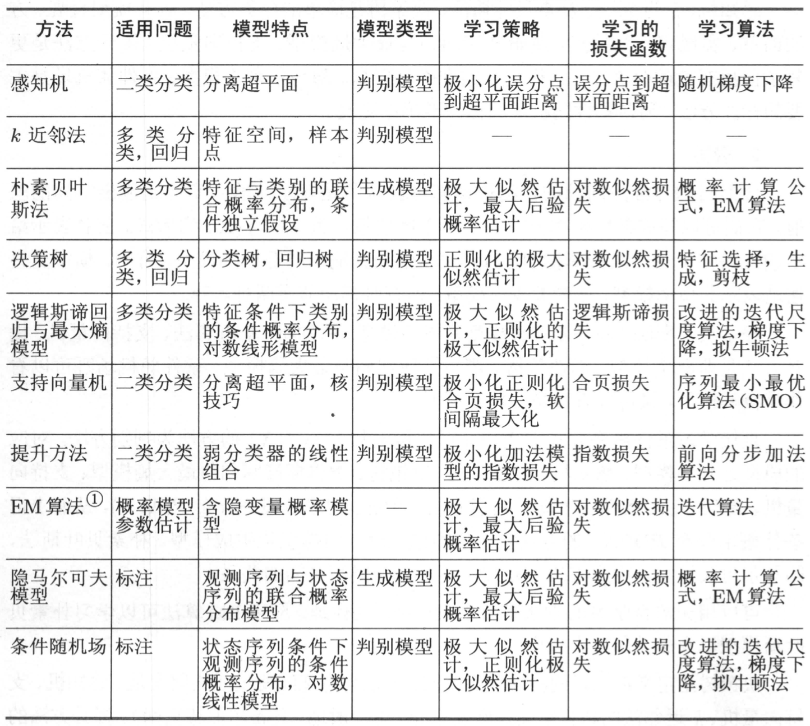
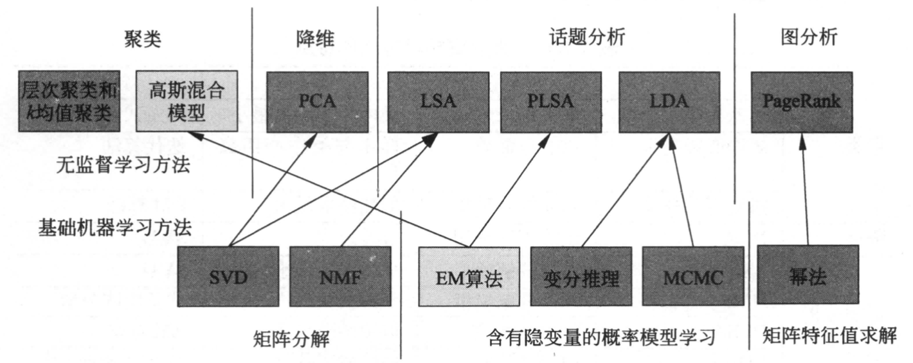
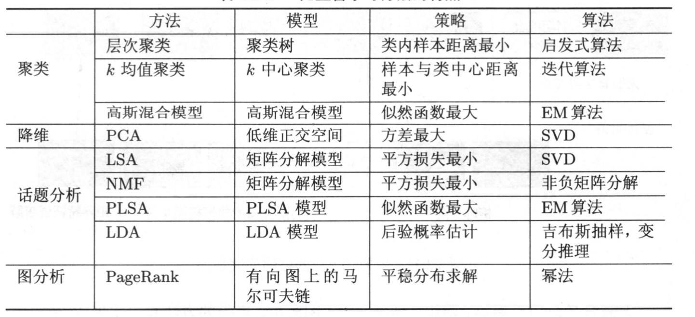
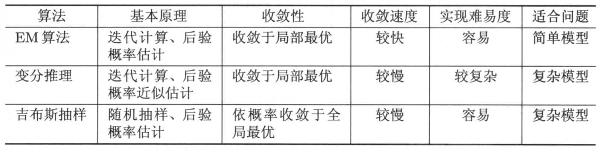

# 决策树
## ID3算法 熵

信息熵    
$$H(D)=-\sum_{k=1}^{K} \frac{\left|C_{k}\right|}{|D|} \log _{2} \frac{\left|C_{k}\right|}{|D|}$$

每个决策的条件熵 
$$\begin{aligned} H(D \mid A) &=\sum_{i=1}^{n} \frac{\left|D_{i}\right|}{|D|} H\left(D_{i}\right)  =-\sum_{i=1}^{n} \frac{\left|D_{i}\right|}{|D|}\left(\sum_{k=1}^{K} \frac{\left|D_{i k}\right|}{\left|D_{i}\right|} \log _{2} \frac{\left|D_{i k}\right|}{\left|D_{i}\right|}\right) \end{aligned}$$

其中$D_i$表示 D 中特征 A 取第 i 个值的样本子集，$D_{i,k} $表示 $D_i$ 中属于第 k 类的样本子集

信息熵减去条件熵得出信息增益 $\operatorname{Gain}(D,A)=H(D)-H(D \mid A)$

### 缺点

没有剪枝策略，容易过拟合

信息增益准则对可取值数目较多的特征有所偏好

只能处理离散分布的特征

没有考虑缺失值

## C4.5算法

引入悲观剪枝策略进行后剪枝；

引入信息增益率/比作为划分标准； 

将连续特征离散化，假设 n 个样本的连续特征 A 有 m 个取值，C4.5 将其排序并取相邻两样本值的平均数共 m-1 个划分点，分别计算以该划分点作为二元分类点时的信息增益，并选择信息增益率最大的点作为该连续特征的二元离散分类点； 

对于缺失值的处理可以分为两个子问题：问题一：在特征值缺失的情况下进行划分特征的选择？（即如何计算特征的信息增益率）问题二：选定该划分特征，对于缺失该特征值的样本如何处理？（即到底把这个样本划分到哪个结点里）

针对问题一，C4.5 的做法是：对于具有缺失值特征，用没有缺失的样本子集所占比重来折算；  
针对问题二，C4.5 的做法是：将样本同时划分到所有子节点，不过要调整样本的权重值，其实也就是以不同概率划分到不同节点中。

$\operatorname{Gain}_{radio}(D,A)=\frac{\operatorname{Gain}(D,A)}{H(D)}$

这里需要注意，**信息增益率对可取值较少的特征有所偏好（分母越小，整体越大）**，因此 C4.5 并不是直接用增益率最大的特征进行划分，而是使用一个启发式方法：先从候选划分特征中找到信息增益高于平均值的特征，再从中选择增益率最高的。

## CART 分类与回归树

CART算法是给定输入随机变量X条件下输出随机变量Y的条件概率分布的学习方法。CART假设决策树是二叉树，内部节点取值为“是”或“否”。这样的决策树等价于递归地二分每个特征，将特征空间划分为有限个单元，并在这些单元上确定预测的概率分布即输入给定的条件下输出的条件概率分布。

分裂过程是一个二叉递归划分过程，其输入和预测特征既可以是连续型的也可以是离散型的，CART 没有停止准则，会一直生长下去；

### 基尼系数
分类树用基尼系数选择最优特征，同时决定该特征的最优二值切分点。
分类问题分类问题中：
$$\begin{aligned} \operatorname{Gini}(D) =\sum_{k=1}^{K} \frac{\left|C_{k}\right|}{|D|}\left(1-\frac{\left|C_{k}\right|}{|D|}\right) =1-\sum_{k=1}^{K}\left(\frac{\left|C_{k}\right|}{|D|}\right)^{2} \end{aligned}$$

在特征A的条件下，集合D的基尼指数定义为

$$\begin{aligned}  \operatorname{Gini}(D \mid A) &=\sum_{i=1}^{n} \frac{\left|D_{i}\right|}{|D|} \operatorname{Gini}\left(D_{i}\right) \end{aligned}$$

### 决策树的生成

CART生成算法

输入：训练数据集D，停止计算的条件

输出： CART决策树

计算现有特征对该数据集的基尼指数。根据特征A=a的测试为“是”或“否”，将数据集划分为两个子集D1和D2,利用上面的公式计算A=a时的基尼指数；

在所有可能的特征A以及它们所有可能分割点a中，选择基尼系数最小的特征及其分割点作为最优特征和最优切分点。并根据该特征和切分点，从现节点生成两个子节点，将训练集划分到两个子节点去；

对两个子节点递归地调用上述步骤，直至满足停止条件;

生成CART决策树。


### CART剪枝
训练集的精确度越高；但测试集的精确度到达某一高度时会随着树的复杂度增加而减小，即产生过拟合。而**剪枝正是为了防止过拟合，缩小树的复杂度**而生的。

在一个复杂的树内部，有许多较简单的子树，**每一个子树代表在模型复杂性和训练集误差分类率之间的一种折中**。CART算法把这样一些子树的集合视为候选模型，这些候选子树被应用于验证集，具有最低验证集误分类率的树被选作最终模型。

以t为根节点的子树Tt的损失函数是：
$$
Cα(Tt)=C(Tt)+α|Tt|
$$
其中C(Tt)为误差（例如基尼指数）,∣Tt∣为子树的叶节点树，α > = 0为参数，用来权衡训练数据的拟合程度和模型的复杂度。

输入：CART算法生成的决策树T0

输出：最优决策树Tα

1. 设k=0,T=T0
2. 设α=+∞
3. $g(t)=\frac{C(t)-C(Tt)}{|Tt|-1}$，C(t)是Tt的子节点的误差。
4. 自上而下地对各内部节点t计算C(Tt)，|Tt|以及g(t)，这里，Tt表示以t为根节点的子树，C(Tt)是对训练数据的预测误差。|Tt|是Tt的叶结点个数。
5. 对g(t)=α的内部结点t进行剪枝，并对叶节点t以多数表决法决定其类得到树T。
设k=k+1，αk=α,Tk=T。
5. 如果Tk不是由根节点及两个叶节点构成的树，则回到步骤(4)；否则令Tk=Tn。
6. 采用交叉验证法在子树序列T0，T1，...，Tn中选取最优子树Tα。


## 差异

划分标准的差异：**ID3 使用信息增益偏向特征值多的特征**，**C4.5 使用信息增益率克服信息增益的缺点，偏向于特征值少的特征**，**CART 使用基尼系数克服 C4.5 需要求 log 的巨大计算量，偏向于特征值较多的特征。**

使用场景的差异：ID3 和 C4.5 都**只能用于分类问题**，**CART 可以用于分类和回归问题**；**ID3 和 C4.5 是多叉树**，速度较慢，**CART 是二叉树，计算速度很快**；

样本数据的差异：ID3 只能处理离散数据且缺失值敏感，C4.5 和 CART **可以处理连续性数据且有多种方式处理缺失值**；

从样本量考虑的话，**小样本建议 C4.5、大样本建议 CART**。C4.5 处理过程中需对数据集进行多次扫描排序，处理成本耗时较高，而 CART 本身是一种大样本的统计方法，小样本处理下泛化误差较大 ；

样本特征的差异：ID3 和 C4.5 层级之间**只使用一次特征**，CART 可**多次重复使用特征**；

剪枝策略的差异：ID3**没有剪枝策略**，C4.5 是通过**悲观剪枝策略**来修正树的准确性，而 CART 是通过**代价复杂度剪枝**。

# 感知机

损失函数的优化目标，就是使得所有误分类的样本满足到超平面的距离之和最小。

相当于一个神经元，只能做线性分类，是判别式模型。

激活函数让神经网络有了非线性拟合能力


# 支持向量机


原始问题

$$\min_{w,b} \frac{1}{2}||w||^2$$

$$s.t. y_i(w^Tx_i+b)-1>0$$

拉格朗日乘子法
对偶问题将minmax转换为$max_a min_{w,b}$

$$L(w,b,a)=\frac{1}{2}||w||^2-\sum_{i=1}^N a_iy_i(w*x_i+b)+\sum_{i=1}^Na_i$$

对w、b求偏导等于0 $\quad \ \ w-\sum_{i=1}^N a_iy_ix_i=0$  $\quad \ \ \sum_{i=1}^N a_iy_i=0$

$$max_a -\frac{1}{2}\sum _{i=1}^N\sum _{j=1}^Na_ia_jy_iy_j(x_i*x_j)+\sum_{i=1}^Na_i$$

等价于

$$
min_a \frac{1}{2}\sum _{i=1}^N\sum _{j=1}^Na_ia_jy_iy_j(x_i*x_j)-\sum_{i=1}^Na_i\\

s.t.  \sum_{i=1}^N a_iy_i=0\\

\quad \ \ a_i\geq 0
$$

核函数$K(x_i,x_j)=\phi(x_i)*\phi(x_j)$

映射函数$\phi$将原本的输入空间映射到新的空间中，将输入空间的内积$x_i*x_j$映射到新的空间$\phi(x_i)*\phi(x_j)$中

$$\begin{array}{ll}
\operatorname{argmin} & \frac{1}{2}||w||^{2}+C \sum_{i} \xi_{i} \\
\text {st. } \quad & y_{i}\left(w^{T} x_{i}+b\right) \geq 1-\xi_{i} \\
& \xi_{i} \geq 0 \\
& \xi_{i} \geq 1-y_{i}\left(w^{T} x_{i}+b\right)
\end{array}$$

$$\begin{aligned}
J(w)&=\frac{1}{2}|| w||^{2}+C \sum_{i} \max \left(0,1-y_{i}\left(w^{T} x_{i}+b\right)\right) \\
&=\frac{1}{2}|| w||^{2}+C \sum_{i} \max (0,1-Y f(x)) \\
&=\frac{1}{2}|| w||^{2}+C \sum_{i} L_{H i n g e}
\end{aligned}$$

SVM软间隔的损失函数可以看做是L2正则化与Hinge loss之和。


## 对偶问题
一是对偶问题往往更容易求解；二是自然引入核函数，进而推广到非线性分类问题。

# LDA
一种是线性判别分析(Liner Discriminant Analysis),一种是概率主题模型：隐含狄利克雷分布(Latent Dirichlet Allocation,简称LDA)。

## 隐含狄利克雷分布
它可以将文档集 中每篇文档的主题以概率分布的形式给出，从而通过分析一些文档抽取出它们的主题（分布）出来后，便可以根据主题（分布）进行主题聚类或文本分类。同时，它是一种典型的词袋模型，即一篇文档是由一组词构成，词与词之间没有先后顺序的关系。此外，一篇文档可以包含多个主题，文档中每一个词都由其中的一个主题生成。

当我们看到一篇文章后，往往喜欢推测这篇文章是如何生成的，我们可能会认为作者先确定这篇文章的几个主题，然后围绕这几个主题遣词造句，表达成文。LDA就是要干这件事：根据给定的一篇文档，反推其主题分布。

因此LDA用于推测分析文章主题，且各篇文章中各个主题出现的概率大小（主题分布）。

## PLSA模型
pLSA中生成文档的整个过程便是选定文档生成主题，确定主题生成词。

## LDA
LDA就是pLSA的贝叶斯版本（正因为LDA被贝叶斯化了，所以才需要考虑历史先验知识，才加的两个先验参数）。

## pca、lad、Fisher判别
PCA是找到方差尽可能大的维度，使得信息尽可能都保存，不考虑样本的可分离性，不具备预测功能。

LDA(线性判别分析) 是找到一个低维的空间，投影后，使得可分离性最佳，投影后可进行判别以及对新的样本进行预测。

Fisher判别分析是要实现有最大的类间距离，以及最小的类内距离


# K近邻 K-NN
在训练集种找到与输入X最近的k个点，然后投票决定输入X的类别。可以用欧氏距离也可以用其他如曼哈顿距离、Minkowski距离等。

## kd树

### 切分

kd树的每轮切分点的选择策略比较简单，是将带切分平面上的所有数据点按照切分域的维度进行大小排序，选择正中间的点作为切分点。

### 查找

1 寻找近似点-寻找最近邻的叶子节点作为目标数据的近似最近点。

2 回溯-以目标数据和最近邻的近似点的距离沿子节点到父节点方向进行回溯和迭代。


# 朴素贝叶斯

朴素贝叶斯算法是假设各个特征之间相互独立
$P(Y|X)= \frac{P(X|Y)*P(Y)}{P(X)}=\frac{\prod P(x_i|Y)*P(Y)}{\prod P(x_i)} $ 

优点：

（1） 算法逻辑简单,易于实现

（2）分类过程中时空开销小

缺点：

理论上，朴素贝叶斯模型与其他分类方法相比具有最小的误差率。但是实际上并非总是如此，这是因为朴素贝叶斯模型假设属性之间相互独立，这个假设在实际应用中往往是不成立的，在属性个数比较多或者属性之间相关性较大时，分类效果不好。
而在属性相关性较小时，朴素贝叶斯性能最为良好。对于这一点，有半朴素贝叶斯之类的算法通过考虑部分关联性适度改进。


# 逻辑斯蒂回归 LR

$\begin{array}{l}
P(Y=1 \mid x)=\frac{\exp (w \cdot x)}{1+\exp (w \cdot x)} ~~~~~~
P(Y=0 \mid x)=\frac{1}{1+\exp (w \cdot x)}
\end{array}$

现在考查逻辑斯谛回归模型的特点。一个事件的几率 （odds）是指该事件发生的概率与该事件不发生的概率的比值。如果事件发生的概率是p，那么该事件的几率是p/1-p，该事件的对数几率 （log odds）或 logit 函数是:

$\operatorname{logit}(p)=\log \frac{p}{1-p}=\log \frac{P(Y=1 \mid x)}{1-P(Y=1 \mid x)}=w \cdot x$

这就是说，在逻辑斯谛回归模型中，输出Y=1 的对数几率是输入x的线性函数。或者说，输出Y=1的对数几率是由输入x的线性函数表示的模型，即逻辑斯谛回归模型。

https://www.bilibili.com/video/BV17r4y137bW?spm_id_from=333.999.0.0&vd_source=cda54caf7daa0c1a91d08c632937453b 

令
$P(Y=1 \mid x)=\pi(x), \quad P(Y=0 \mid x)=1-\pi(x)$

似然函数为
$\prod_{i=1}^{N}\left[\pi\left(x_{i}\right)\right]^{y_{i}}\left[1-\pi\left(x_{i}\right)\right]^{1-y_{i}}$

取对数，结构类似交叉熵，即

$$
\begin{aligned} 
L(w) &=\sum_{i=1}^{N}\left[y_{i} \log \pi\left(x_{i}\right)+\left(1-y_{i}\right) \log \left(1-\pi\left(x_{i}\right)\right)\right]
\end{aligned}
$$

对$L(w)$取极大得到$w$，求导即可得到$\frac{\partial L(w)}{\partial w}$，即

$$
\begin{aligned}
\frac{\partial}{\partial \theta_{j}} \ell(\theta) &=\left(y \frac{1}{g\left(\theta^{T} x\right)}-(1-y) \frac{1}{1-g\left(\theta^{T} x\right)}\right) \frac{\partial}{\partial \theta_{j}} g\left(\theta^{T} x\right) \\
&=\left(y \frac{1}{g\left(\theta^{T} x\right)}-(1-y) \frac{1}{1-g\left(\theta^{T} x\right)}\right) g\left(\theta^{T} x\right)(1-g\left(\theta^{T} x\right))  \frac{\partial}{\partial \theta_{j}} \theta^{T} x\\
&=\left(y\left(1-g\left(\theta^{T} x\right)\right)-(1-y) g\left(\theta^{T} x\right)\right) x_{j} \\
&=\left(y-h_{\theta}(x)\right) x_{j}
\end{aligned}
$$


多项逻辑斯谛回归模型

$$
P(Y=k \mid x)=\frac{\exp \left(w_{k} \cdot x\right)}{1+\sum_{k=1}^{K-1} \exp \left(w_{k} \cdot x\right)}, \quad k=1,2, \cdots, K-1 \\
P(Y=K \mid x)=\frac{1}{1+\sum_{k=1}^{K-1} \exp \left(w_{k} \cdot x\right)}
$$

logistic 回归模型在多分类问题上进行推广，就是 Softmax 回归模型

重点：

1）softmax 函数转换概率的思路是评价每个类别，然后做归一化，这样每个输出都映射到 0~1 区间；

2）ℎ𝜃(𝑥) 表示的是 x 属于不同类别的概率组成的向量，哪个类别对应的概率大，就可能是哪个类别 ，即 ℎ𝜃(𝑥(𝑖))=max𝑝(𝑦(𝑖)=𝑘|𝑥(𝑖);𝜃) ;

3）Logistic 回归处理的是伯努利分布，而 softmax 回归处理的是多项式分布。

## 逻辑回归的优点

直接对分类可能性进行建模，无需实现假设数据分布，这样就避免了假设分布不准确所带来的问题。

形式简单，模型的可解释性非常好，特征的权重可以看到不同的特征对最后结果的影响。

除了类别，还能得到近似概率预测，这对许多需利用概率辅助决策的任务很有用。

## 逻辑回归的缺点

准确率不是很高，因为形势非常的简单，很难去拟合数据的真实分布。

本身无法筛选特征。

## 逻辑回归用一句话总结

逻辑回归假设数据服从伯努利分布，通过极大似然函数的方法，运用梯度下降来求解参数，来达到将数据二分类的目的。

## 损失函数
1）线性回归中的损失函数是均方误差，而 Logistic 回归的损失函数是负对数似然（Negative Log-Likelihood，NLL）。其实他们都是通过最大似然估计推导而来。

2）一般似然求最大，而损失函数求最小，所以给对数似然加负号，变成负对数似然。不过，业界习惯上依然将 Logistic 回归的损失函数称为对数损失，即对数似然损失 (Log-likelihood Loss), 也有人会称为逻辑斯谛回归损失 (Logistic Loss)。

3）对数损失等价于交叉熵损失，都是在概率估计上定义的。

4）对数损失（交叉熵损失）主要用于评估分类器的概率输出，十分常见，比如树模型、神经网络中都会用到，有时也会用于一些求期望极大算法的变体。

5）有时为了分类更方便辨别，会把 𝑦𝑖 的取值映射到 {-1,1}，即 𝑦𝑖∈{−1,1}，这里的 {-1,1} 不是区间，而是-1 和 1 两个值。

6）损失函数中 1𝑚 对结果没影响，有时候为了方便可以去掉。

## 逻辑回归的离散化
在工业界，很少直接将连续值作为特征喂给逻辑回归模型，而是将连续特征离散化为一系列0、1特征交给逻辑回归模型，这样做的优势有以下几点：

1. 稀疏向量内积乘法运算速度快，计算结果方便存储，容易scalable（扩展）。

2. 离散化后的特征对异常数据有很强的鲁棒性：比如一个特征是年龄>30是1，否则0。如果特征没有离散化，一个异常数据“年龄300岁”会给模型造成很大的干扰。

3. 逻辑回归属于广义线性模型，表达能力受限；单变量离散化为N个后，每个变量有单独的权重，相当于为模型引入了非线性，能够提升模型表达能力，加大拟合。

4. 离散化后可以进行特征交叉，由M+N个变量变为M*N个变量，进一步引入非线性，提升表达能力。

5. 特征离散化后，模型会更稳定

# EM算法
E步,求期望(expectation);M步,求极大(maximization）

https://www.bilibili.com/video/BV1RT411G7jJ?spm_id_from=333.999.0.0&vd_source=cda54caf7daa0c1a91d08c632937453b

输入：观测变量数据Y，隐变量数据Z，联合分布$P(Y,Z|\theta)$，条件分布$P(Z|Y,\theta)$；

输出：模型参数$\theta$。

(1)选择参数的初值$\theta^0$，开始迭代；

(2)E步：记$\theta^i$ 为第i次迭代参数$\theta$的估计值，在第i十1次迭代的E步，计算

$\begin{aligned}
Q\left(\theta, \theta^{(i)}\right) &=E_{Z}\left[\log P(Y, Z \mid \theta) \mid Y, \theta^{(i)}\right] \\
&=\sum_{Z} \log P(Y, Z \mid \theta) P\left(Z \mid Y, \theta^{(i)}\right)
\end{aligned}$

(3) M 步: 求使  $Q\left(\theta, \theta^{(i)}\right)$ 极大化的  $\theta$ , 确定第  i+1  次迭代的参数的估计值  $\theta^{(i+1)}$

$\theta^{(i+1)}=\arg \max _{\theta} Q\left(\theta, \theta^{(i)}\right)$

(4)重复第(2)步和第(3)步，直到收敛。

# 高斯混合模型
高斯混合模型是指具有如下形式的概率分布模型：
$$
p(x \mid \theta)=\sum_{k=1}^{K} \alpha_{k} \phi\left(x \mid \theta_{k}\right)
$$
其中, $\alpha_{k}$ 是系数, 且 $\alpha_{k} \geq 0, \sum_{k=1}^{K} \alpha_{k}=1$, 而 $\phi\left(y \mid \theta_{k}\right)$ 是 高斯分布 $Q$ 密度, $\theta_{k}=\left(\mu_{k}, \sigma_{k}^{2}\right)$, 对于随机变量 $\mathrm{y}$ 是一维数据时,
$$
\phi\left(x \mid \theta_{k}\right)=\frac{1}{\sqrt{2 \pi \sigma_{k}^{2}}} \exp \left(\frac{\left(x-\mu_{k}\right)^{2}}{2 \sigma_{k}^{2}}\right)
$$
称为第k个分模型。

GMM是多个高斯分布叠加而成的加权平均的结果，理论上只要分模型足够多，并且各分模型的系数设置合理，就能够产生任意分布的样本。公式可简写为：
$p(x)=\sum_{z} p(x, z)=\sum_{k=1}^{K} p(x, z)=\sum_{k=1}^{K} p(z) \cdot p(x \mid z)=\sum_{k=1}^{K} p_{k} \cdot N\left(\mu_{k}, \sum_{k}\right)$

$$
p(x)=\sum_{k=1}^{K} \alpha_{k} \cdot N\left(\mu_{k}, \sum_{k}\right), \sum_{k=1}^{K} \alpha_{k}=1(\alpha_{k} \geq 0)
$$


高斯混合模型属于生成模型, 可以设想观测数据 $y_{j}, j=1,2, \ldots, N$, 是这样生成的: 首先以概率 $\alpha_{k}$ 选择第 $\mathrm{k}$ 个分模型, 然后由第 $\mathrm{k}$ 个分模 型的概率分布生成观测数据 $y_{j}$ 。这里我们先约定: $x^{(i)}$ 表示为第 $\mathrm{i}$ 个样本的观测变量; $z^{(i)}$ 表示第 $\mathrm{i}$ 个样本所属的分模型, 是隐变量; 为了方 便, 统一用 $\theta$ 表示模型参数 $\alpha 、 \mu$ 和 $\sigma^{2}$ (对于一维数据）。观测数据是能直接观测到的, 已知的; 而反映第 $\mathrm{i}$ 个样本来自第 $\mathrm{k}$ 个分模型的数据 是末知的, 称为隐随机变量。一般地, 用 $x$ 表示观测随机变量的数据; $z$ 表示隐随机变量的数据。 $x$ 称为不完全数据, 而 $y$ 和z连在一起称为 完全数据。
为求模型参数, 先计算其似然函数：
$$
\begin{aligned}
L(\theta)&=\prod_{i=1}^{n} p\left(x^{(i)} \mid \theta\right)=\prod_{i=1}^{n} \sum_{k=1}^{K} \alpha_{k} \phi\left(x^{(i)} \mid \mu_{k} ; \sigma_{k}\right) \\
&=\prod_{i=1}^{n} \sum_{k=1}^{K} p\left(z^{(i)}=k \mid \theta\right) p\left(x^{(i)} \mid z^{(i)}=k ; \theta\right) \\
&=\prod_{i=1}^{n} \sum_{k=1}^{K} p\left(x^{(i)}, z^{(i)}=k \mid \theta\right)
\end{aligned}
$$
对数似然为
$$
L L(\theta)=\ln L(\theta)=\sum_{i=1}^{n} \ln \sum_{k=1}^{K} p\left(z^{(i)}=k \mid \theta\right) p\left(x^{(i)} \mid z^{(i)}=k ; \theta\right)
$$
可以看到, GMM通过求不完全数据的边缘概率来得到完全数据的似然函数。其中, $\alpha_{k}$ 对应于 $p\left(z^{(i)}=k \mid \theta\right), \phi\left(x^{(i)} \mid \mu_{k} ; \sigma_{k}\right)$ 对应于 $p\left(x^{(i)} \mid z^{(i)}=k ; \theta\right)$ 。因此
$$
\theta=\underset{\theta}{\arg \max } L L(\theta)
$$

(1) 初始化模型的参数值。EM算法对初始值较敏感, 不同的初始值可能得到不同的参数估计值。

(2) E-step：依据当前模型参数, 计算分模型k对观测样本数据的响应度。
$$
\varpi_{k}^{(i)}=\frac{\alpha_{k} \phi\left(x^{(i)} \mid \theta_{k}\right)}{\sum_{k=1}^{K} \alpha_{k} \phi\left(x^{(i)} \mid \theta_{k}\right)}
$$
(3) M-step: 计算新一轮迭代的模型参数
求模型参数：固定 $\varpi^{(i)}$ 后最大化 
$$
\sum_{i=1}^{n} \sum_{k=1}^{K} \varpi_{k}^{(i)} \ln \frac{p\left(z^{(i)}=k \mid \theta\right) p\left(x^{(i)} \mid z^{(i)}=k ; \theta\right)}{\varpi_{k}^{(i)}}=\sum_{i=1}^{n} \sum_{k=1}^{K} \varpi_{k}^{(i)} \ln \frac{\alpha_{k} \phi\left(x^{(i)} \mid \mu_{k} ; \sigma_{k}\right)}{\varpi^{(i)}}
$$
求解模型参数, 即
$$
\theta^{t+1}=\arg \max _{\theta} \sum_{i=1}^{n} \sum_{k=1}^{K} \varpi_{k}^{(i)} \ln \frac{\alpha_{k} \phi\left(x^{(i)} \mid \mu_{k} ; \sigma_{k}\right)}{c s \varpi_{k}^{(i)} }
$$
(4) 重复步骤 (2) (3) , 直至达到收敛。

# 监督学习总结



# 无监督学习





# K均值聚类 K-Means

算法接受参数 k ；然后将事先输入的n个数据对象划分为k个聚类以便使得所获得的聚类满足：同一聚类中的对象相似度较高；而不同聚类中的对象相似度较小。聚类相似度是利用各聚类中对象的均值所获得一个“中心对象”（引力中心）来进行计算的。

（1）适当选择c个类的初始中心；

（2）在第k次迭代中，对任意一个样本，求其到c个中心的距离，将该样本归到距离最短的中心所在的类；

（3）利用均值等方法更新该类的中心值；

（4）对于所有的c个 聚类中心，如果利用（2）（3）的 迭代法更新后，值保持不变，则迭代结束，否则继续迭代。

## 代码

```python
for t in range(self.times):
    for index, x in enumerate(X):
        dis = np.sqrt(np.sum(x-self.cluster_centers)**2, axis=1)
        # 将最小距离的所有赋值给标签数组，索引的值就说当前点所属的簇
        self.labels_[index] = dis.argmin()
    # 循环遍历每个簇
    for i in range(self.k):
        # 计算每个簇内的所有的点均值，更新聚类中心
        self.cluster_centers[i] = np.mean(X[self.labels_ == i], axis=0)
```

## 复杂度
时间复杂度：O(I* n * k *m)

空间复杂度：O(n*m)

其中m为每个元素字段个数，n为数据量，I为迭代个数。一般I,k,m均可认为是常量，

所以时间和空间复杂度可以简化为：O(n)，即线性的。
## 区别
KMeans与KNN的区别：

(1)KMeans是无监督学习算法，KNN是监督学习算法。

(2)KMeans算法的训练过程需要反复迭代的操作（寻找新的质心），但是KNN不需要。

(3)KMeans中的K代表的是簇中心，KNN的K代表的是选择与新测试样本距离最近的前K个训练样本数。
    
(4)KMeans算法的训练过程中，每次迭代都需要遍历所有的训练样本，而KNN算法的训练过程中，只需要遍历前K个训练样本即可。


# 集成学习
集成学习是用多个弱学习器构成一个强学习器。一般的弱学习器可以由 Logistic 回归，决策树，SVM，神经网络，贝叶斯分类器，K-近邻等构成。集成中的个体学习器可以是相同的算法，可称为同质集成（Homogeneous Ensemble），其中的个体学习器称为 “基学习器”（base learner），相应的学习算法称为 “基学习算法”（base learning algorithm）；集成也可以包含不同类型的算法，可称为异质集成（heterogenous），个体学习器一般称为 “组件学习器” 或直接称为个体学习器。

## Bagging
Bagging 是 Bootstrap Aggregation 的缩写，直译为自助汇聚法，其中 Bootstrap 是指一种有放回式的自助采样法（bootstrap sampling）。Bagging 是并行集成学习方法的典型代表，著名的集成学习算法随机森林其实是 Bagging 的一个扩展变体。

Bagging是为了得到泛化能力强的集成，因而就需要让各个子学习器之间尽可能独立，但是如果将样本分为了不同的不重合子集，那么每个基学习器学习的样本就会不足。所以它采用一种自助采样的方法（boostrap sampling），生成互相有交叠的采样子集。然后对每个采样子集分别进行训练，产生多个具有比较大差异的基学习器，最后使用投票法或平均法获得最终的预测结果。

### 算法过程
1. 自助采样

    给定包含 m 个样本的数据集，我们先随机取出一个样本放入采样集中，再把该样本放回初始数据集，使得下次采样时该样本仍有可能被选中，这样，经过 m 次随机采样操作，我们得到含 m 个样本的采样集，初始训练集中有的样本在采样集里多次出现，有的则从未出现，初始训练集中约有 63.2% 的样本出现在采样集中。样本再 m 次采样中始终不被采到的概率是$(1-1/m)^m$
2. 训练基学习器

    照这样，我们可采样出 T 个含 m 个训练样本的采样集，然后基于每个采样集训练出一个基学习器，再将这些基学习器进行结合。这就是 Bagging 的基本流程。
3. 集成

    在对预测输出进行结合时，Bagging 通常对分类任务使用简单投票法，对回归任务使用简单平均法。若分类预测时出现两个类收到同样票数的情形，则最简单的做法是随机选择一个，也可进一步考察学习器投票的置信度来确定最终胜者。

### 特点
1）从偏差-方差分解角度来看，Bagging 主要关注降低方差，因此它在不剪枝决策树、神经网络等易受样本扰动的学习器上效用更为明显；

2）Bagging 是一个非常高效的集成学习算法，算法复杂度大致为 𝑇(𝑂(𝑚)+𝑂(𝑠))，其中 𝑂(𝑚) 为基学习器的计算复杂度，𝑂(𝑠) 是采样与投票/平均过程的复杂度，T 是训练轮数。一般情况下，𝑂(𝑠) 的复杂度较小，𝑇 也是一个不太大的常数，因此，训练一个 Bagging 集成与直接使用基学习算法训练一个学习器的复杂度同阶。

3）Bagging 能够不经修改地用于多分类、回归等任务，而 Adaboost 若不经修改的话，只适用于二分类任务。

## 随机森林
随机森林（Random Forest， RF）是 Bagging 的一个扩展变体，RF 在以决策树为基学习器构建 Bagging 集成的基础上，进一步在决策树的训练过程中引入了随机属性选择。也就是说，随机森林不仅具有 Bagging 中样本扰动（初始训练集采样）的过程，还增加了一个属性扰动的过程，具体来说，传统决策树在选择划分属性时是在当前结点的属性集合(假定有d个属性)中选择一个最优属性；而在 RF 中，对基决策树的每个结点，先从该结点的属性集合中随机选择一个包含K个属性的子集，然后再从这个子集中选择一个最优属性用于划分．这里的参数 〞控制了随机性的引入程度：若令人=d，则基次策树的构建与传统决策树相同；若令K=1，则是随机选择一个属性用于划分；一般情记下，推荐值k= log2d。

这得基学习器的 “多样性” 和 “差异度” 进一步提升，从而提高了最终集成的泛化性能。
### 算法过程
1. 自助采样

    从样本集中用 Bootstrap 采样选出 𝑛 个样本。

2. 选择随机属性子集

    传统决策树在选择划分属性时是在当前结点的属性集合（假定有 𝑑 个属性）中选择一个最优属性，而在 RF 中对基决策树的每个结点，**先从该结点的属性集合中随机选择一个包含 𝑘 个属性的子集，然后再从这个子集中选择一个最优属性用于划分**。这里的参数 𝑘 控制了随机性的引入程度：若令 𝑘=𝑑，则基决策树的构建与传统决策树相同；若令 𝑘=1，则是随机选择一个属性用于划分； 一 般情况下，推荐值 𝑘=log2𝑑 。

3. 建立 CART 决策树

    选择最优属性后，用采样样本建立 CART 决策树。

    可以选择基尼系数来进行节点划分，也可以使用OOB袋外误差。

    假设总共有 M 个样本，一次采样只采集 A 个样本，那么就有 M-A 个样本没有被采集到，这些样本就是用来作为测试样本后期衡量决策树的好坏，当然也拿来衡量特征的好坏。

4. 重复

    重复以上三步 𝑚 次，即建立了 𝑚 棵 CART 决策树。

5. 集成

    对预测输出进行结合，如分类任务使用多数投票法，对回归任务使用简单平均法。方法包括简单平均法、加权平均法、绝对多数投票法、相对多数投票法、加权投票法。

类标记：ℎ𝑗𝑖(𝑥)∈{0,1}，若 ℎ𝑖 将样本 𝑥 预测为类别 𝑐𝑗 则取值为 1，否则为 0。使用类标记的投票亦称 “硬投票”（hard voting)。

类概率： ℎ𝑗𝑖∈[0,1]，相当于对后验概率 𝑃(𝑐𝑗|𝑥) 的一个估计，使用类概率的投票亦称 “软投票”（soft voting)。

经验发现，虽然分类器估计出的类概率值一般都不太准确，但基于类概率进行集成却往往比直接基于类标记进行集成性能更好。不同类型的 ℎ𝑗𝑖 值不能混用，若基学习器的类型不同（异质集成），则其概率值不能直接进行比较，这种情况下，通常可将类概率输出转化为类标记输出（例如将类概率输出最大的时 ℎ𝑗𝑖(𝑥) 设为 1 ，其他设为 0）然后再投票。

### 特点
1）随机森林简单易实现，计算开销小；

2）随机森林在实践应用中表现出强大的性能，被誉为 “代表集成学习技术水平的方法”；

3）随机森林的收敛性与 Bagging 相似，起始性能较差，随着个体学习器数目的增加，随机森林通常会收敛到更低的泛化误差。

4）随机森林训练效率常优于 Bagging，因为在个体决策树的构建过程中，Bagging 使用的是 “确定型” 决策树，在选择划分属性时要对结点的所有属性进行考察 ，而随机森林使用的 “随机型” 决策树则只需考察一个属性子集。同时保留bagging的Bootstrap有放回的随机采样。

5）除了使用决策树作为个体学习器，随机森林还可以使用 SVM、Logistic 回归等其他学习器，习惯上，这些学习器组成的 “总学习器”，仍然叫作随机森林。

6）由于之前的两个随机采样的过程保证了随机性，所以就算不剪枝，也不会出现over-fitting。

## Boosting
Boosting 就是著名的提升方法，是一族可将弱学习器提升为强学习器的算法，可用于回归和分类问题。严格来讲提升并不是一种独立算法，而是在已有算法上进行优化的机器学习技术。从偏差-方差分解的角度看， **Boosting 主要关住降低偏差**，因此 Boosting 能基于泛化性能相当弱的学习器构建出很强的集成，从理论上讲，如果一个问题存在弱学习器，则可以通过提升的方法得到强学习器。

提升算法族的工作机制类似：先从初始训练集训练出一个基学习器，再根据基学习器的表现对训练样本分布进行调整，使得先前基学习器做错的训练样本在后续受到更多关注，然后基于调整后的样本分布来训练下一个基学习器；如此重复进行，直至基学习器数目达到事先指定的值 T ，最终将这 T 个基学习器进行加权结合（通常为线性加权）。

Boosting 算法族著名的代表有 AdaBoost、GBDT以及 XGBoost。

## Adaboost
Adaboost（Adaptive Boost）即自适应提升算法。对提升方法来说，有两个问题需要回答：一是在每一轮如何改变训练数据的权值或概率分布；二是如何将弱分类器组合成一个强分类器。关于第一个问题，AdaBoost 的做法是，提高那些被前一轮弱分类器错误分类样本的权值，而降低那些被正确分类样本的权值。这样一来，那些没有得到正确分类的数据，由于其权值的加大而受到后一轮的弱分类器的更大关注。于是，分类问题被一系列的弱分类器 “分而治之”。至于第二个问题，即弱分类器的组合，AdaBoost 采取加权多数表决的方法。具体地，加大分类误差率小的弱分类器的权值，使其在表决中起较大的作用，减小分类误差率大的弱分类器的权值，使其在表决中起较小的作用。AdaBoost 的巧妙之处就在于它将这些想法自然且有效地实现在一种算法里。

从弱分类器出发，每一次分类错误的样本都会增加权重，使得在下一次分类的时候更加关注这些错分样本，如此重复，最后将这些弱分类器组合，构成一个强分类器。这里需要注意的一点是，我们最后需要的强分类器不是通过提升得到的最后一个分类器，而是结合了所有中间的弱分类器，最终构成的强分类器。

Adaboost 使用指数损失函数作为 0-1 损失函数的替代损失函数，通过 “加性模型” 即基学习器的线性组合来最小化指数损失函数。后面的基学习器和样本分布更新公式都是为了最小化指数损失函数推导得到的。

### 重采样法
Boosting 要求基学习器能对特定的数据分布进行学习，则可通过上面提到重赋权法（re-weighting）实施，即在训练过程的每一轮中，根据样本分布为每个训练样本重新赋予一个权重。

然而有些基学习器无法接受带权样本，则可通过重采样法（re-sampling）来处理，即在每一轮学习中，根据样本分布对训练集重新进行采样，再用重采样而得的样本集对基学习器进行训练。一般而言，这两种做法没有显著的优劣差别，不过在一些特殊情况中，重采样法还有一些额外的好处。

Boosting 算法在训练的每一轮都要检查当前生成的基学习器是否满足基本条件（例如检查当前基分类器是否是比随机猜测好），一旦条件不满足，则当前基学习器即被抛弃，且学习过程停止。在此种情形下，初始设置的学习轮数 T 也许遥远未达到，可能导致最终集成中只包含很少的基学习器而性能不佳。若采用重采样法，则可获得 “重启动” 机会以避免训练过程过早停止，即在抛弃不满足条件的当前基学习器之后，可根据当前分布重新对训练样本进行采样，再基于新的采样结果重新训练出基学习器，从而使得学习过程可以持续到预设的 T 轮完成。


### 算法特点

Adaboost 算法可以认为是模型是**加法模型**、**损失函数为指数损失函数**、**学习算法为前向分步算法的二类分类学习方法**；前向分步算法的优化思路是：因为学习的是加法模型，如果能够从前向后，每一步只学习一个基函数及其系数，逐步逼近优化目标函数，那么就可以简化优化的复杂度。

Adaboost 的训练误差是以指数速率下降的；

Adaboost 算法的样本权重和基分类器的权重是交叉更新的；

Adaboost 算法不需要事先知道每个分类器误差下降的是多少，具有自适应性（Adaptive），它能自适应分类器的训练误差率。

Adaboost 算法可以使用 Logistic 回归，决策树，SVM，神经网络，贝叶斯分类器等作为基分类器；

Adaboost 最初的算法过程仅适用于二分类的分类任务，对于处理多分类或回归任务的情况，需要对 Adaboost 算法过程进行修改，目前已经有适用的变体算法。

## GBDT
GBDT（Gradient Boosting Decision Tree）称为梯度提升树，也是 Boosting 族算法之一，在传统机器学习算法里面是对真实分布拟合的最好的几种算法之一。

GBDT 是从提升树而来，可以说是提升树的升级版本。

### 提升树与梯度提升树
提升树（Boosting Tree）是以决策树为基学习器（基函数）的提升方法，个体决策树通常都会使用 CART 决策树生成算法，对分类问题是二叉决策树，对回归问题是二叉回归树。提升树模型可以表示为决策树的加法模型。

按照 Boosting 的前向分步算法，第 m 步基学习器是对第 m-1 步基学习器的进一步优化，前面已经学习到了一些基学习器，但是线性加和后与期望值之间依然有些误差，Boosting 的做法就是通过继续更新学习新的基学习器，用新的基学习器来逐步 “弥补” 误差，直至这个误差消失或者非常小。

对回归问题的提升树算法来说，只需简单地拟合当前模型的残差，不断更新决策树，直到获得最优模型。

Boosting 每一次更新目的就是让当前模型的预测值更加接近期望值，也就是使得当前 𝐹(𝑥𝑖) 的预测结果与期望值 𝑦𝑖 之间的差距越来越小，这个差距如果使用平方误差损失函数的话，其实就是残差。因此，我们可以将减小残差作为优化方向，每一次更新学到的新决策树都是为了减小残差，这其实就是 GBDT 的本质。

通过最小化损失函数求解最优模型成为了一个 NP 难问题，这个时候，我们便可通过贪心法，借助梯度下降法，迭代求局部最优解。

利用一般损失函数的负梯度在当前模型的值仅仅是回归提升树算法中残差的近似值，我们称之为伪残差（pseudo-residual），有时也称为响应（response）或负梯度误差。

残差是 GBDT 的一个特例情况。使用了梯度下降法的提升树就是梯度提升树。GBDT 就是在函数空间的梯度下降，与梯度下降类似。

GBDT 在函数空间中利用梯度下降法进行优化，而 XGBoost 在函数空间中用牛顿法进行优化


### GBDT算法
输入：训练数据集 𝑇，损失函数 𝐿(𝑦,𝐹(𝑥));

输出：回归树 𝐹∗(𝑥)。

1. 初始化 𝐹0；

    a）随机初始化；

    b）用训练样本中的充分统计量初始化，如习惯上有：

    如果损失函数是平方误差损失（服从正态分布），用样本的均值初始化
    如果损失函数是绝对损失（服从拉普拉斯分布），用样本的中位数初始化
    c）用其他函数的预测值初始化

    GBDT 很健壮，对初始值并不敏感，但是更好的初始值能够获得更快的收敛速度和质量。


2. 对 $m=1,2, \ldots, M$
  
    a) 对 $i=1,2, \ldots, N$, 计算伪残差：
    $$
    r_{m i}=-\left[\frac{\partial L\left(y_{i}, F\left(x_{i}\right)\right)}{\partial F\left(x_{i}\right)}\right]_{F(x)=F_{m-1}(x)}
    $$
    b) 利用 $\left(x_{i}, r_{m i}\right)(i=1,2, \ldots N)$, 拟合一棵 CART 回归树, 得到第 $m$ 棵回归树, 其对应 的叶子节点区域为 $R_{m j}, j=1,2, \ldots, J$ 。其中 $J$ 为第 $m$ 棵回归树的叶子节点的个数。

    c) 对叶子区域 $j=1,2, \cdots, J$, 利用线性搜索（Line Search）计算最佳拟合值:
    $$
    c_{m j}=\arg \min _{c} \sum_{x_{i} \in R_{m j}} L\left(y_{i}, F_{m-1}\left(x_{i}\right)+c\right)
    $$
    d) 更新模型：
    $$
    F_{m}(x)=F_{m-1}(x)+\sum_{j=1}^{J} c_{m j} I\left(x \in R_{m j}\right)
    $$
3. 得到最优模型:
$$
F^{*}(x)=F_{M}(x)=F_{0}(x)+\sum_{m=1}^{M} \sum_{j=1}^{J} c_{m j} I\left(x \in R_{m} j\right)
$$

GBDT 虽然使用 CART 决策树，但是已经不是用 gini 系数来做选择特征分割点了，gini 系数只适用分类问题，而 GBDT 实质是个回归问题。即便是 GBDT 来解决分类问题，实质上也是把它转化为回归问题（转化为概率分布），分类问题选择分裂点和 GBDT 做回归是一样的，比如用分裂后方差最小之类的指标。

### GBDT常用损失函数

1. 平方损失，主要应用于回归问题，使用平方损失的 GBDT，可称为 LSBoost。


2. 对数损失，主要应用于分类问题， 使用对数损失的 GBDT，可称为 LogitBoost。

### GBDT常用正则化方法
GBDT 有非常快的降低 Loss 的能力，这也会造成一个问题：Loss 迅速下降，容易使模型低 bias，高 variance，造成过拟合。

1. 在损失后面增加正则惩罚项
2. 限制树的复杂度（树深度）
3. 行采样，训练每棵树的时候，只使用一部分样本，参考 Bagging。
4. 列采样，训练每棵树的时候，只使用一部分特征（随机K个中选一个），这是 XGBoost 的创新，它将随机森林中的思想引入了GBDT。
5. 衰减因子 Shrinkage在更新 𝐹𝑚(𝑥) 的时候，进一步惩罚 𝑐𝑚𝑗，给它们乘一个大于 0 小于 1 的系数 𝛼（通常 𝛼∈[0.001,0.01]），也可以理解为设置了一个较低的学习率，这样每次走一小步逐渐逼近结果的效果，要比每次迈一大步很快逼近结果的方式更容易避免过拟合。即它不完全信任每一个棵残差树，它认为每棵树只学到了真理的一小部分，累加的时候只累加一小部分，通过多学几棵树弥补不足。
6. 早停止 Early Stop因为 GBDT 的可叠加性，我们使用的模型不一定是最终的最优集合模型，因此可根据测试集的测试情况，选择使用前若干棵树。

## XGBoost
### 对比GBDT
1、GBDT是机器学习算法，而XGBoost是算法的工程实现

2、使用CART作为基分类器时，XGBoost显式的加入了正则项来控制模型的复杂度，防上过拟合，提高了模型的泛化能力

3、GBDT只使用了代价函数的一阶导数信息，而XGBoost对代价函数进行二阶泰勒展开，同时使用一阶和二阶信息。相对于GBDT的一阶泰勒展开，XGBoost采用二阶泰勒展开，可以更为精准的逼近真实的损失函数。可扩展性：损失函数支持自定义，只需要新的损失函数二阶可导。

4、传统的GBDT采用CART作为基分类器，而XGBoost支持多种类型的基分类器

5、传统的GBDT迭代时采用全部的数据，而XGBoost采用了随机森林相似的策略，支持对数据进行采样

6、传统的GBDT没有对缺失值的处理策略，而XGBoost自动学习出对缺失值的处理策略

7、XGBoost的目标函数加了L2正则项， 相当于预剪枝，使得学习出来的模型更加不容易过拟合。

8、缺失值处理：对树中的每个非叶子结点，XGBoost可以自动学习出它的默认分裂方向。如果某个样本该特征值缺失，会将其划入默认分支。

9、并行化：注意不是tree维度的并行，而是特征维度的并行。XGBoost预先将每个特征按特征值排好序，存储为块结构，分裂结点时可以采用多线程并行查找每个特征的最佳分割点，极大提升训练速度。

### 算法细节
初始化f0(xi)

拟合残差树h1(xi)(通过不同的分裂准则，即不同的增益，这也是各个boosting算法的最大的区别)

更新f1 = f0(xi) + h1(xi)

依次类推，不断迭代，直到模型满足收敛条件。

Xgboost采用的增益是分裂前的结构分与分裂后的结构分之差。

Xgboost的亮点之一是定义一种分裂准则，使每次最优分割点的分裂都能比没有分裂时损失减少最大。这也是Xgboost高效的原因之一。因此，找到了一种方法：**定义分裂前的结构分减去分裂后的结构分作为分割点的增益，然后找到增益最大的分割点作为该次分裂的最优分割点**。结构分的意义：当已知树的结构时的损失函数的最小值。在已知gi,hi的条件下，结构分就可以求解。

结构分的意义：当已知树的结构时的损失函数的最小值。Xgboost的增益定义就是分裂前的结构分减去分裂后的结构分，选择增益最大的分割点作为最优分割点，其意义为使分裂后模型损失比分裂前损失减小最大的那个分割点。这样的增益定义方法拟合的该轮残差树效果很优。

### XGBoost防止过拟合的方法
XGBoost在设计时，为了防止过拟合做了很多优化，具体如下：

1. 目标函数添加正则项：叶子节点个数+叶子节点权重的L2正则化
2. 列抽样：参考随机森林，训练的时候只用一部分特征（不考虑剩余的block块即可）
3. 行采样：参考bagging，每轮计算可以不使用全部样本，使算法更加保守
4. shrinkage: 可以叫学习率或步长，为了给后面的训练留出更多的学习空间

### XGBoost如何评价特征的重要性
采用三种方法来评判XGBoost模型中特征的重要程度：

weight ：该特征在所有树中被用作分割样本的特征的总次数。

gain ：该特征在其出现过的所有树中产生的平均增益。

cover ：该特征在其出现过的所有树中的平均覆盖范围。

注意：覆盖范围这里指的是一个特征用作分割点后，其影响的样本数量，即有多少样本经过该特征分割到两个子节点。

## Bagging 与 Boosting 算法对比

|项目|	Bagging|	Boosting|
|:--|:--|:--|
|样本选择|	有放回式的自助采样，产生多个相互独立的训练集|	使用原始训练集|
|样本权重|	训练期间各样本权重相等|	按错误率调整样本权重，提升对错误样本的关注以便下一轮优化|
个体学习器权重|	个体学习器权重相等|	个体学习器权重不同，误差小的权重更大。|
并行计算|	个体学习器可并行生成|	个体学习器前后依赖，无法并行生成
偏差方差分解|	关注降低方差|	关注降低偏差

Bagging 通过样本采样，一定几率减少了异常噪声（Outlier）出现在个体学习器的训练数据集中，在训练基学习器的过程中也就减少了噪声的干扰，最后再经过多个模型的平均或投票，进一步了降低异常噪声的影响，因此，Bagging 更加关注减小方差；

Boosting **重点是在每一轮迭代过程中如何拟合一棵残差树**，是通过最优化损失来获得最优模型的，无论是 GBDT 中的拟合伪残差还是 Adaboost 中依据指数损失更新的权重值，Boosting 的每一次更新都是以减小损失为目的进行的优化，反应在最后获得模型上，就是最小化偏差。因此，Boosting 更加关注减小偏差。

Bagging 更加关注降低方差，对样本重采样和增加个体学习器的数量，其主要目的就是降低方差，因此它在不剪枝的决策树、神经网络等学习器上效用更为明显。但要想使模型达到一定的精度，集成方法对降低偏差的作用就不明显了，所以只能通过提升个体学习器的性能来弥补，因此 Bagging 对个体学习器的性能要求也稍高一些，即便存在一些性能稍弱的，也会在投票和权重更新中被淘汰或降权。这也是为什么 RandomForest 在调参的时候，个体决策树的深度往往要调的比较高，就是为了极力降低偏差且不用考虑因树深导致方差高带来的影响。

Boosting 更加关注降低偏差，通过前向分步这种贪心算法，每一步我们都会在上一轮的基础上更加拟合原数据，因此 Boosting 对个体学习器的性能要求并不高，它能基于泛化性能相当弱的学习器构建出很强的集成，因为即便仍有偏差，也会不断用新的个体学习器进行拟合叠加来弥补上的，而且为了避免过拟合，往往选择方差更小的简单学习器，所以在 GBDT 和 XGBoost 的调参中，个体决策树的深度往往不高。

Bagging 和 Boosting 在调参的时候有不同的关注点，Bagging 更加注重降低方差，因此我们在模型优化的时候要更加注重如何降低偏差，甚至为了降低偏差还要适当的提高个体学习器的复杂度，却不用担心过拟合情况会发生，因为 Bagging 自带降低方差的效果，类似剪枝这种决策树的正则化方法就更不需要用了。而 Boosting 却恰恰相反，因为 Boosting 更加关注降低偏差，然而有时候因为降低偏差太快，往往有过拟合的风险，因此，Boosting 是需要正则方法的，比如可使用：类似 Bagging 中的自采样法，限制树的深度，降低偏差减小的速度，还有甚至是以牺牲一定偏差为代价的早停止方法。

GBDT 可用于搜索引擎和推荐系统排序过程

GBDT 与 LR 融合提升广告点击率预估模型

1、**结构上，bagging是并行处理，boosting是串行处理**

2、**训练上，bagging的基分类器训练是独立的，boosting的训练依赖于之前的模型**

3、**作用，bagging是减小variance（方差），boosting是减小bias（偏差）**

对于Bagging，对样本进行重采样，通过重采样得到的子样本集训练模型，最后取平均。因为子样本集的相似性，而且使用相同的弱学习器，因此每个学习器有近似相等的bias和variance，因为每个学习器相互独立，所以可以显著降低variance，但是无法降低bias

对于Boosting，采用顺序的方式最小化损失函数（残差），所以bias自然是逐步下降，子模型之和不能显著降低variance。


## 优缺点
两种集成算法的主要代表是随机森林和 GBDT
### 随机森林的优缺点
优点：

1. 表现性能好，与其他算法相比有着很大优势。
2. 随机森林能处理很高维度的数据（也就是很多特征的数据），并且不用做特征选择。
3. 在训练完之后，随机森林能给出哪些特征比较重要。
4. 训练速度快，容易做成并行化方法 (训练时，树与树之间是相互独立的)。
5. 在训练过程中，能够检测到 feature 之间的影响。
6. 对于不平衡数据集来说，随机森林可以平衡误差。当存在分类不平衡的情况时，随机森林能提供平衡数据集误差的有效方法。
7. 如果有很大一部分的特征遗失，用 RF 算法仍然可以维持准确度。
8. 随机森林算法有很强的抗干扰能力（具体体现在 6,7 点）。所以当数据存在大量的数据缺失，用 RF 也是不错的。
9. 随机森林抗过拟合能力比较强（虽然理论上说随机森林不会产生过拟合现象，但是在现实中噪声是不能忽略的，增加树虽然能够减小过拟合，但没有办法完全消除过拟合，无论怎么增加树都不行，再说树的数目也不可能无限增加的。）
10. 随机森林能够解决分类与回归两种类型的问题，并在这两方面都有相当好的估计表现。（虽然 RF 能做回归问题，但通常都用 RF 来解决分类问题）。
11. 在创建随机森林时候，对 generlization error(泛化误差) 使用的是无偏估计模型，泛化能力强。

缺点：

1. 随机森林在解决回归问题时，并没有像它在分类中表现的那么好，这是因为它并不能给出一个连续的输出。当进行回归时，随机森林不能够做出超越训练集数据范围的预测，这可能导致在某些特定噪声的数据进行建模时出现过度拟合。（PS: 随机森林已经被证明在某些噪音较大的分类或者回归问题上会过拟合）。
2. 对于许多统计建模者来说，随机森林给人的感觉就像一个黑盒子，你无法控制模型内部的运行。只能在不同的参数和随机种子之间进行尝试。
3. 可能有很多相似的决策树，掩盖了真实的结果。
4. 对于小数据或者低维数据（特征较少的数据），可能不能产生很好的分类。**（处理高维数据，处理特征遗失数据，处理不平衡数据是随机森林的长处）**。
5. 执行数据虽然比 boosting 等快（随机森林属于 bagging），但比单只决策树慢多了。


### GBDT的优缺点
优点：

1. 可以灵活处理各种类型的数据，包括连续值和离散值。
2. 在相对少的调参时间情况下，预测的准确率也可以比较高。这个是相对 SVM 来说的。
3. 使用一些健壮的损失函数，对异常值的鲁棒性非常强。比如 Huber 损失函数和 Quantile 损失函数。
4. 预测阶段树与树之间可并行化计算，计算速度快，最终的预测值就是所有树的预测值之和。
5. 在分布稠密的数据集上，泛化能力和表达能力都很好，这使得 GBDT 在 Kaggle 的众多竞赛中，经常名列榜首。
6. 采用决策树作为弱分类器使得 GBDT 模型具有较好的解释性和鲁棒性，能够自动发现特征间的高阶关系，并且也不需要对数据进行特殊的预处理如归一化等。
7. （特点）从决策边界来说，线性回归的决策边界是一条直线，Logistic 回归的决策边界根据是否使用核函数可以是一条直线或者曲线，而 GBDT 的决策边界可能是很多条线。

缺点：

1. 由于个体学习器之间存在依赖关系，训练过程需要串行训练，难以并行训练数据。只能在决策树内部采用一些局部并行的手段提高训练速度。如通过自采样的 SGBT 来达到部分并行，**XGBoost 则实现了特征粒度上的并行计算**。『采用子采样的 GBDT 有时也称为随机梯度提升树（SGBT）』
2. GBDT 在高维稀疏的数据集上，表现不如支持向量机或者神经网络。
3. GBDT 在处理文本分类特征问题上，相对其他模型的优势不如它在处理数值特征时明显。


# 多类分类 multi-class
1. One-vs-One
    将N个类别两两配对，训练N(N−1)/2个分类器。测试阶段，新样本同时提交给所有的分类器，得到N(N−1)/2个分类结果，投票表决。
2. One-vs-Rest
   每次将一个类作为正例，其余所有类作为负例，训练N个分类器。在测试时如果只有一个类为正例，则对应的类标标记为最终结果，如果多个分类器预测为正类，则考虑分类器的预测置信度，选择置信度最大的类别标记为分类结果。
   
   容易看出，OvR 只需训练N 个分类器，而 OvO 需训练N(N -1)/2 个分类器，因此，OvO的存储开销和测试时间开销通常比 OvR 更大．但在训练时， OvR的每个分类器均使用全部训练样例，而 OvO 的每个分类器仅用到两个类的样例，因此，在类别很多时，OvO 的训练时间开销通常比 OvR 更小．至于预测性能，则取决于具体的数据分布，在多数情形下两者差不多。

Many-Vs-Many
将若干个类作为正类，若干个类作为负类。MvM的正反类构造必须有特别的设计，Error Correcting Output Code纠错输出码是一种常用的技术。

对N个类别做M次划分，每次划分将一部分类别划为正类，一部分划为反类（M个训练集）。

测试示例交给M个分类器进行预测输出

分别得到N个M长度的编码


对于二元ECOC码
可计算海明距离，对于二元ECOC码，进行异或操作。也可计算欧氏距离。

最小的那一类就是我们的预测值（最相似的一行）。

